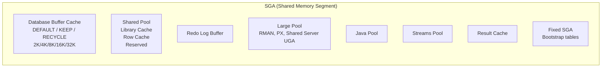

# System Global Area (SGA)

## Overview

The **SGA** is the shared-memory region allocated at instance startup and released only at shutdown. Every session in the instance sees the same SGA. It holds cached data blocks, cached SQL plans, redo not yet written to disk, and dozens of smaller pools. Sizing the SGA correctly is one of the highest-leverage tuning decisions a DBA makes: too small and the buffer cache and shared pool thrash; too large and you starve the OS and PGA.

On Linux the SGA is a single (or with HugePages, several) shared memory segment attached by every Oracle process at fork time. `ipcs -m` shows it.

## Architecture



## Internal Working

### Allocation

At startup Oracle:

1. Reads sizing parameters (`sga_target`, `sga_max_size`, individual pool sizes).
2. Calls `shmget()` (or attaches HugePages).
3. Formats the segment into granules — 4 MB or 16 MB depending on total SGA.
4. Initializes sub-pool structures.
5. Registers the segment with all subsequent forked processes.

### Granules

The SGA is managed in **granules**, not bytes. Every subcomponent gets an integer number of granules:

- `sga_target < 1 GB`: granule = 4 MB
- `sga_target 1–8 GB`: granule = 16 MB
- `sga_target 8–16 GB`: granule = 32 MB
- `sga_target > 16 GB`: granule = 64 MB
- `sga_target > 32 GB`: granule = 128 MB
- Ultra-large (Exadata): 256 or 512 MB

`V$SGAINFO` shows the granule size and total granules allocated.

### ASMM vs AMM vs Manual

- **AMM** (`memory_target > 0`) — Oracle auto-manages _both_ SGA and PGA. Uses `/dev/shm` on Linux. Incompatible with HugePages. Deprecated for production.
- **ASMM** (`sga_target > 0`, `memory_target = 0`) — Auto-manages SGA components (buffer cache vs shared pool). PGA managed by `pga_aggregate_target`. **Recommended.**
- **Manual** — Set every pool explicitly. Rare; used only for very specific tuning.

`sga_max_size` is a ceiling; Oracle can grow up to that value at runtime (but cannot shrink below `sga_target`).

## Components

| Component                 | Managed by                      | Purpose                             |
| ------------------------- | ------------------------------- | ----------------------------------- |
| **Database Buffer Cache** | `db_cache_size` (or ASMM)       | Cached datafile blocks              |
| **Shared Pool**           | `shared_pool_size` (or ASMM)    | Library cache + row cache           |
| **Redo Log Buffer**       | `log_buffer` (fixed at startup) | Uncommitted redo before LGWR flush  |
| **Large Pool**            | `large_pool_size`               | RMAN, PX buffers, shared-server UGA |
| **Java Pool**             | `java_pool_size`                | Java code / data if JVM in use      |
| **Streams Pool**          | `streams_pool_size`             | LogMiner, GoldenGate, XStream       |
| **Result Cache**          | `result_cache_max_size`         | Cached SQL + PL/SQL results         |
| **Fixed SGA**             | non-tunable                     | Bootstrap fixed tables              |

## Important Parameters

| Parameter              | Purpose                                                 |
| ---------------------- | ------------------------------------------------------- |
| `sga_target`           | ASMM cap — soft target                                  |
| `sga_max_size`         | Hard maximum for SGA (set = `sga_target` for stability) |
| `memory_target`        | AMM cap — leave 0 for production                        |
| `db_cache_size`        | Explicit buffer cache lower bound                       |
| `shared_pool_size`     | Explicit shared pool lower bound                        |
| `log_buffer`           | Redo log buffer (fixed at startup, typically 8–128 MB)  |
| `large_pool_size`      | Explicit large pool lower bound                         |
| `pga_aggregate_target` | PGA target (separate from SGA)                          |
| `use_large_pages`      | ONLY / TRUE / FALSE / AUTO — HugePages policy           |

## Important Views

| View                       | Purpose                                                |
| -------------------------- | ------------------------------------------------------ |
| `V$SGA`                    | Fixed, Variable, Database Buffers, Redo Buffers totals |
| `V$SGAINFO`                | Detailed component sizes and granule                   |
| `V$SGASTAT`                | Current bytes per named subcomponent                   |
| `V$SGA_TARGET_ADVICE`      | ASMM sizing advice                                     |
| `V$SGA_DYNAMIC_COMPONENTS` | Per-component current size + operation history         |
| `V$MEMORY_TARGET_ADVICE`   | AMM sizing advice                                      |

## Diagnostic Queries

```sql
-- SGA overview
SELECT name, ROUND(bytes/1024/1024, 1) AS mb, resizeable FROM v$sgainfo;

-- Per-pool detail
SELECT pool, name, ROUND(bytes/1024/1024, 1) AS mb
FROM   v$sgastat
WHERE  bytes > 100*1024*1024
ORDER  BY bytes DESC;

-- Advice
SELECT sga_size AS sga_mb,
       sga_size_factor AS factor,
       estd_db_time
FROM   v$sga_target_advice
ORDER  BY sga_size;

-- Component resize history
SELECT component, oper_type, initial_size/1024/1024 AS from_mb,
       target_size/1024/1024 AS to_mb, start_time, status
FROM   v$sga_resize_ops
ORDER  BY start_time DESC
FETCH FIRST 20 ROWS ONLY;

-- HugePages usage (Linux)
!cat /proc/meminfo | grep -i huge
```

## Common Issues

- **SGA won't allocate on startup** — Kernel `shmmax` too small or HugePages misconfigured (`ORA-27125`).
- **Frequent ASMM resizes** — Set individual pool _floors_ to stop resize thrashing.
- **`ORA-04031`** — Shared pool fragmentation. Increase `shared_pool_size`, use `shared_pool_reserved_size`, or bind more.
- **Buffer cache too small** — `db file scattered read` and `db file sequential read` dominate waits.
- **HugePages partially used** — Mix of huge and normal pages fragments performance. Set `use_large_pages=ONLY`.
- **`memory_target` on RAC** — Not supported the same across all platforms; use ASMM instead.

## Troubleshooting

1. Check `V$SGAINFO` and `V$SGASTAT` for actual layout.
2. Check `V$SGA_RESIZE_OPS` for excessive automatic resizes (>10/hour is a sign).
3. Verify HugePages: `grep -i huge /proc/meminfo` — `HugePages_Free` should be low.
4. If OS is swapping, SGA is too large for the box.
5. If AWR shows heavy library cache latch or `latch: shared pool`, shared pool is undersized.

## Best Practices

1. **Use ASMM** in production (`sga_target > 0`, `memory_target = 0`).
2. Set `sga_max_size = sga_target` to prevent runtime growth surprises.
3. Set minimum floors on `db_cache_size` and `shared_pool_size` (e.g., 25% of `sga_target` each) — prevents ASMM from starving one pool.
4. **Enable HugePages** for any SGA > 8 GB on Linux. Set `use_large_pages=ONLY`.
5. Reserve about 20% of physical RAM for the OS + PGA + non-Oracle processes.
6. Never oversubscribe: `sga_target + pga_aggregate_target` should be ≤ 75% of RAM.
7. In RAC, all instances should have identical SGA sizing.

## Interview Questions

1. **Q:** What is the SGA?
   **A:** The shared-memory region allocated by an Oracle instance at startup, containing the buffer cache, shared pool, log buffer, large pool, and other pools.

2. **Q:** Difference between AMM and ASMM?
   **A:** AMM (`memory_target`) auto-manages SGA + PGA together and uses `/dev/shm` on Linux. ASMM (`sga_target`) auto-manages only SGA components; PGA is separate. ASMM is recommended for production.

3. **Q:** What is a granule?
   **A:** The allocation unit for SGA components. Size depends on total SGA (4 MB up to 512 MB).

4. **Q:** Can you resize `log_buffer` online?
   **A:** No — `log_buffer` is fixed at startup.

5. **Q:** Why use HugePages?
   **A:** Reduces TLB pressure and eliminates pageout of SGA pages. Required for large SGAs on Linux.

6. **Q:** What is `sga_max_size` vs `sga_target`?
   **A:** `sga_target` is the current ASMM target. `sga_max_size` is the ceiling that Oracle can grow to. Setting them equal removes ambiguity.

## References

- Oracle Database Concepts 19c — Chapter 14, "Memory Architecture"
- Oracle Database Performance Tuning Guide 19c — Memory Configuration and Use
- MOS Doc ID 749851.1 — HugePages on Linux
- MOS Doc ID 443746.1 — HugePages on Oracle Linux 64-bit
- MOS Doc ID 269495.1 — How to Diagnose SGA_TARGET Behavior
