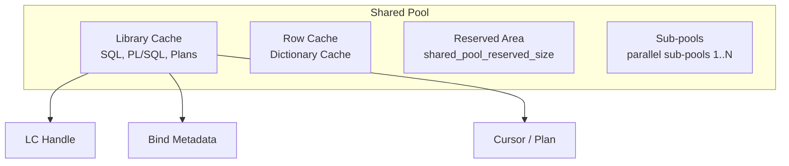

# Shared Pool

## Overview

The **Shared Pool** is the SGA region that caches parsed SQL, PL/SQL code, execution plans, data dictionary rows, and control structures. Every SQL statement lives here as a **library cache** entry. Every data dictionary lookup passes through the **row cache**. If the shared pool is undersized or fragmented, symptoms include `ORA-04031`, `library cache: mutex X` waits, and high hard-parse rates.

The shared pool is the second-most tuning-sensitive SGA area after the buffer cache. Fortunately, ASMM tunes it automatically for most workloads.

## Architecture



## Internal Working

### Library Cache

Every SQL statement (and PL/SQL block) gets a **library cache handle** identified by a hash of its text. Under the handle sit:

- The **parent cursor** — SQL text + basic metadata.
- One or more **child cursors** — each with a distinct execution plan (different bind types, session settings, or NLS parameters cause child proliferation).
- Bind variable metadata.
- The compiled plan tree.

Hard parse = create handle + child. Soft parse = find existing handle. Softer soft parse = session's session cursor cache already resolved the handle.

Fragmentation happens as objects invalidate (DDL on referenced table, statistics change, plan aging) and their chunks are freed; large objects allocated later may not find contiguous space.

### Dictionary (Row) Cache

Caches rows from `SYS`-owned tables: object definitions, privileges, sequences (`dc_sequences`), tablespaces. Missing rows are fetched via recursive SQL. Hit rate should be > 90% in steady state.

### Sub-pools

For large SGAs, Oracle splits the shared pool into **sub-pools** (`_kghdsidx_count`, default = CPU count / 4, capped at 7). Each sub-pool has its own free lists and latches, reducing contention.

`V$SGASTAT` shows per-sub-pool detail: `shared pool (1)`, `shared pool (2)`, etc.

### Latches and Mutexes

- **shared pool latch** — protects sub-pool free lists.
- **library cache latch** — protected the library cache in 10g.
- **Library cache mutexes** (11g+) — finer-grained, protect individual cursor operations.

### Reserved Area

`shared_pool_reserved_size` (default 5% of shared pool) is set aside for large allocations. Small allocations cannot use it, so a fragmented shared pool can still satisfy a big alloc.

## Components

| Component               | Purpose                       |
| ----------------------- | ----------------------------- |
| Library cache           | SQL + PL/SQL + plans          |
| Row cache               | Dictionary rows               |
| Reserved area           | Large-alloc safety net        |
| Sub-pools               | Concurrency partition         |
| Result cache (adjacent) | Cached function/query results |

## Important Parameters

| Parameter                   | Purpose                              |
| --------------------------- | ------------------------------------ |
| `shared_pool_size`          | Explicit floor (ASMM manages actual) |
| `shared_pool_reserved_size` | Reserved area                        |
| `cursor_sharing`            | EXACT / FORCE / SIMILAR (deprecated) |
| `open_cursors`              | Per-session cursor cap               |
| `session_cached_cursors`    | Session cursor cache size            |
| `_shared_pool_reserved_pct` | (hidden) reserved area %             |

## Important Views

| View                     | Purpose                              |
| ------------------------ | ------------------------------------ |
| `V$SGASTAT`              | Per-name allocations                 |
| `V$SHARED_POOL_ADVICE`   | Sizing advice                        |
| `V$LIBRARYCACHE`         | Library cache stats                  |
| `V$SQLAREA`, `V$SQL`     | Cached SQL                           |
| `V$SQL_SHARED_CURSOR`    | Reasons a child cursor did not share |
| `V$ROWCACHE`             | Row cache stats                      |
| `V$SHARED_POOL_RESERVED` | Reserved area free list              |
| `V$LIBRARY_CACHE_MEMORY` | LC memory pieces                     |

## Diagnostic Queries

```sql
-- Shared pool composition
SELECT pool, name, ROUND(bytes/1024/1024,1) AS mb
FROM   v$sgastat
WHERE  pool = 'shared pool' AND bytes > 100*1024*1024
ORDER  BY bytes DESC;

-- Library cache hit rate
SELECT namespace, gets, gethitratio, pins, pinhitratio, reloads, invalidations
FROM   v$librarycache
ORDER  BY gets DESC;

-- Row cache
SELECT parameter, gets, getmisses,
       ROUND(getmisses/DECODE(gets,0,1,gets)*100, 2) AS miss_pct
FROM   v$rowcache
WHERE  gets > 0
ORDER  BY miss_pct DESC
FETCH FIRST 10 ROWS ONLY;

-- Shared pool advice
SELECT shared_pool_size_for_estimate AS mb,
       shared_pool_size_factor AS factor,
       estd_lc_time_saved AS time_saved_secs
FROM   v$shared_pool_advice
ORDER  BY shared_pool_size_for_estimate;

-- Why did cursors not share?
SELECT sql_id, address, child_number,
       unbound_cursor, sql_type_mismatch, optimizer_mismatch,
       outline_mismatch, stats_row_mismatch, literal_mismatch,
       explain_plan_cursor, buffered_dml_mismatch, pdml_env_mismatch,
       inst_drtld_mismatch, slave_qc_mismatch, typecheck_mismatch,
       auth_check_mismatch, bind_mismatch, describe_mismatch,
       language_mismatch, translation_mismatch, insuff_privs
FROM   v$sql_shared_cursor
WHERE  sql_id = '&sql_id';

-- Session cursor cache hits
SELECT name, value FROM v$sysstat WHERE name LIKE '%cursor%';
```

## Common Issues

- **`ORA-04031: unable to allocate ... shared pool`** — Fragmentation or undersized pool. Immediate mitigation: `ALTER SYSTEM FLUSH SHARED_POOL;` (production-safe but wipes cache). Fix: enlarge shared pool, bind more (reduce cursors), pin large PL/SQL packages with `DBMS_SHARED_POOL.KEEP`.
- **`library cache: mutex X` waits** — Hot cursor being re-parsed. Often a bind issue or literal SQL causing extreme child cursor counts.
- **Excessive child cursors** — Look at `V$SQL_SHARED_CURSOR` for the sql_id.
- **Low library cache hit rate** — Literals instead of binds; force cursor sharing (`cursor_sharing=FORCE`) as a temporary measure, then fix the application.
- **Dictionary cache miss rate rising** — DDL storm; check for schema churn.

## Troubleshooting

1. `SELECT * FROM v$sgastat WHERE pool='shared pool' ORDER BY bytes DESC;` — is one bucket dominating?
2. Look at `V$SHARED_POOL_ADVICE`.
3. High mutex waits: find the hot sql_id via `V$SESSION.p2raw` while waiting.
4. `ORA-04031` in alert log includes the failing allocation size — hint at which pool component.
5. For persistent issues, set `_kghdsidx_count` to a higher value (with Oracle Support guidance) to add sub-pools.

## Best Practices

1. Use bind variables. Every literal is a hard parse.
2. Set `session_cached_cursors=100–200` — cheap latency win.
3. Never leave `cursor_sharing=FORCE` in place as a long-term fix — it hides bad application patterns.
4. Pin large PL/SQL packages at startup:
   ```sql
   EXEC dbms_shared_pool.keep('SYS.STANDARD','P');
   ```
5. Monitor `V$SQL_SHARED_CURSOR` for cursor bloat monthly.
6. `ORA-04031` is a warning, not a whim. Investigate root cause; don't just enlarge and forget.
7. Avoid unnecessary DDL — every ALTER TABLE invalidates cursors and floods the shared pool with new versions.

## Interview Questions

1. **Q:** What lives in the shared pool?
   **A:** Library cache (SQL, PL/SQL, plans), row cache (dictionary), reserved area, and control structures.

2. **Q:** What is a hard parse vs soft parse?
   **A:** Hard parse = full syntactic + semantic parse + optimization + new library cache entry. Soft parse = find existing entry. Softer soft parse = session cursor cache resolves the handle.

3. **Q:** What causes `ORA-04031`?
   **A:** Failure to allocate a chunk in the shared pool. Root causes: fragmentation, undersizing, or excessive child cursors.

4. **Q:** What is the row cache?
   **A:** The dictionary cache — rows from `SYS`-owned dictionary tables.

5. **Q:** What is a mutex, and how does it differ from a latch?
   **A:** Latches serialize larger regions; mutexes are lighter-weight per-object serialization used since 11g for the library cache. Mutex contention shows as `library cache: mutex X`.

6. **Q:** How would you diagnose excessive child cursors?
   **A:** `V$SQL_SHARED_CURSOR` — each `Y` in the columns indicates a mismatch reason (bind type, session settings, NLS, etc.).

## References

- Oracle Database Concepts 19c — Chapter 14, "Shared Pool"
- Oracle Database Performance Tuning Guide 19c — Shared Pool
- MOS Doc ID 62143.1 — Understanding and Tuning the Shared Pool
- MOS Doc ID 396940.1 — Troubleshooting ORA-04031
- Jonathan Lewis — _Oracle Core_, Chapter 7 — Parsing and Optimizing
