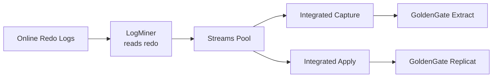

# Streams Pool

## Overview

The **Streams Pool** is the SGA area used by Oracle Streams, Oracle GoldenGate integrated capture, XStream, and internal replication features. It holds LogMiner buffers used to mine redo, staging queues for logical change records, and internal state.

Even if you do not run Streams or GoldenGate, some background components (`AQ`, certain LogMiner functions) will still touch the Streams pool. In modern deployments, GoldenGate integrated capture and integrated apply are the biggest consumers.

## Architecture



## Internal Working

The Streams pool caches:

- **LogMiner buffers** — decoded redo records ready for downstream consumption.
- **Capture message queues** — per-capture process staging.
- **Apply reader queues** — per-apply process staging.

Under ASMM, Oracle auto-sizes Streams pool if `streams_pool_size = 0` and Streams is active. In practice, GoldenGate integrated capture strongly recommends setting an explicit floor (`streams_pool_size = 1G` or larger).

## Components

| Component        | Purpose                            |
| ---------------- | ---------------------------------- |
| LogMiner buffer  | Decoded redo waiting for consumers |
| Capture queue    | Per-capture staging                |
| Apply queue      | Per-apply staging                  |
| AQ shared memory | Advanced Queuing structures        |

## Important Parameters

| Parameter                       | Purpose                                  |
| ------------------------------- | ---------------------------------------- |
| `streams_pool_size`             | Streams pool floor                       |
| `enable_goldengate_replication` | Required for GG integrated capture/apply |
| `_lm_share_lock_opt`            | (hidden) LogMiner optimizations          |

## Important Views

| View                                                     | Purpose                            |
| -------------------------------------------------------- | ---------------------------------- |
| `V$STREAMS_POOL_ADVICE`                                  | Sizing advice                      |
| `V$SGASTAT` (`pool='streams pool'`)                      | Current allocations                |
| `V$LOGMNR_STATS`                                         | LogMiner statistics                |
| `DBA_APPLY`, `DBA_CAPTURE`                               | Streams / integrated apply objects |
| `V$GOLDENGATE_CAPTURE`, `V$GOLDENGATE_APPLY_COORDINATOR` | GG integrated                      |

## Diagnostic Queries

```sql
-- Streams pool composition
SELECT name, ROUND(bytes/1024/1024, 1) AS mb
FROM   v$sgastat
WHERE  pool = 'streams pool'
ORDER  BY bytes DESC;

-- Advice
SELECT size_for_estimate AS mb,
       size_factor AS factor,
       estd_spill_count, estd_unspill_count
FROM   v$streams_pool_advice
ORDER  BY size_for_estimate;

-- GG integrated capture flow control
SELECT capture_name, state, total_messages_captured,
       total_messages_enqueued, apply_name
FROM   dba_capture;

-- Confirm GG replication enabled
SHOW PARAMETER enable_goldengate_replication;
```

## Common Issues

- **`ORA-01341: LogMiner out-of-memory`** — Streams pool too small for LogMiner working set. Enlarge.
- **GoldenGate abends `OGG-01031` with pool error** — Streams pool undersized or contention with other consumers.
- **`ORA-04031` on Streams pool** — Same fix: enlarge, or set floor under ASMM.
- **Capture lag growing** — Could be Streams pool pressure, redo I/O, or apply-side bottleneck. Correlate with `V$LOGMNR_STATS`.

## Troubleshooting

1. Monitor `V$SGASTAT` during peak capture activity — track growth.
2. `V$STREAMS_POOL_ADVICE` recommends how much to add.
3. GG-specific: `stats extract <name>` and Replicat lag reports.
4. If mixing GG integrated + classic capture, note memory usage differs — integrated captures consume Streams pool.

## Best Practices

1. If GoldenGate integrated capture/apply runs, set `streams_pool_size ≥ 1G` explicitly as a floor.
2. Set `enable_goldengate_replication=TRUE` before configuring GG.
3. For heavy replication, monitor `V$STREAMS_POOL_ADVICE` at least weekly.
4. Do not let ASMM whittle Streams pool below its steady-state use — pin it.
5. Log switches too frequent for capture → tune redo log sizes.

## Interview Questions

1. **Q:** What is the Streams pool for?
   **A:** LogMiner buffers, integrated capture/apply queues, GoldenGate integrated processes, and AQ.

2. **Q:** Do you need the Streams pool if no Streams / GG is running?
   **A:** Minimal use; some internal LogMiner features touch it. Default sizing is fine.

3. **Q:** What parameter enables GoldenGate integrated capture?
   **A:** `enable_goldengate_replication=TRUE`.

4. **Q:** How do you get sizing advice?
   **A:** `V$STREAMS_POOL_ADVICE`.

## References

- Oracle Streams Concepts and Administration
- Oracle Database GoldenGate Configuration Guide 19c
- MOS Doc ID 418755.1 — Streams Pool Sizing
- MOS Doc ID 2199829.1 — GoldenGate Integrated Extract Sizing
