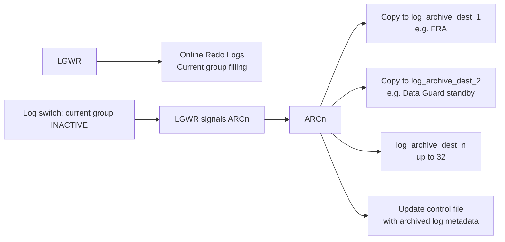

# ARCn — Archiver

## Overview

**ARCn** processes copy filled online redo log groups to the archive log destinations. Without ARCn keeping up with LGWR, the database eventually stalls: LGWR can't reuse the oldest online redo log because it hasn't been archived, triggering `log file switch (archiving needed)`.

ARCn runs only in **ARCHIVELOG** mode. In NOARCHIVELOG (rare — dev only), online redo logs are reused as they fill and no archive copy is made. Production Oracle should always be in ARCHIVELOG.

## Architecture



## Internal Working

### Process Naming

- `ora_arc0_<sid>` through `ora_arc<n>_<sid>` — archiver processes.
- Number controlled by `log_archive_max_processes` (default 4, max 30).
- In 12c+, additional roles: `LGWR` and ARCn cooperate for Data Guard redo transport; `TT00`–`TT29` are transport slaves.

### The Log-Switch Flow

1. LGWR fills the current online redo log group and switches to the next.
2. The previous group becomes **ACTIVE** (not yet checkpointed) or **INACTIVE** (checkpointed).
3. Once inactive, an ARCn process copies it to every enabled archive destination.
4. Only after all mandatory destinations succeed can the group be marked **REUSABLE** by LGWR.
5. If ARCn is slow or a destination is failing, LGWR eventually wraps around and blocks — `log file switch (archiving needed)`.

### Archive Destinations

Up to 32 (`log_archive_dest_1` through `log_archive_dest_32`). Each destination has attributes:

- `LOCATION=/path` or `SERVICE=standby_alias` for Data Guard
- `MANDATORY` vs `OPTIONAL`
- `VALID_FOR=(ONLINE_LOGFILE,PRIMARY_ROLE)` or various combinations for DG
- `MAX_FAILURE` — retries before giving up
- `REOPEN=n` — seconds before retrying a failed destination

FRA-based:

```sql
ALTER SYSTEM SET db_recovery_file_dest = '/u03/fra' SCOPE = SPFILE;
ALTER SYSTEM SET db_recovery_file_dest_size = 200G SCOPE = SPFILE;
ALTER SYSTEM SET log_archive_dest_1 = 'LOCATION=USE_DB_RECOVERY_FILE_DEST' SCOPE = SPFILE;
```

### RAC

Each RAC instance has its own redo thread and its own ARCn processes archiving that thread. All threads' archive logs are needed for recovery.

## Components

- `ora_arc0` .. `ora_arcn` — archivers.
- `TT00` .. `TT29` — redo transport slaves (Data Guard SYNC/ASYNC via LGWR).

## Important Parameters

| Parameter                      | Purpose                                |
| ------------------------------ | -------------------------------------- |
| `log_archive_dest_n`           | Destination n (1–32)                   |
| `log_archive_dest_state_n`     | ENABLE / DEFER / ALTERNATE             |
| `log_archive_format`           | Filename format, e.g. `%t_%s_%r.arc`   |
| `log_archive_max_processes`    | Max ARCn count                         |
| `log_archive_min_succeed_dest` | Minimum destinations that must succeed |
| `db_recovery_file_dest`        | FRA path                               |
| `db_recovery_file_dest_size`   | FRA size                               |
| `archive_lag_target`           | Force a log switch every N seconds     |

## Important Views

| View                          | Purpose                        |
| ----------------------------- | ------------------------------ |
| `V$ARCHIVE_DEST`              | Destination status             |
| `V$ARCHIVE_DEST_STATUS`       | Runtime status per destination |
| `V$ARCHIVED_LOG`              | Archive log metadata           |
| `V$LOG_HISTORY`               | Log switches (and archives)    |
| `V$RECOVERY_AREA_USAGE`       | FRA usage per file type        |
| `V$FLASH_RECOVERY_AREA_USAGE` | (10g compat alias for above)   |
| `V$ARCHIVE_PROCESSES`         | ARCn state                     |
| `V$INSTANCE.ARCHIVER`         | Current archiver state         |

## Diagnostic Queries

```sql
-- Archivelog mode?
SELECT log_mode FROM v$database;

-- ARCn state
SELECT * FROM v$archive_processes ORDER BY process;

-- Destinations
SELECT dest_id, dest_name, status, error, destination, target
FROM   v$archive_dest
WHERE  status <> 'INACTIVE'
ORDER  BY dest_id;

-- Recent archived logs
SELECT thread#, sequence#, first_time, blocks*block_size/1024/1024 AS mb,
       archived, applied, deleted, name
FROM   v$archived_log
WHERE  first_time > SYSDATE - 1
ORDER  BY first_time DESC;

-- FRA usage
SELECT file_type, percent_space_used, percent_space_reclaimable
FROM   v$recovery_area_usage;

-- Archive lag?
SELECT (SYSDATE - MAX(first_time)) * 24 AS hours_since_last_arch
FROM   v$archived_log
WHERE  dest_id = 1;
```

## Common Issues

- **`log file switch (archiving needed)`** — LGWR blocked waiting for ARCn to free a group. Causes: ARCn slow, destination full/unreachable, FRA full.
- **`ORA-00257: archiver error`** — FRA full or destination unreachable.
- **`ORA-19809: limit exceeded for recovery files`** — FRA size cap reached. Enlarge or clean up.
- **Data Guard standby destination failing** — Primary can pile up archives waiting to ship. Configure `log_archive_dest_state_n=DEFER` to unblock primary while fixing.
- **ARCn dies** — Not fatal to instance; but archiving stops. Alert log records; restart with `alter system archive log start`.

## Troubleshooting

1. `alert.log` — always the first check.
2. `V$ARCHIVE_DEST` shows per-destination error.
3. `V$RECOVERY_AREA_USAGE` shows FRA composition.
4. To unblock immediately: `alter system set log_archive_dest_state_2=DEFER;` (for a specific failing destination) or delete old archives after RMAN backup.
5. Never manually delete archive logs at OS level unless you have first told RMAN with `crosscheck archivelog all; delete expired archivelog all;`.

## Best Practices

1. Always run in ARCHIVELOG mode.
2. Direct archives to FRA — `log_archive_dest_1 = 'LOCATION=USE_DB_RECOVERY_FILE_DEST'`.
3. Size FRA at 3× largest daily archive volume, minimum.
4. RMAN backup archives frequently (every few hours for HA systems) with `DELETE INPUT`.
5. Set `log_archive_max_processes ≥ 4`. Increase for very high transaction rate.
6. Alert on `V$INSTANCE.ARCHIVER` != `STARTED`.
7. In Data Guard, monitor `V$ARCHIVE_DEST_STATUS.STATUS = VALID` for standby destinations.
8. `archive_lag_target = 900` (15 min) forces log switch at low activity — bounds Data Guard lag for quiet periods.

## Interview Questions

1. **Q:** What does ARCn do?
   **A:** Copies filled online redo logs to the archive destination(s).

2. **Q:** When does ARCn run?
   **A:** After a log switch, when the previous group becomes inactive.

3. **Q:** What is `log file switch (archiving needed)`?
   **A:** LGWR is waiting for ARCn to archive an online redo log before it can be reused.

4. **Q:** What's the FRA?
   **A:** Fast Recovery Area — a dedicated directory managed by Oracle for archives, backups, flashback logs, and control file autobackups.

5. **Q:** How many ARCn processes should I run?
   **A:** `log_archive_max_processes = 4` default is fine for most; raise for high transaction rates with slow destinations (Data Guard over WAN).

6. **Q:** What is `MANDATORY` vs `OPTIONAL` on a destination?
   **A:** Mandatory destinations must succeed before Oracle can reuse the online redo log. Optional destinations retry but don't block LGWR.

7. **Q:** What happens if the FRA fills?
   **A:** `ORA-00257` — archiver blocked. LGWR eventually blocks on `log file switch (archiving needed)`, and no new transactions can commit.

## References

- Oracle Database Backup and Recovery User's Guide 19c
- Oracle Database Concepts 19c — Archiving
- MOS Doc ID 371139.1 — Managing Archiving
- MOS Doc ID 305648.1 — What to do when the FRA is full
- Runbook: [Archive Destination Full](../../27-runbooks/archive-destination-full.md)
