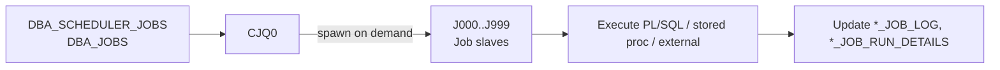

# CJQ0 — Job Queue Coordinator

## Overview

**CJQ0** is the coordinator for the DBMS_SCHEDULER (and legacy DBMS_JOB) framework. It wakes periodically, checks `DBA_SCHEDULER_JOBS` and `DBA_JOBS` for jobs due to run, and spawns **J0nn** slave processes to execute them.

If CJQ0 is inactive or `job_queue_processes = 0`, no scheduled jobs run — including built-in maintenance (stats gathering, AWR purging).

## Architecture



## Internal Working

CJQ0 wakes every 5 seconds (configurable). For each ready job, it spawns a J0nn slave (up to `job_queue_processes` concurrently). Slaves are ordinary Oracle processes with their own PGA — they connect as the job's owning schema.

Jobs failing raise an alert (via DBMS_SCHEDULER events) and update `DBA_SCHEDULER_JOB_RUN_DETAILS`.

## Components

- `ora_cjq0_<sid>` — coordinator.
- `ora_j000_<sid>` .. `ora_j999_<sid>` — slaves (spawned on demand).

## Important Parameters

| Parameter             | Purpose                                                   |
| --------------------- | --------------------------------------------------------- |
| `job_queue_processes` | Max concurrent job slaves (0 disables scheduler entirely) |
| `_job_queue_interval` | (hidden) coordinator wake interval                        |

## Important Views

| View                            | Purpose           |
| ------------------------------- | ----------------- |
| `DBA_SCHEDULER_JOBS`            | All defined jobs  |
| `DBA_SCHEDULER_RUNNING_JOBS`    | Currently running |
| `DBA_SCHEDULER_JOB_RUN_DETAILS` | Historical runs   |
| `DBA_SCHEDULER_JOB_LOG`         | Job event log     |
| `V$BGPROCESS`                   | CJQ0 PID          |

## Diagnostic Queries

```sql
-- Currently running jobs
SELECT job_name, session_id, running_instance, elapsed_time
FROM   dba_scheduler_running_jobs;

-- Recent failures
SELECT job_name, status, actual_start_date, run_duration, error#, additional_info
FROM   dba_scheduler_job_run_details
WHERE  status <> 'SUCCEEDED'
   AND actual_start_date > SYSDATE - 1
ORDER  BY actual_start_date DESC;

-- Broken jobs
SELECT owner, job_name, next_run_date, enabled, state
FROM   dba_scheduler_jobs
WHERE  state IN ('BROKEN','DISABLED');

-- Slot pressure
SELECT COUNT(*) AS running
FROM   dba_scheduler_running_jobs;
SHOW PARAMETER job_queue_processes;
```

## Common Issues

- **Jobs not running** — `job_queue_processes = 0` or CJQ0 dead. Check parameter and `V$BGPROCESS`.
- **Slot exhaustion** — All slaves busy; new jobs wait. Increase `job_queue_processes`.
- **Job hung** — Long-running procedure. `V$SESSION` for the slave shows current state; kill session to abort.
- **AUTOTASK not running** — Predefined maintenance jobs disabled. `dbms_auto_task_admin.enable`.

## Troubleshooting

1. Confirm `job_queue_processes > 0`.
2. `SELECT * FROM dba_scheduler_running_jobs;` — anything stuck?
3. Failed jobs: check `DBA_SCHEDULER_JOB_RUN_DETAILS.ADDITIONAL_INFO` for stack.
4. If AUTOTASK stopped, `SELECT client_name, status FROM dba_autotask_client;`.

## Best Practices

1. `job_queue_processes = 1000` (default in 19c) for most workloads. Adjust based on actual max concurrency.
2. Use DBMS_SCHEDULER, not DBMS_JOB (legacy).
3. Use job classes to group related jobs and control resource consumer group assignment.
4. Alert on `state=BROKEN` jobs.
5. For critical maintenance (stats gathering), monitor completion daily.

## Interview Questions

1. **Q:** What does CJQ0 do?
   **A:** Coordinates DBMS_SCHEDULER and DBMS_JOB — checks for ready jobs and spawns J0nn slaves.

2. **Q:** What is `job_queue_processes`?
   **A:** Max concurrent job slaves. Setting to 0 disables all scheduler jobs.

3. **Q:** How does DBMS_SCHEDULER differ from DBMS_JOB?
   **A:** SCHEDULER is the modern framework (12c+): supports programs, schedules, chains, resource groups. DBMS_JOB is legacy — avoid for new work.

4. **Q:** Where do job run histories live?
   **A:** `DBA_SCHEDULER_JOB_RUN_DETAILS`, retained per class settings.

5. **Q:** How do you disable Oracle's built-in nightly maintenance?
   **A:** `EXEC dbms_auto_task_admin.disable('sql tuning advisor', NULL, NULL);` (for a specific client).

## References

- Oracle Database Administrator's Guide 19c — DBMS_SCHEDULER
- Oracle Database Reference 19c — job_queue_processes
- MOS Doc ID 461140.1 — DBMS_SCHEDULER
