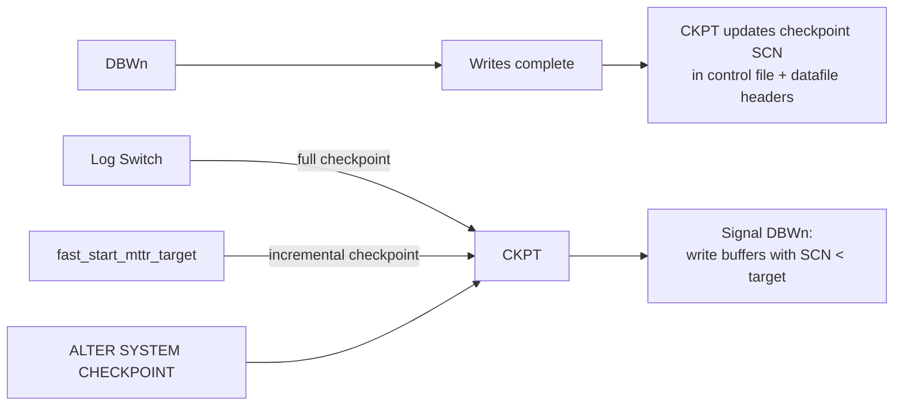

# CKPT — Checkpoint

## Overview

**CKPT** is the background process that manages checkpoints. A **checkpoint** is a point in time up to which all dirty buffers have been written to datafiles — so instance recovery starting from that SCN needs only newer redo. CKPT advances the checkpoint SCN in the control file and each datafile header when checkpoints complete.

CKPT does _not_ write data blocks itself — DBWn does. CKPT is the bookkeeper and signaler.

## Architecture



## Internal Working

### Checkpoint Types

- **Full checkpoint** — all dirty buffers must be written. Triggered by: log switch, `ALTER SYSTEM CHECKPOINT`, `SHUTDOWN NORMAL/IMMEDIATE`, `ALTER TABLESPACE ... OFFLINE`, `ALTER DATABASE BEGIN BACKUP`.
- **Incremental checkpoint** — continuous, low-intensity DBWn activity paced to satisfy `fast_start_mttr_target`. Most modern systems only ever see incremental checkpoints.
- **Object-level checkpoint** — for a single tablespace or datafile (`ALTER TABLESPACE ... OFFLINE`).
- **Thread checkpoint** — one RAC instance's redo thread.

### `fast_start_mttr_target`

Sets a target instance recovery time in seconds. Oracle computes how much redo can be replayed in that time and paces incremental checkpoints so redo since last checkpoint stays below that limit.

Trade-off: lower MTTR → more DBWn writes → potentially more I/O overhead but faster recovery.

### Control File and Datafile Header Updates

After DBWn confirms writes, CKPT updates:

1. **Control file** — records the current checkpoint SCN, thread checkpoint SCN.
2. **Datafile headers** — each datafile's header records its checkpoint SCN and log sequence.

This information is what SMON uses on next startup to know where to begin roll-forward.

## Components

Single background process: `ora_ckpt_<sid>`. RAC has one CKPT per instance.

## Important Parameters

| Parameter                  | Purpose                                                |
| -------------------------- | ------------------------------------------------------ |
| `fast_start_mttr_target`   | Target MTTR in seconds                                 |
| `log_checkpoint_interval`  | Legacy — redo blocks between checkpoints               |
| `log_checkpoint_timeout`   | Legacy — seconds between checkpoints                   |
| `log_checkpoints_to_alert` | Log checkpoint activity to alert log (diagnostic only) |

## Important Views

| View                  | Purpose                                               |
| --------------------- | ----------------------------------------------------- |
| `V$INSTANCE_RECOVERY` | Recovery target and estimate                          |
| `V$BGPROCESS`         | CKPT PID                                              |
| `V$DATAFILE_HEADER`   | Datafile checkpoint SCN + timestamp                   |
| `V$LOG_HISTORY`       | Log switch (and checkpoint) history                   |
| `V$SYSSTAT`           | `DBWR checkpoints`, `DBWR checkpoint buffers written` |

## Diagnostic Queries

```sql
-- Checkpoint SCNs per datafile
SELECT file#, name, checkpoint_change# AS ckpt_scn,
       checkpoint_time
FROM   v$datafile_header
ORDER  BY file#;

-- Recovery configuration
SELECT recovery_estimated_ios,
       actual_redo_blks, target_redo_blks,
       target_mttr, estimated_mttr,
       ckpt_block_writes, log_file_size_redo_blks
FROM   v$instance_recovery;

-- How many checkpoints happening?
SELECT name, value
FROM   v$sysstat
WHERE  name IN ('DBWR checkpoints',
                'DBWR checkpoint buffers written',
                'DBWR thread checkpoint buffers written');

-- Log switch frequency (each triggers a full checkpoint)
SELECT TO_CHAR(first_time,'YYYY-MM-DD HH24') AS hr,
       COUNT(*) AS switches
FROM   v$log_history
WHERE  first_time > SYSDATE - 1
GROUP  BY TO_CHAR(first_time,'YYYY-MM-DD HH24')
ORDER  BY 1;
```

## Common Issues

- **`log file switch (checkpoint incomplete)`** — DBWn didn't finish previous checkpoint before next log switch. Fix: enlarge log groups, add DBWn workers, or raise `fast_start_mttr_target`.
- **CKPT dies** — Instance crashes.
- **High DBWn writes** — Very low `fast_start_mttr_target` forcing aggressive checkpointing. Trade against RTO.
- **Wrong instance recovery MTTR estimate** — Advisory takes time to warm up after startup.

## Troubleshooting

1. `V$INSTANCE_RECOVERY.ESTIMATED_MTTR` tells you what recovery would take right now.
2. If log switches are frequent (< 10 minutes at peak), enlarge log groups.
3. `log_checkpoints_to_alert=TRUE` (temporarily) captures every checkpoint to alert log for diagnostic.
4. If DBWn is chronically busy, either storage is slow or MTTR is too aggressive.

## Best Practices

1. Set `fast_start_mttr_target` to your RTO in seconds (e.g., 300 seconds).
2. Ignore `log_checkpoint_interval` and `log_checkpoint_timeout` — legacy; leave at 0.
3. Size redo logs so switches occur every 15–20 minutes at peak.
4. Alert on `log file switch (checkpoint incomplete)`.
5. Do not manually issue `ALTER SYSTEM CHECKPOINT` in production except for specific maintenance — it forces a full checkpoint.

## Interview Questions

1. **Q:** What does CKPT do?
   **A:** Manages checkpoints: signals DBWn to write dirty buffers up to a target SCN, then updates the control file and datafile headers with the new checkpoint SCN.

2. **Q:** Does CKPT write data blocks?
   **A:** No — DBWn writes data blocks.

3. **Q:** What triggers a full checkpoint?
   **A:** Log switch, `ALTER SYSTEM CHECKPOINT`, clean shutdown, tablespace offline, hot backup begin.

4. **Q:** What's an incremental checkpoint?
   **A:** Continuous, low-intensity DBWn writes paced by `fast_start_mttr_target` so instance recovery stays within the MTTR budget.

5. **Q:** What is `fast_start_mttr_target`?
   **A:** Target instance recovery time in seconds. Oracle paces incremental checkpoints to meet it.

6. **Q:** If CKPT dies, what happens?
   **A:** Instance crashes; SMON recovers on next startup.

## References

- Oracle Database Concepts 19c — Checkpoints
- Oracle Database Performance Tuning Guide 19c
- MOS Doc ID 34381.1 — Checkpoint Tuning
- MOS Doc ID 76713.1 — What is fast_start_mttr_target
