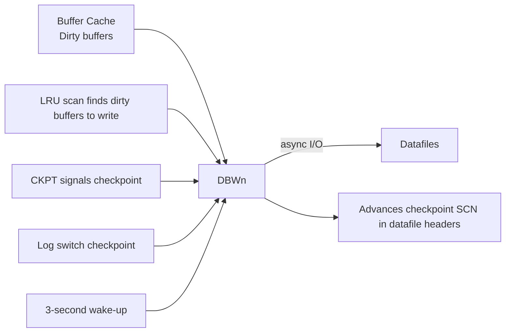

# DBWn — Database Writer

## Overview

**DBWn** (`ora_dbw0`, `ora_dbw1`, ...) writes dirty buffers from the buffer cache to the datafiles. It is one of the most performance-critical background processes: too few DBWn workers means dirty buffers accumulate, DBWn falls behind on checkpoints, and foreground processes hit `free buffer waits`.

The `n` in DBWn is the process index. Oracle can run 1 to 100 DBWn processes (`db_writer_processes`). Modern systems with fast storage usually need 2–4; NVMe / all-flash may benefit from more.

## Architecture



## Internal Working

DBWn is event-driven, not clock-driven. It writes when:

1. **A foreground can't find a free buffer** — DBWn is signaled to free some.
2. **CKPT triggers a checkpoint** — full or incremental.
3. **A log switch occurs** — implicit checkpoint.
4. **Every 3 seconds** — timeout-based idle write.
5. **Buffer count crosses a threshold** — proactive.

DBWn writes are **asynchronous** on Linux (`disk_asynch_io = TRUE`), meaning DBWn submits I/O and continues, checking for completion later. Older platforms without async I/O used I/O slave threads (`dbwr_io_slaves`).

### Multi-Block Writes

DBWn tries to gather **adjacent dirty buffers** and issue a single multi-block write when possible. Adjacency is checked by DBA (data block address) proximity.

### Checkpoint

CKPT identifies buffers to be written (based on `fast_start_mttr_target`), signals DBWn, then updates control file and datafile headers after DBWn confirms writes. This is how instance recovery time is bounded.

### Write Failures

If DBWn cannot write to a datafile (I/O error, missing disk):

- The block goes into `WRITE ERRORS` state.
- Alert log records `ORA-01115`, `ORA-01116`, or `ORA-27063`.
- DBWn retries; if persistent, instance may abort.

## Components

Multiple DBWn processes work independently:

- `ora_dbw0`, `ora_dbw1`, ..., `ora_dbw63` (up to 100 in 19c).
- Each is assigned a subset of the buffer cache LRU chains.

## Important Parameters

| Parameter                | Purpose                                                    |
| ------------------------ | ---------------------------------------------------------- |
| `db_writer_processes`    | Number of DBWn workers                                     |
| `dbwr_io_slaves`         | Async I/O emulation (legacy)                               |
| `disk_asynch_io`         | Enable async I/O (TRUE by default)                         |
| `fast_start_mttr_target` | Target recovery MTTR; controls incremental checkpoint pace |
| `_db_writer_max_writes`  | (hidden) max writes per pass                               |

## Important Views

| View                  | Purpose                                                                        |
| --------------------- | ------------------------------------------------------------------------------ |
| `V$BGPROCESS`         | DBWn PIDs                                                                      |
| `V$SYSSTAT`           | `physical writes`, `DBWR checkpoint buffers written`, `DBWR undo block writes` |
| `V$SYSTEM_EVENT`      | `db file parallel write` — DBWn's own wait event                               |
| `V$SESSION_WAIT`      | Foreground `free buffer waits`                                                 |
| `V$INSTANCE_RECOVERY` | Checkpoint pace                                                                |

## Diagnostic Queries

```sql
-- Physical write throughput
SELECT name, value
FROM   v$sysstat
WHERE  name IN ('physical writes',
                'physical writes direct',
                'DBWR checkpoint buffers written',
                'DBWR checkpoints',
                'DBWR undo block writes',
                'DBWR revisited being-written buffer');

-- DBWn wait
SELECT event, total_waits, time_waited, average_wait
FROM   v$system_event
WHERE  event LIKE 'db file parallel write%';

-- Foreground pressure symptoms
SELECT event, total_waits, time_waited
FROM   v$system_event
WHERE  event IN ('free buffer waits', 'write complete waits',
                 'log file switch (checkpoint incomplete)');

-- How many DBWn workers?
SELECT COUNT(*) FROM v$bgprocess WHERE name LIKE 'DBW%' AND paddr <> '00';
```

## Common Issues

- **`free buffer waits`** — DBWn can't keep up with foreground dirty-block creation. Add DBWn workers or faster storage.
- **`log file switch (checkpoint incomplete)`** — DBWn didn't finish previous checkpoint before next log switch. Enlarge redo logs or add DBWn workers.
- **`db file parallel write` high** — DBWn I/O latency. Move datafiles to faster storage.
- **`write complete waits`** — Foreground waiting for a specific dirty buffer to be written. Add DBWn workers.
- **DBWn dies** — Fatal — instance crashes.

## Troubleshooting

1. Compare `physical writes / second` with storage throughput capacity.
2. `db file parallel write` average > 20 ms suggests storage is the bottleneck.
3. If `free buffer waits` in top waits, increase `db_writer_processes` incrementally (2 → 4 → 8) and remeasure.
4. Confirm `disk_asynch_io = TRUE` on Linux.
5. If `filesystemio_options != SETALL` on ext4/xfs, DBWn is doing sync I/O — fix.

## Best Practices

1. **`db_writer_processes = 2–4`** for typical OLTP on modern all-flash storage. Scale for very large SGA (> 64 GB) to 8+.
2. **`filesystemio_options=SETALL`** for full O_DIRECT + async I/O on Linux filesystem-backed datafiles.
3. Use ASM — direct I/O, async by default.
4. Set `fast_start_mttr_target` to your RTO in seconds. Lower values mean more DBWn writes; balance against I/O headroom.
5. Alert on `free buffer waits` and `log file switch (checkpoint incomplete)`.
6. Avoid `dbwr_io_slaves` — legacy path.

## Interview Questions

1. **Q:** What does DBWn do?
   **A:** Writes dirty buffers from the buffer cache to datafiles.

2. **Q:** When does DBWn write?
   **A:** When a foreground can't find a free buffer, on checkpoint, on log switch, every 3 seconds, or when buffer counts cross thresholds.

3. **Q:** How many DBWn processes should I run?
   **A:** Start with 2–4 for OLTP. Scale up with SGA size and I/O concurrency. Measure `db file parallel write`.

4. **Q:** What does `free buffer waits` indicate?
   **A:** DBWn can't keep up. Add DBWn workers or improve storage.

5. **Q:** DBWn writes are synchronous or asynchronous?
   **A:** Asynchronous on Linux with `disk_asynch_io = TRUE`.

6. **Q:** Difference between DBWn and LGWR?
   **A:** DBWn writes data blocks (asynchronously, when convenient). LGWR writes redo (synchronously on commit).

## References

- Oracle Database Concepts 19c — Process Architecture
- Oracle Database Performance Tuning Guide 19c — I/O Configuration
- MOS Doc ID 34405.1 — DBWR Sizing
- MOS Doc ID 793845.1 — free buffer waits investigation
