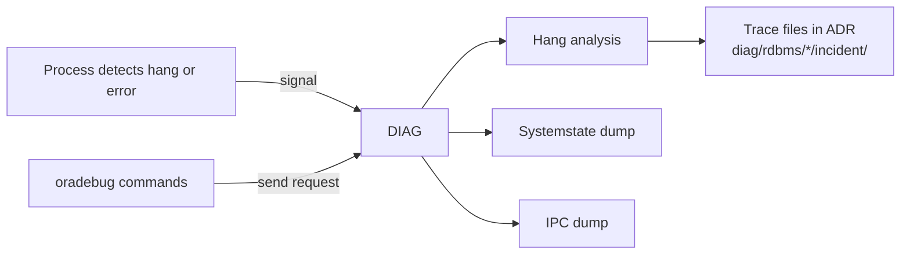

# DIAG — Diagnostic Process

## Overview

**DIAG** is the diagnostic process that captures **diagnostic dumps** — hang analysis, systemstate dumps, and process-death investigation. DIAG runs continuously and reacts to signals from other processes to take snapshots of internal state.

DIAG is the process behind `oradebug hanganalyze` and `oradebug dump systemstate`.

## Architecture



## Internal Working

DIAG wakes up when:

- Another process triggers a hang analysis (deadlock detection).
- A DBA runs `oradebug` commands.
- Instance error detection routines fire.

DIAG writes to the ADR (Automatic Diagnostic Repository) under `$ORACLE_BASE/diag/rdbms/<db>/<inst>/`:

- `trace/` — background process traces including DIAG's own.
- `incident/` — incident packages when critical errors detected.

### Hang Analysis

`oradebug hanganalyze <level>`:

- Level 1–3: quick summary
- Level 4: process detail
- Level 10: exhaustive

Produces a trace file with all wait chains.

### Systemstate Dump

`oradebug dump systemstate <level>`:

- Level 10: full dump of every session's state (huge!)
- Level 258: less verbose
- Level 266: memory + processes

Used by Oracle Support to diagnose complex hangs.

## Components

Single process: `ora_diag_<sid>`. Also `ora_dia0_<sid>` (specific role) and `ora_dbrm_<sid>` (database resource manager) in some releases.

## Important Parameters

- `diagnostic_dest` — root of ADR (default `$ORACLE_BASE`).
- `_hang_analysis_num_call_stacks` — (hidden) sample depth.

## Important Views

| View               | Purpose                      |
| ------------------ | ---------------------------- |
| `V$DIAG_ALERT_EXT` | Alert log via view           |
| `V$DIAG_INCIDENT`  | Incident metadata            |
| `V$DIAG_PROBLEM`   | Problems (grouped incidents) |
| `V$BGPROCESS`      | DIAG PID                     |

## Diagnostic Queries

```sql
-- Recent incidents
SELECT incident_id, problem_key, create_time, close_time, status
FROM   v$diag_incident
ORDER  BY create_time DESC
FETCH FIRST 20 ROWS ONLY;

-- Recent alerts
SELECT originating_timestamp, message_text
FROM   v$diag_alert_ext
WHERE  originating_timestamp > SYSDATE - 1/24
ORDER  BY originating_timestamp DESC
FETCH FIRST 30 ROWS ONLY;
```

```bash
# From OS
adrci
> show incident
> ips create package incident <id>
```

## Common Issues

- **DIAG dies** — Fatal; instance crashes.
- **ADR fills disk** — Retention configured too high or a bug generating floods of incidents. Purge with adrci: `purge -age 1440`.
- **Incident dumps not appearing** — DIAG hung or ADR write failing (disk full).

## Troubleshooting

1. Use `adrci` to browse incidents.
2. `adrci purge -age 43200` — purge > 30 days.
3. For deadlocks, DIAG's trace contains the wait chain.
4. Systemstate + hang analyze are heavy — only run when Oracle Support asks.

## Best Practices

1. Do not run `oradebug dump systemstate 10` casually — it can be gigabytes and may impact production.
2. `hanganalyze 3` is safer for initial diagnosis.
3. Set ADR retention to 30 days minimum via `adrci`.
4. Include ADR path in backup exclusion, but ensure disk is monitored for space.
5. When engaging Oracle Support, package incidents with `adrci ips create package`.

## Interview Questions

1. **Q:** What does DIAG do?
   **A:** Produces diagnostic dumps — hang analysis, systemstate, incident packages.

2. **Q:** What's the difference between `hanganalyze` and `systemstate`?
   **A:** `hanganalyze` shows wait chains and blocker relationships. `systemstate` dumps every session's full state — much larger, more detailed.

3. **Q:** Where does DIAG write?
   **A:** ADR under `$ORACLE_BASE/diag/rdbms/<db>/<inst>/`.

4. **Q:** What tool packages incidents for Support?
   **A:** `adrci` — `ips create package`.

## References

- Oracle Database Administrator's Guide 19c — Automatic Diagnostic Repository
- MOS Doc ID 452358.1 — ADRCI Usage
- MOS Doc ID 175006.1 — Systemstate Dumps
- MOS Doc ID 175006.1 — Hanganalyze command
