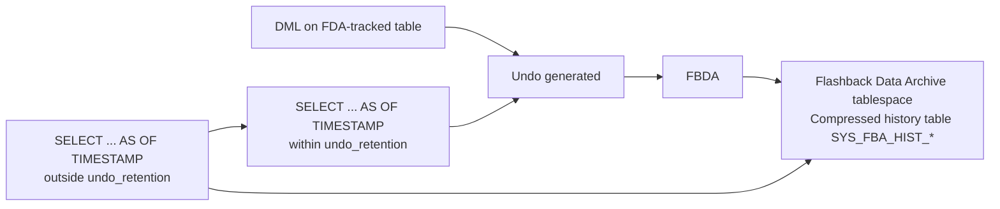

# FBDA — Flashback Data Archiver

## Overview

**FBDA** is the background process that maintains **Flashback Data Archive** (FDA). Also called **Total Recall** in earlier releases, FDA is a time-travel history mechanism: it retains changes to tracked tables for a user-defined retention (30 days, 5 years, etc.) so you can `SELECT ... AS OF TIMESTAMP` far into the past.

FBDA only runs when at least one Flashback Data Archive exists and at least one table is enabled for FDA.

## Architecture



## Internal Working

FBDA runs asynchronously (default every 5 minutes). It reads undo generated by tracked tables, extracts pre-images, and inserts them into internal history tables `SYS_FBA_HIST_<obj_id>` inside the configured FDA tablespace.

Once history is in the FDA:

- Queries `AS OF TIMESTAMP older_than_undo_retention` transparently redirect to the FDA history table.
- The history is compressed by default (Advanced Compression license required for read-only history compression).
- Retention is enforced automatically by FBDA (drops rows past retention).

### Configuration

```sql
-- Create FDA tablespace
CREATE TABLESPACE fda_ts DATAFILE '/u02/oradata/fda_ts.dbf' SIZE 10G;

-- Create archive
CREATE FLASHBACK ARCHIVE fda_5yr
  TABLESPACE fda_ts
  QUOTA 100G
  RETENTION 5 YEAR;

-- Enable tracking on a table
ALTER TABLE sales FLASHBACK ARCHIVE fda_5yr;

-- Query history
SELECT * FROM sales AS OF TIMESTAMP TO_TIMESTAMP('2024-01-15','YYYY-MM-DD');
```

## Components

- `ora_fbda_<sid>` — main process.
- `ora_fba_<n>_<sid>` — helper processes on very busy systems.

## Important Parameters

None user-tunable directly. Related:

- Licensed feature — Advanced Compression required for FDA history compression.
- `undo_retention` — bounds recent history in undo before FBDA archives it.

## Important Views

| View                           | Purpose                 |
| ------------------------------ | ----------------------- |
| `DBA_FLASHBACK_ARCHIVE`        | Defined archives        |
| `DBA_FLASHBACK_ARCHIVE_TABLES` | Tracked tables          |
| `DBA_FLASHBACK_ARCHIVE_TS`     | Tablespaces used        |
| `SYS_FBA_HIST_<obj_id>`        | Physical history tables |
| `V$BGPROCESS`                  | FBDA PID                |

## Diagnostic Queries

```sql
-- FBDA alive?
SELECT name, description, paddr FROM v$bgprocess WHERE name = 'FBDA';

-- Defined archives
SELECT flashback_archive_name, retention_in_days, status,
       archive_size_in_gb, quota_in_gb
FROM   dba_flashback_archive;

-- Tracked tables
SELECT owner_name, table_name, flashback_archive_name,
       archive_table_name, status
FROM   dba_flashback_archive_tables;

-- History table sizes
SELECT segment_name, ROUND(bytes/1024/1024/1024, 2) AS gb
FROM   dba_segments
WHERE  segment_name LIKE 'SYS_FBA_HIST_%'
ORDER  BY bytes DESC;
```

## Common Issues

- **FDA space filling** — Retention too long vs quota; FBDA can't prune fast enough. Enlarge tablespace or shorten retention.
- **`ORA-55617: Flashback Archive ... does not have sufficient privileges`** — Table owner needs FLASHBACK ARCHIVE ADMINISTER privilege.
- **DDL on tracked table restricted** — Some DDLs (renaming columns, dropping columns) require the FDA to be disabled first (or with FDA `NO KEEP DATA`).
- **Compression not applied** — Advanced Compression not licensed / not enabled.
- **FBDA lag** — Under heavy DML, FBDA can lag hours behind. Monitor `DBA_FLASHBACK_ARCHIVE_TABLES.STATUS`.

## Troubleshooting

1. `SELECT * FROM dba_flashback_archive` — is the archive `OPEN` state?
2. Check FBDA process alive.
3. If tablespace fills, `ALTER FLASHBACK ARCHIVE ... MODIFY TABLESPACE ADD DATAFILE` or reduce retention.
4. For DDL blocked: `ALTER TABLE ... NO FLASHBACK ARCHIVE;`, do DDL, re-enable.

## Best Practices

1. Use FDA for **compliance retention** (SOX, GDPR) — cheaper than triggers + shadow tables.
2. Size the FDA tablespace generously — 5–10× estimated annual growth.
3. Set retention aligned with data governance policy.
4. Use compression for large history tables (Advanced Compression license).
5. Monitor `SYS_FBA_HIST_*` growth monthly.
6. Do not track high-volume transient tables — history explodes.
7. Test the query pattern `AS OF TIMESTAMP` before relying on FDA in production.

## Interview Questions

1. **Q:** What does FBDA do?
   **A:** Maintains Flashback Data Archive history — extracts pre-images from undo into permanent history tables.

2. **Q:** What is FDA for?
   **A:** Long-term retention of table history for compliance and time-travel queries beyond undo retention.

3. **Q:** How is FDA different from Flashback Query?
   **A:** Flashback Query uses undo (short-term). FDA persists history in dedicated tablespace (long-term, years).

4. **Q:** What license does FDA need?
   **A:** Base FDA is included; **Advanced Compression** is needed for compressed history tables.

5. **Q:** What's the maximum retention?
   **A:** Unlimited — bounded only by tablespace quota.

## References

- Oracle Database Development Guide 19c — Flashback Data Archive
- MOS Doc ID 1461404.1 — FDA overview
- MOS Doc ID 2039884.1 — FDA best practices
