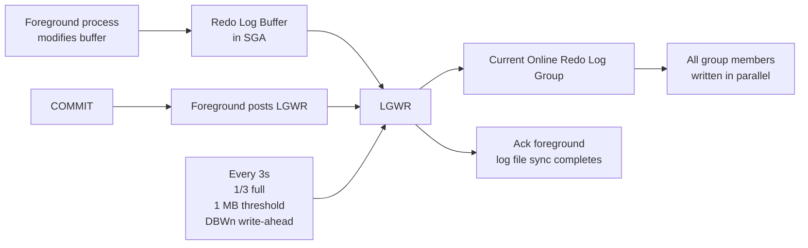

# LGWR — Log Writer

## Overview

**LGWR** is the Oracle background process that writes the redo log buffer to the current online redo log group. It is the process on which Oracle's durability guarantee depends: `COMMIT` returns only after LGWR confirms the redo is on disk. If LGWR is slow, every transaction pays the cost as `log file sync` waits.

## Architecture



## Internal Working

LGWR wakes and writes when:

1. **A session commits** — LGWR flushes and the foreground waits (`log file sync`).
2. **Redo log buffer is 1/3 full** or has 1 MB of redo.
3. **Every 3 seconds** — periodic write.
4. **Before DBWn writes a block whose redo is not yet on disk** — write-ahead protocol.

LGWR writes to **all members** of the current log group in parallel. If a member's disk is slow, LGWR is slow — hence redundancy pays a latency cost.

### 12c+ — LGnn Slave Processes

19c can run LGWR with multiple **slave processes** (`ora_lgnn_<sid>`, where nn = 00..99), enabled by `_use_single_log_writer = false` (default TRUE for most configurations, but 19c defaults to _scalable LGWR_ on many platforms). Slaves parallelize the redo write.

Modes:

- **Single-process** — legacy behavior; one LGWR process handles all writes.
- **Scalable LGWR** — LGWR distributes work to LG00..LGnn worker slaves. Recommended for high-throughput workloads.

### Commit Types

- **IMMEDIATE, WAIT** — default. `log file sync` blocks until write on disk.
- **IMMEDIATE, NOWAIT** — send redo but don't wait. Rare; used in specialized queuing.
- **BATCH, WAIT** — group commits; batches multiple sessions into one write.
- **BATCH, NOWAIT** — same as BATCH but async.

Application-level: `commit write batch nowait` (rare). System-level: `commit_write` init parameter (also rare).

### Redo Log Buffer

Set by `log_buffer` (default a few MB, can be up to hundreds of MB). LGWR flushes based on the triggers above. A larger buffer _does not_ reduce latency — LGWR flushes at commit regardless.

## Components

- `ora_lgwr_<sid>` — main LGWR process.
- `ora_lg00_<sid>` through `ora_lg99_<sid>` — scalable LGWR worker slaves (if enabled).
- `ora_lreg_<sid>` — separate process; not related.

## Important Parameters

| Parameter                | Purpose                                 |
| ------------------------ | --------------------------------------- |
| `log_buffer`             | Redo log buffer size (fixed at startup) |
| `commit_write`           | Global commit mode override             |
| `commit_wait`            | WAIT / NOWAIT                           |
| `commit_logging`         | IMMEDIATE / BATCH                       |
| `_use_single_log_writer` | (hidden) FALSE to enable scalable LGWR  |

## Important Views

| View             | Purpose                                       |
| ---------------- | --------------------------------------------- |
| `V$SYSSTAT`      | `redo size`, `redo write time`, `redo writes` |
| `V$SYSTEM_EVENT` | `log file sync`, `log file parallel write`    |
| `V$LOG`          | Log groups                                    |
| `V$LOGFILE`      | Log group members                             |
| `V$LOG_HISTORY`  | Log switch history                            |

## Diagnostic Queries

```sql
-- Redo throughput
SELECT name, value
FROM   v$sysstat
WHERE  name IN ('redo size',
                'redo entries',
                'redo writes',
                'redo write time');

-- log file sync and parallel write
SELECT event, total_waits, time_waited_micro/total_waits AS avg_us
FROM   v$system_event
WHERE  event IN ('log file sync', 'log file parallel write')
   AND total_waits > 0;

-- Recent log switches
SELECT thread#, sequence#, first_time, first_change#, next_change#
FROM   v$log_history
ORDER  BY first_time DESC
FETCH FIRST 20 ROWS ONLY;

-- Redo log groups and members
SELECT lg.group#, lg.thread#, lg.sequence#, lg.bytes/1024/1024 AS mb,
       lg.status, lf.member
FROM   v$log lg
JOIN   v$logfile lf ON lf.group# = lg.group#
ORDER  BY lg.group#;

-- Scalable LGWR slaves running?
SELECT name, description, paddr
FROM   v$bgprocess
WHERE  name LIKE 'LG%' AND paddr <> '00';
```

## Common Issues

- **High `log file sync`** — LGWR is slow. Causes: slow log disks, small log groups causing switches, CPU pressure on LGWR, network latency for standby-sync.
- **`log file switch (checkpoint incomplete)`** — Not LGWR's fault; DBWn is slow — but LGWR must wait for the next log group.
- **`log file switch (archiving needed)`** — ARCn can't keep up.
- **LGWR dies** — Instance crashes.

## Troubleshooting

1. Compare `log file sync` avg wait to `log file parallel write` avg wait:
   - Both high → storage latency.
   - Sync high, parallel-write low → CPU / post-processing latency, or Data Guard SYNC.
2. Check redo log disk latency at OS level (`iostat -x`).
3. Multiplex log members should be on independent, low-latency disks. Slow member = slow LGWR.
4. In Data Guard SYNC mode, primary LGWR waits for standby ack — long-distance link adds to `log file sync`.
5. Enable scalable LGWR for high transaction rates: `alter system set "_use_single_log_writer"=false scope=spfile;` then restart.

## Best Practices

1. Redo log files on lowest-latency storage available. NVMe or ASM `+REDO` diskgroup with HIGH redundancy.
2. Multiplex log groups: at least 2 members per group.
3. Size log groups for a switch every 15–20 minutes at peak load. Typical 1–4 GB per group.
4. Keep at least 3 groups per thread (per instance in RAC).
5. Enable scalable LGWR for OLTP with > 100 transactions/second.
6. Alert on `log file sync` avg > 20 ms.
7. Do not use commit write batch nowait unless the app is designed for possible loss of last uncommitted change on crash.

## Interview Questions

1. **Q:** What does LGWR do?
   **A:** Flushes the redo log buffer to the current online redo log group on commit, buffer threshold, timeout, and before DBWn writes.

2. **Q:** Why does commit wait for LGWR?
   **A:** Durability — the transaction is not durable until its redo is on disk. LGWR write must complete before `COMMIT` returns.

3. **Q:** What's the difference between `log file sync` and `log file parallel write`?
   **A:** `log file sync` is measured at the foreground (total wait for LGWR to finish). `log file parallel write` is measured at LGWR itself (just the I/O). Diff = LGWR CPU + queuing.

4. **Q:** Does a larger `log_buffer` improve throughput?
   **A:** Marginal — LGWR still flushes on commit. Larger buffer helps only if backlog builds between commits.

5. **Q:** What is scalable LGWR?
   **A:** 19c can run LGWR as a master coordinating worker slaves (`LG00..LG99`) for parallel redo writes.

6. **Q:** If a redo log member disk is slow, is LGWR slow?
   **A:** Yes — LGWR must wait for all members in the group to complete.

## References

- Oracle Database Concepts 19c — Log Writer
- Oracle Database Performance Tuning Guide 19c — Redo Log Configuration
- MOS Doc ID 34592.1 — LGWR: Tuning Recommendations
- MOS Doc ID 1376916.1 — Scalable LGWR
