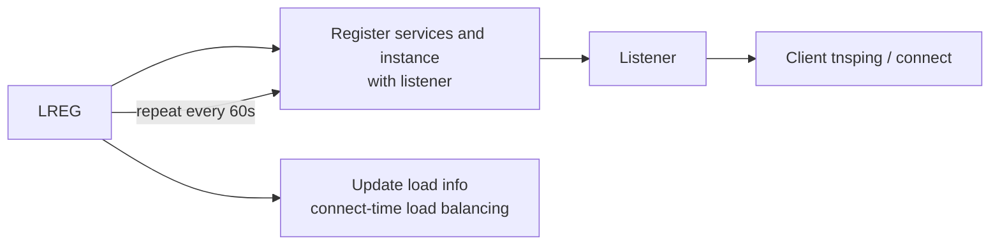

# LREG — Listener Registration

## Overview

**LREG** (Listener Registration) is the 12c+ background process that registers database services with configured listeners. Prior to 12c, PMON handled this. Splitting it out gives LREG its own life-cycle and clearer diagnostics: if services aren't visible from `lsnrctl services`, LREG is the first suspect.

## Architecture



## Internal Working

At startup and every 60 seconds, LREG:

1. Reads `service_names`, `instance_name`, and `local_listener` / `remote_listener`.
2. Connects to each listener (via IPC on the same host or TCP for remote listeners).
3. Registers **services**, **instance**, and current load metadata (connection count, load average).

This enables the listener to route incoming connections and perform **connect-time load balancing** in RAC.

### `LOCAL_LISTENER` and `REMOTE_LISTENER`

- `local_listener` — comma list of listener aliases (from `tnsnames.ora`) or an inline address. Usually the SCAN listener in RAC.
- `remote_listener` — additional listeners for CLB and TAF; usually the SCAN listener too.

### Manual Registration

```sql
-- Force LREG to register now
ALTER SYSTEM REGISTER;
```

Useful after starting a listener that came up after the instance.

## Components

Single process: `ora_lreg_<sid>`.

## Important Parameters

| Parameter         | Purpose                                             |
| ----------------- | --------------------------------------------------- |
| `service_names`   | Services this instance provides                     |
| `instance_name`   | Instance ID for registration                        |
| `local_listener`  | Local listener alias/address                        |
| `remote_listener` | Remote listener alias/address (usually SCAN in RAC) |
| `db_domain`       | Domain suffix appended to service_names             |

## Important Views

| View                     | Purpose                                  |
| ------------------------ | ---------------------------------------- |
| `V$BGPROCESS`            | LREG PID                                 |
| `V$ACTIVE_SERVICES`      | Currently registered services            |
| `V$SESSION.SERVICE_NAME` | Which service each session connected via |

## Diagnostic Queries

```sql
-- Registered services
SHOW PARAMETER service_names

SELECT name, network_name, creation_date
FROM   v$active_services
ORDER  BY name;

-- Verify listener knows about them
-- (from OS)
-- lsnrctl services
-- lsnrctl status

-- Which listener are we registering with?
SHOW PARAMETER local_listener
SHOW PARAMETER remote_listener
```

```bash
# From OS
lsnrctl status
lsnrctl services
```

## Common Issues

- **Services not registered** — LREG can't reach the listener. Check `local_listener` parameter and listener status.
- **Wrong service_names** — Application connecting to a service not defined here fails with `ORA-12514: TNS:listener does not currently know of service requested`.
- **Listener started after instance** — LREG will register on next cycle (up to 60s); or run `ALTER SYSTEM REGISTER;`.
- **Multiple listeners** — Set `local_listener='(ADDRESS_LIST=...)'` to comma list.

## Troubleshooting

1. `lsnrctl services` — do you see this instance and services?
2. If not, check listener alert log: `$ORACLE_HOME/network/log/listener.log`.
3. `V$ACTIVE_SERVICES` shows what LREG _should_ be registering.
4. `ALTER SYSTEM REGISTER;` to force retry.
5. Verify `local_listener` value:
   ```sql
   SELECT sys_context('userenv','local_listener') FROM dual; -- won't work; use SHOW PARAMETER
   ```

## Best Practices

1. Use `srvctl` or `dbms_service` to create and manage services — avoid the old `service_names` parameter alone.
2. In RAC, `local_listener` = node VIP listener; `remote_listener` = SCAN listener.
3. Alert on services disappearing from `V$ACTIVE_SERVICES`.
4. Check LREG registration after every listener restart.

## Interview Questions

1. **Q:** What does LREG do?
   **A:** Registers database services with listeners on behalf of the instance.

2. **Q:** Which older process did LREG take over from?
   **A:** PMON — in 12c+ this responsibility moved to LREG.

3. **Q:** How often does LREG register?
   **A:** Every 60 seconds; also on startup and on `ALTER SYSTEM REGISTER`.

4. **Q:** In RAC, what does `remote_listener` typically point to?
   **A:** SCAN listener addresses — enables connect-time load balancing.

5. **Q:** Why might `lsnrctl services` not show your instance?
   **A:** Listener down, wrong `local_listener` parameter, or LREG not running.

## References

- Oracle Database Net Services Administrator's Guide 19c
- MOS Doc ID 1957301.1 — LREG in 12c/19c
