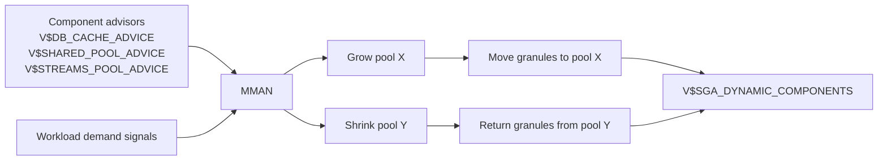

# MMAN — Memory Manager

## Overview

**MMAN** is the background process that performs SGA **component resizes** under ASMM (and PGA + SGA resizes under AMM). It reads sizing advisories, decides which pool to grow or shrink, and executes the granule reassignment.

Where MMON is the manageability _administrator_, MMAN is the memory _actor_.

## Architecture



## Internal Working

MMAN wakes periodically and evaluates:

1. **Advisor input** — each pool has an advisor view telling MMAN whether it would benefit from more memory (fewer physical reads, higher cache hit).
2. **Demand pressure** — pools hitting `ORA-04031` or having low free space accumulate priority.
3. **Floor constraints** — user-set floors (e.g., `db_cache_size = 8G`) are respected.

MMAN then computes a resize plan and executes it in granule increments. Grows are typically fast; shrinks are slower because active buffers must be flushed or moved.

### AMM Behavior

Under AMM, MMAN also moves memory between SGA and PGA within the `memory_target` budget. This is why AMM depends on `/dev/shm` on Linux — the SGA size can grow beyond initial allocation.

## Components

Single process: `ora_mman_<sid>`.

## Important Parameters

| Parameter                                                          | Purpose                    |
| ------------------------------------------------------------------ | -------------------------- |
| `sga_target`                                                       | ASMM budget                |
| `memory_target`                                                    | AMM budget                 |
| Individual pool floors (`db_cache_size`, `shared_pool_size`, etc.) | Prevent shrink below floor |

## Important Views

| View                          | Purpose                              |
| ----------------------------- | ------------------------------------ |
| `V$SGA_DYNAMIC_COMPONENTS`    | Current auto-managed sizes + history |
| `V$SGA_RESIZE_OPS`            | Every resize operation               |
| `V$SGA_CURRENT_RESIZE_OPS`    | Ongoing resizes                      |
| `V$MEMORY_DYNAMIC_COMPONENTS` | AMM view                             |
| `V$MEMORY_RESIZE_OPS`         | AMM resize history                   |
| `V$MEMORY_TARGET_ADVICE`      | AMM advice                           |

## Diagnostic Queries

```sql
-- MMAN alive?
SELECT name, description, paddr FROM v$bgprocess WHERE name = 'MMAN';

-- Recent resize actions
SELECT component, oper_type,
       initial_size/1024/1024 AS from_mb,
       target_size/1024/1024 AS to_mb,
       start_time, end_time, status
FROM   v$sga_resize_ops
ORDER  BY start_time DESC
FETCH FIRST 30 ROWS ONLY;

-- Any resize currently in progress?
SELECT component, oper_type, initial_size/1024/1024 AS from_mb,
       target_size/1024/1024 AS to_mb, start_time
FROM   v$sga_current_resize_ops;

-- Thrashing analysis: same component resized many times / day?
SELECT component, COUNT(*) AS resizes_last_day
FROM   v$sga_resize_ops
WHERE  start_time > SYSDATE - 1
GROUP  BY component
ORDER  BY 2 DESC;
```

## Common Issues

- **MMAN dies** — Fatal. Instance crashes.
- **Slow shrink** — Component with lots of active memory (buffer cache full of pinned buffers) is slow to shrink. Set floors to avoid emergency shrinks.
- **Thrashing** — Rapid grow/shrink between two components. Fix by setting explicit floors.

## Troubleshooting

1. `V$SGA_RESIZE_OPS.STATUS` may be `CANCELLED` or `ERROR` — investigate alert log.
2. If MMAN is idle when you expect resize, check `sga_target` isn't already at ceiling.
3. Confirm ASMM enabled: `SHOW PARAMETER sga_target` (nonzero) and `memory_target` (zero).

## Best Practices

1. Set explicit floors on shared pool and buffer cache to prevent thrash.
2. Set `sga_max_size = sga_target`.
3. In RAC, keep sizing identical across all instances.
4. Monitor `V$SGA_RESIZE_OPS` weekly after major workload changes.

## Interview Questions

1. **Q:** What does MMAN do?
   **A:** Resizes SGA components (and under AMM, moves memory between SGA and PGA) based on advisors and demand.

2. **Q:** What's the difference between MMAN and MMON?
   **A:** MMAN moves memory. MMON manages AWR / ADDM / alerts.

3. **Q:** What triggers MMAN resizes?
   **A:** Advisor recommendations, demand pressure (near-`ORA-04031`), or floor changes.

4. **Q:** Why would MMAN thrash?
   **A:** Two competing pools both grow and shrink each other. Fix with floors.

5. **Q:** If I set `db_cache_size = 4G` under ASMM, what happens?
   **A:** MMAN can grow buffer cache above 4G but never shrink below it — 4G is the floor.

## References

- Oracle Database Concepts 19c — Automatic Shared Memory Management
- Oracle Database Performance Tuning Guide 19c
- MOS Doc ID 295626.1 — Automatic SGA Memory Management
