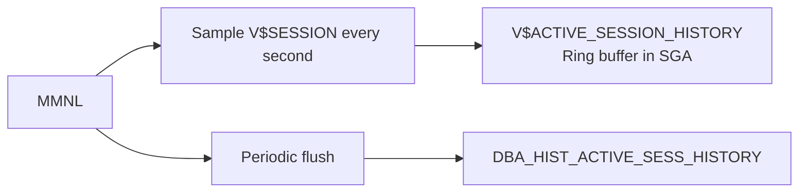

# MMNL — Manageability Monitor Light

## Overview

**MMNL** is the companion process to MMON. Where MMON runs long, coordinating tasks (AWR snapshots, ADDM, alerts), MMNL handles **short, fast, high-frequency** manageability work: sampling **Active Session History (ASH)**, computing per-second metrics, and other short-lived monitoring tasks.

Every DBA who has ever run `V$ACTIVE_SESSION_HISTORY` or an ASH report has consumed MMNL's output.

## Architecture



## Internal Working

### ASH — Active Session History

Once per second, MMNL scans `V$SESSION` and captures snapshots of every **active** session (session in `wait class != Idle` or currently on CPU). Each sample records:

- SID, SERIAL#, USERNAME, PROGRAM, MODULE, ACTION
- Current `sql_id`, `sql_child_number`, `sql_plan_hash_value`
- Current wait event, wait class, p1/p2/p3
- Object being accessed
- Blocking session (if any)

These samples land in a **ring buffer in the SGA** — `V$ACTIVE_SESSION_HISTORY`. Every 10th sample (default) is persisted to disk as part of the AWR snapshot into `DBA_HIST_ACTIVE_SESS_HISTORY`.

The ring buffer holds ~1 hour of samples on a typical system. Sampling frequency is not tunable in production (there are hidden params, but don't touch).

### Per-Second Metrics

MMNL populates `V$SYSMETRIC` (in-memory, most recent) and hands off to MMON for long-term rollups.

## Components

Single process: `ora_mmnl_<sid>`.

## Important Parameters

None user-tunable. Hidden:

- `_ash_sampling_interval` (ms, default 1000)
- `_ash_size` — ring buffer size

## Important Views

| View                           | Purpose                     |
| ------------------------------ | --------------------------- |
| `V$ACTIVE_SESSION_HISTORY`     | ASH ring buffer (in-memory) |
| `DBA_HIST_ACTIVE_SESS_HISTORY` | Persisted ASH (SYSAUX)      |
| `V$SYSMETRIC`                  | Per-second metrics          |
| `V$SYSMETRIC_HISTORY`          | Recent metric history       |
| `V$SYSMETRIC_SUMMARY`          | Longer-term aggregates      |

## Diagnostic Queries

```sql
-- Recent hot SQL from ASH (in-memory)
SELECT sql_id, COUNT(*) AS samples,
       COUNT(DISTINCT session_id) AS sessions
FROM   v$active_session_history
WHERE  sample_time > SYSDATE - 15/1440
GROUP  BY sql_id
ORDER  BY samples DESC
FETCH FIRST 20 ROWS ONLY;

-- Wait events over last hour
SELECT event, COUNT(*) AS samples
FROM   v$active_session_history
WHERE  sample_time > SYSDATE - 1/24
   AND event IS NOT NULL
GROUP  BY event
ORDER  BY samples DESC
FETCH FIRST 15 ROWS ONLY;

-- Blocking sessions in ASH
SELECT session_id, blocking_session, event, COUNT(*)
FROM   v$active_session_history
WHERE  blocking_session IS NOT NULL
   AND sample_time > SYSDATE - 1/24
GROUP  BY session_id, blocking_session, event
ORDER  BY 4 DESC;

-- MMNL alive?
SELECT name, description, paddr
FROM   v$bgprocess
WHERE  name = 'MMNL';
```

## Common Issues

- **ASH data missing** — MMNL dead or `statistics_level=BASIC`.
- **Truncated ASH** — Very busy system samples faster ring rotation; historical ASH only in DBA*HIST*.
- **RAC — GV$ASH** — In cluster, use `GV$ACTIVE_SESSION_HISTORY` to see all instances.

## Troubleshooting

1. Verify MMNL running via `V$BGPROCESS`.
2. `SELECT MIN(sample_time), MAX(sample_time) FROM v$active_session_history;` — how far back does the ring go?
3. If ASH is empty of user sessions, confirm `statistics_level = TYPICAL` and check Diagnostic Pack licensing (`control_management_pack_access`).

## Best Practices

1. Never disable MMNL — you lose real-time performance diagnostics.
2. Use `V$ACTIVE_SESSION_HISTORY` for the last hour; `DBA_HIST_ACTIVE_SESS_HISTORY` for older data.
3. In RAC, always query `GV$ACTIVE_SESSION_HISTORY`.
4. ASH is your first-line troubleshooting tool for "what was happening at 3:15 PM?".
5. Consider Compressed ASH or ASH Analytics (OEM) for long-term retention.

## Interview Questions

1. **Q:** What does MMNL do?
   **A:** Samples `V$SESSION` every second into the ASH ring buffer, computes per-second metrics, and hands off to MMON for AWR persistence.

2. **Q:** How often does ASH sample?
   **A:** Every 1 second by default.

3. **Q:** What's the difference between `V$ACTIVE_SESSION_HISTORY` and `DBA_HIST_ACTIVE_SESS_HISTORY`?
   **A:** `V$` is in-memory ring buffer (~1 hour). `DBA_HIST_` is persisted snapshots of 1-in-10 samples (weeks of data).

4. **Q:** How does ASH help troubleshooting?
   **A:** Shows what every active session was doing (SQL, wait event, blocker) at every second — enables retrospective diagnosis of performance issues.

5. **Q:** Is ASH licensed?
   **A:** Yes — Diagnostic Pack.

## References

- Oracle Database Performance Tuning Guide 19c — Active Session History
- Oracle Database Reference 19c — V$ACTIVE_SESSION_HISTORY
- MOS Doc ID 243132.1 — MMNL role
- Kyle Hailey — ASH and beyond
