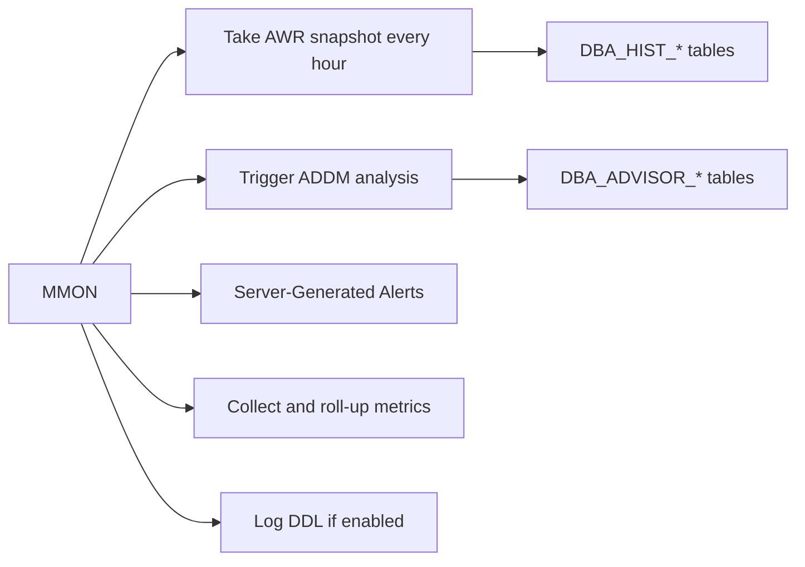

# MMON — Manageability Monitor

## Overview

**MMON** (Manageability Monitor) is the background process behind Oracle's manageability infrastructure: **AWR** snapshots, **ADDM** analysis, alert generation, threshold monitoring, and metric collection. If MMON hangs or is disabled, AWR stops capturing snapshots — a red flag for any DBA relying on historical performance data.

## Architecture



## Internal Working

MMON runs on a schedule (default 60-second intervals) and delegates work to **slave processes** (MMNL, plus MMON action slaves M000..M004).

- **AWR snapshots** — every hour by default (`dbms_workload_repository.modify_snapshot_settings`). Data comes from `V$SYSSTAT`, `V$SYSTEM_EVENT`, `V$OSSTAT`, and dozens of internal counters. Snapshots are written to `DBA_HIST_*` tables in SYSAUX.
- **ADDM** — after each snapshot, ADDM computes a diagnosis of the previous window.
- **Alerts** — MMON checks configured thresholds (`DBA_THRESHOLDS`) and generates events (`DBA_OUTSTANDING_ALERTS`, `DBA_ALERT_HISTORY`).
- **Metrics** — per-second, per-minute, per-hour rollups (`V$SYSMETRIC`, `V$SYSMETRIC_HISTORY`, `DBA_HIST_SYSMETRIC_*`).

### Retention

`AWR` snapshots default to 8 days retention. Set with:

```sql
EXEC dbms_workload_repository.modify_snapshot_settings(
       retention => 30 * 24 * 60,   -- 30 days in minutes
       interval  => 30);            -- every 30 minutes
```

## Components

- **MMON** — main manager.
- **MMNL** — Memory Manager Light (short-time metrics, per-second sampling).
- **M000..M004** — MMON action slaves.
- **MMAN** — Memory Manager (SGA resize actor — different process).

## Important Parameters

| Parameter                        | Purpose                                                      |
| -------------------------------- | ------------------------------------------------------------ |
| `statistics_level`               | TYPICAL (default) or ALL — must be TYPICAL or higher for AWR |
| `control_management_pack_access` | Enable Diagnostic + Tuning packs (license-gated)             |
| `awr_snapshot_time_offset`       | RAC-specific offset                                          |
| `_awr_flush_workload_gd_intvl`   | (hidden) internal                                            |

## Important Views

| View                     | Purpose                          |
| ------------------------ | -------------------------------- |
| `V$BGPROCESS`            | MMON PID                         |
| `DBA_HIST_WR_CONTROL`    | AWR retention/interval per DB ID |
| `DBA_HIST_SNAPSHOT`      | Snapshot metadata                |
| `DBA_ADVISOR_TASKS`      | ADDM task history                |
| `DBA_OUTSTANDING_ALERTS` | Current alerts                   |
| `DBA_ALERT_HISTORY`      | Historical alerts                |
| `V$SYSMETRIC_HISTORY`    | Recent metric samples            |

## Diagnostic Queries

```sql
-- AWR configuration
SELECT snap_interval, retention, most_recent_snap_time
FROM   dba_hist_wr_control;

-- Latest AWR snapshots
SELECT snap_id, begin_interval_time, end_interval_time, snap_flag
FROM   dba_hist_snapshot
ORDER  BY snap_id DESC
FETCH FIRST 20 ROWS ONLY;

-- Is MMON alive?
SELECT name, description, paddr FROM v$bgprocess WHERE name = 'MMON';

-- Outstanding alerts
SELECT reason, metric_value, message_text, suggested_action
FROM   dba_outstanding_alerts;

-- Any missed snapshots?
SELECT b.begin_interval_time, e.begin_interval_time,
       (e.begin_interval_time - b.begin_interval_time) * 24 * 60 AS minutes_gap
FROM   dba_hist_snapshot b
JOIN   dba_hist_snapshot e ON e.snap_id = b.snap_id + 1
WHERE  (e.begin_interval_time - b.begin_interval_time) > 1.5/24
ORDER  BY b.begin_interval_time DESC;
```

## Common Issues

- **AWR snapshots stopped** — MMON hung or `statistics_level` set to `BASIC`. Check `V$BGPROCESS` and alert log.
- **SYSAUX growth** — Long retention + heavy activity. Reduce retention or purge old snapshots (`dbms_workload_repository.drop_snapshot_range`).
- **`ORA-13541` when running ADDM** — Diagnostic Pack not enabled or not licensed.
- **Excessive M000 slave activity** — MMON is chasing many tasks; check for a plugin/PDB storm.

## Troubleshooting

1. `SELECT name, value FROM v$parameter WHERE name = 'statistics_level';` — must not be BASIC.
2. `SELECT * FROM dba_hist_wr_control;` — verify snap interval + retention.
3. Manually take a snapshot: `EXEC dbms_workload_repository.create_snapshot;`.
4. If MMON is deadlocked, `oradebug hanganalyze 4` to capture, then restart the instance.

## Best Practices

1. **`statistics_level = TYPICAL`** (never BASIC in production).
2. Retention 30 days minimum for capacity planning and postmortems.
3. Snapshot interval 30–60 minutes (default 60).
4. Diagnostic Pack license required for AWR/ASH/ADDM — confirm before deploying.
5. Monitor SYSAUX growth quarterly; purge old snapshots if space-constrained.
6. Alert on `V$DIAG_ALERT_EXT` messages about MMON errors.
7. AWR export for baseline: `dbms_workload_repository.export_awr` before major changes.

## Interview Questions

1. **Q:** What does MMON do?
   **A:** Manages AWR snapshots, ADDM runs, server alerts, and metric collection.

2. **Q:** How often does MMON take an AWR snapshot?
   **A:** Every 60 minutes by default; configurable via `dbms_workload_repository.modify_snapshot_settings`.

3. **Q:** What is `statistics_level=BASIC`?
   **A:** Disables AWR, ADDM, and most manageability features. Never use in production.

4. **Q:** Where do AWR snapshots live?
   **A:** `DBA_HIST_*` tables in SYSAUX tablespace.

5. **Q:** What is ADDM?
   **A:** Automatic Database Diagnostic Monitor — analyzes AWR snapshots and issues findings + recommendations.

6. **Q:** How do you take a manual snapshot?
   **A:** `EXEC dbms_workload_repository.create_snapshot;`.

## References

- Oracle Database Performance Tuning Guide 19c — Automatic Performance Statistics
- Oracle Database Reference 19c — AWR views
- MOS Doc ID 748642.1 — MMON Slaves
- MOS Doc ID 754639.1 — AWR troubleshooting
