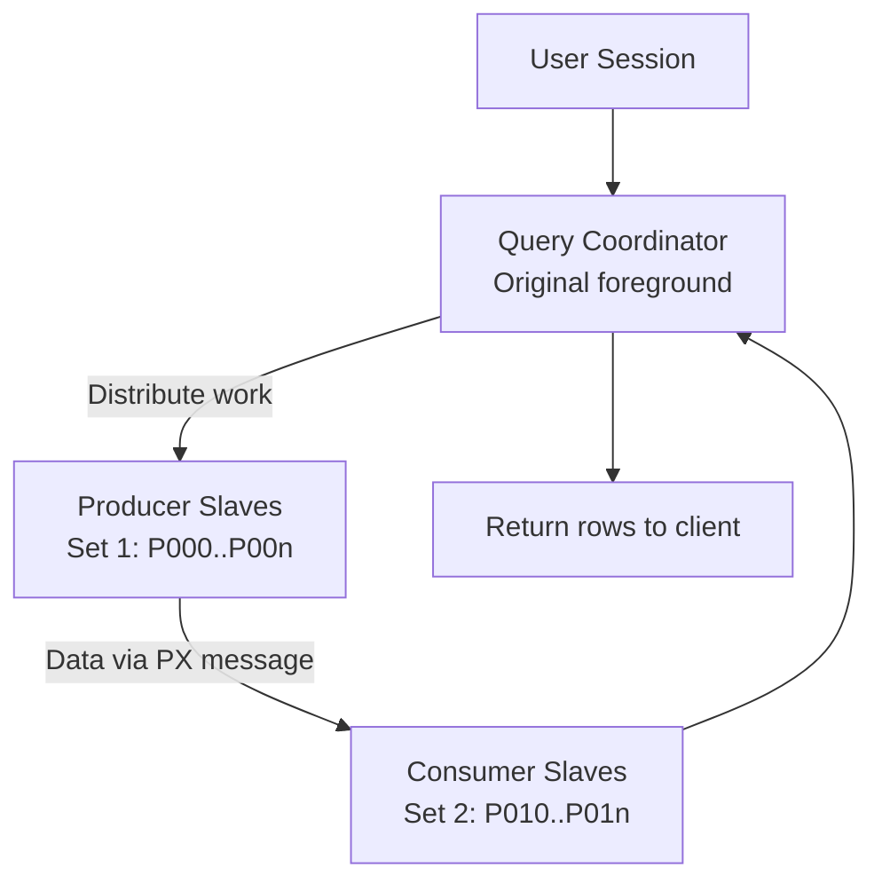

# Parallel Execution — Query Coordinator and Slaves

## Overview

**Parallel Execution** (PX) uses multiple worker processes to divide a SQL statement's work across CPUs and I/O channels. A **Query Coordinator (QC)** is the foreground session that issued the SQL. It hands the query out to **PX slaves** (also called PX servers) — `P000` through `P999` — that execute subordinate operations and hand results back to the QC.

PX is the primary weapon for DW/reporting workloads. It is also a common source of self-inflicted contention when misapplied to OLTP.

## Architecture



## Internal Working

### Degree of Parallelism (DOP)

- **Manual DOP** — hint (`/*+ PARALLEL(t 4) */`) or table-level (`ALTER TABLE t PARALLEL 4`).
- **Auto DOP** — 11.2+, decided by optimizer based on I/O cost. Enabled with `parallel_degree_policy=AUTO` (or MANUAL/LIMITED/ADAPTIVE).

### Slave Sets

Complex plans use two slave sets (producers and consumers). Data flows producer → consumer via **PX message buffers** (from large pool). Wait events `PX Deq: reap credit`, `PX Deq Credit: send blkd` describe inter-slave stalls.

### PQ_DISTRIBUTE

Producer-consumer distribution method (`HASH`, `BROADCAST`, `RANGE`, `PARTITION`) affects how rows split between slaves. Wrong distribution → skewed slaves and long-running query.

### In-Memory PX

For In-Memory Column Store (IMCS), PX slaves are automatically CPU-aware.

## Components

- **QC** — original foreground.
- **PX Slaves** — `ora_p000` .. `ora_pnnn`. Spawned from `parallel_min_servers` pool.
- **PX Coordinator background** — no dedicated process; QC coordinates.

## Important Parameters

| Parameter                         | Purpose                                     |
| --------------------------------- | ------------------------------------------- |
| `parallel_max_servers`            | Cap on total PX slaves per instance         |
| `parallel_min_servers`            | Pre-spawned pool (fast start)               |
| `parallel_degree_policy`          | MANUAL / LIMITED / AUTO / ADAPTIVE          |
| `parallel_degree_limit`           | Cap on DOP under AUTO                       |
| `parallel_execution_message_size` | Message buffer size (default 16 KB)         |
| `parallel_min_time_threshold`     | Auto DOP kicks in above this cost           |
| `parallel_servers_target`         | Statement Queue threshold                   |
| `parallel_min_percent`            | Fail if this % of requested DOP unavailable |

## Important Views

| View                   | Purpose                                       |
| ---------------------- | --------------------------------------------- |
| `V$PX_PROCESS`         | Slave state                                   |
| `V$PX_PROCESS_SYSSTAT` | Slave activity summary                        |
| `V$PX_SESSION`         | PX slaves per QC                              |
| `V$PQ_SESSTAT`         | PX session statistics                         |
| `V$PQ_SLAVE`           | Per-slave counters                            |
| `V$SYSSTAT`            | `Parallel operations downgraded ...` counters |

## Diagnostic Queries

```sql
-- Current PX slave usage
SELECT status, COUNT(*)
FROM   v$px_process
GROUP  BY status;

-- Active PX queries
SELECT qcsid, qcinst_id, qcserial#,
       server_group, server_set, server#,
       degree, req_degree
FROM   v$px_session
ORDER  BY qcsid;

-- PX-friendly SQL statistics (auto DOP)
SELECT name, value FROM v$sysstat WHERE name LIKE 'Parallel%';

-- Common downgrades
SELECT name, value FROM v$sysstat
WHERE  name IN ('Parallel operations downgraded to serial',
                'Parallel operations downgraded 1 to 25 pct',
                'Parallel operations downgraded 25 to 50 pct',
                'Parallel operations downgraded 50 to 75 pct',
                'Parallel operations downgraded 75 to 99 pct');
```

## Common Issues

- **PX slave shortage** — DOP downgraded or `ORA-12827`. Increase `parallel_max_servers` or wait.
- **Skewed slaves** — One slave does 90% of work. Fix: better statistics, different `PQ_DISTRIBUTE`, or partition redesign.
- **Excessive PX inter-slave waits** — `PX Deq Credit: send blkd`. Undersized message buffers or overloaded consumers.
- **PX for OLTP** — Sub-second queries with `parallel` hint spend more on setup than execution.
- **RAC — cross-instance PX** — Parallel query spanning nodes uses interconnect heavily. Use `parallel_force_local=TRUE` to keep slaves on one instance.

## Troubleshooting

1. `V$PX_PROCESS.STATUS = 'BUSY'` — currently working; `IDLE` in pool.
2. AWR "Parallel Execution" section shows downgrades, DOP distribution.
3. `V$SQL_MONITOR` shows PX plan with per-operator stats and slave contribution.
4. For skew, look at `V$PQ_TQSTAT` (per table-queue statistics) after query completes.

## Best Practices

1. Use PX for DW and long-running batch. Do **not** use for OLTP.
2. Prefer table-level `PARALLEL 8` (or degree matching CPU count) over per-query hints for consistency.
3. Under `parallel_degree_policy=AUTO`, let Oracle decide.
4. Set `parallel_max_servers = 2 × CPU × instances` as a starting point.
5. Enable statement queuing (`parallel_servers_target < parallel_max_servers`) to throttle rather than downgrade.
6. In RAC, limit parallel queries to one instance (`parallel_force_local=TRUE`) unless doing very large scans.
7. Monitor downgrade counters in AWR — indicates PX pressure.
8. Watch out for PX and locking — parallel DML acquires table-level locks.

## Interview Questions

1. **Q:** What is DOP?
   **A:** Degree of Parallelism — number of slave processes used by a PX operation.

2. **Q:** Producer vs consumer slaves?
   **A:** Producers do work then hand data via PX messages; consumers receive and continue. Together they form pipeline stages of a parallel plan.

3. **Q:** What causes PX downgrade?
   **A:** Insufficient available slaves in `parallel_max_servers` at execution time.

4. **Q:** What is statement queuing?
   **A:** When `parallel_servers_target < parallel_max_servers`, above target the statement queues instead of downgrading.

5. **Q:** How do you view PX activity per query?
   **A:** `V$SQL_MONITOR` (Real-Time SQL Monitoring, EE + Tuning Pack).

6. **Q:** When should you NOT use PX?
   **A:** OLTP short queries — setup cost exceeds run time. Also small tables.

## References

- Oracle Database VLDB and Partitioning Guide 19c
- Oracle Database Performance Tuning Guide 19c — Parallel Execution
- MOS Doc ID 203238.1 — Understanding Parallel Execution
- MOS Doc ID 1620444.1 — Auto DOP and In-Memory Parallel
