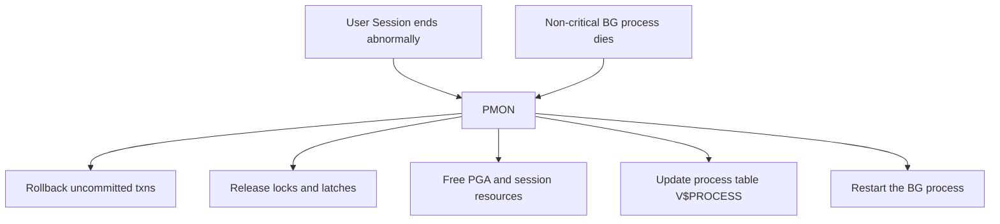

# PMON — Process Monitor

## Overview

**PMON** is the Oracle background process responsible for cleaning up abnormally terminated user processes and restarting failed background processes. It is one of the mandatory background processes: if PMON dies, the instance crashes.

In 12c+, PMON's original role was subdivided across specialized processes (`PMAN`, `CLMN` in cluster) — but the classic PMON remains the anchor of session cleanup.

## Architecture



## Internal Working

PMON wakes up on a schedule (every 3 seconds by default) and:

1. **Scans the process table** for dead foreground processes (those whose OS process disappeared).
2. **Rolls back** their transactions using undo.
3. **Releases** their locks (via `V$LOCK`), latches, and enqueues.
4. **Cleans up** PGA/UGA memory.
5. **Updates** `V$SESSION` — session removed.
6. **Restarts** non-critical background processes if they die (dispatcher, shared server).

For critical processes (SMON, DBWn, LGWR, CKPT), death is fatal — the instance crashes and SMON does instance recovery on next startup.

### PMON vs LREG

Historically PMON registered services with the listener. In 12c+, that role moved to **LREG** (Listener Registration). PMON no longer registers.

## Components

Not applicable — PMON is a single OS process.

## Important Parameters

None directly. Indirectly:

- `processes` — Cap on total OS processes; PMON is one of them.

## Important Views

| View          | Purpose                                                   |
| ------------- | --------------------------------------------------------- |
| `V$BGPROCESS` | PMON's PID and description                                |
| `V$PROCESS`   | All OS processes; PMON is here                            |
| `V$SESSION`   | Sessions PMON is cleaning up (`type='USER'` disappearing) |

## Diagnostic Queries

```sql
-- Confirm PMON is running
SELECT name, description, paddr FROM v$bgprocess WHERE name = 'PMON';

-- OS PID
SELECT p.spid, p.pid, p.username
FROM   v$process p, v$bgprocess bg
WHERE  bg.name = 'PMON' AND p.addr = bg.paddr;
```

```bash
# OS view
ps -ef | grep -w ora_pmon_<SID>
```

## Common Issues

- **PMON dies** — Instance crashes. Alert log shows `PMON: terminating instance`. Root causes usually in the alert log's next entries (usually an underlying error).
- **PMON slow** — Session cleanup delays under heavy churn (kill storms). Rare.
- **Zombie sessions** — Sessions marked `KILLED` in `V$SESSION` but not gone. PMON is stuck waiting for the OS process to die. Check with `ps -ef` for the SPID.

## Troubleshooting

1. Alert log is the first stop for any PMON incident.
2. `select spid from v$process where addr = (select paddr from v$session where sid = X and status='KILLED');` then `kill -9 <spid>` at OS level to force PMON cleanup.
3. If PMON keeps dying, engage Oracle Support with the trace file under `$ORACLE_BASE/diag/rdbms/<db>/<inst>/trace/`.

## Best Practices

1. Alert on any PMON death.
2. For long-lived KILLED sessions, `ALTER SYSTEM KILL SESSION 'sid,serial#' IMMEDIATE;` and OS-level `kill` if needed.
3. Do not confuse PMON with SMON — SMON does instance recovery; PMON does session cleanup.

## Interview Questions

1. **Q:** What does PMON do?
   **A:** Cleans up abnormally terminated foreground processes: rolls back their transactions, releases locks and latches, frees memory, updates `V$SESSION`.

2. **Q:** What happens if PMON dies?
   **A:** The instance crashes. SMON handles recovery on next startup.

3. **Q:** In 12c+, does PMON register services with the listener?
   **A:** No — LREG does that now.

4. **Q:** What's the difference between PMON and SMON?
   **A:** PMON cleans up dead sessions in a running instance. SMON does instance recovery at startup and periodic housekeeping.

5. **Q:** Why is a KILLED session sometimes stuck?
   **A:** PMON is waiting for the OS process to exit. Kill it at OS level (`kill -9 <spid>`).

## References

- Oracle Database Concepts 19c — Process Architecture
- MOS Doc ID 1076242.1 — Background Processes 12c/19c
