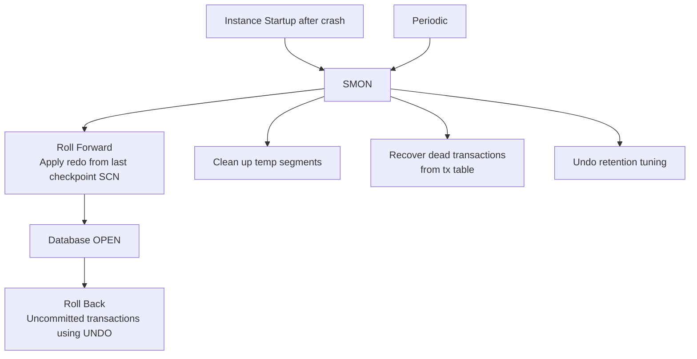

# SMON — System Monitor

## Overview

**SMON** is the Oracle background process that performs **instance recovery** at startup after a crash or `SHUTDOWN ABORT`, cleans up temporary segments, coalesces free space in dictionary-managed tablespaces (historic), and handles background maintenance tasks. It is a mandatory background process; if SMON dies, the instance crashes.

Instance recovery is SMON's most visible function: after a crash, on startup SMON reads redo from the last checkpoint SCN forward, replays it against the datafiles, then rolls back any uncommitted transactions using undo.

## Architecture



## Internal Working

### Instance Recovery

After an `ABORT` or crash:

1. `STARTUP` allocates SGA and starts SMON.
2. At OPEN, SMON reads the control file to find the last checkpoint SCN.
3. SMON walks forward through online redo logs, applying every change vector to the datafiles.
4. Committed transactions are now durable — this is the **roll-forward phase**.
5. Database opens (`ALTER DATABASE OPEN`).
6. SMON continues in the background to **roll back** uncommitted transactions using undo. Users can query and modify data during this phase.

### Temporary Segment Cleanup

When a query allocates space in TEMP tablespace and the session dies (or query completes), those temp segments must be released. SMON does this periodically.

### Dead Transaction Recovery

If a session died during a transaction and PMON couldn't complete rollback (e.g., undo unavailable), the transaction is marked "dead" and SMON continues rollback whenever undo becomes accessible.

### Free Space Coalescing (Legacy)

For dictionary-managed tablespaces (rare in modern databases), SMON periodically coalesces adjacent free extents. Locally-managed tablespaces (default since 10g) don't need this.

## Components

Not applicable — SMON is a single OS process.

## Important Parameters

| Parameter                | Purpose                                  |
| ------------------------ | ---------------------------------------- |
| `fast_start_mttr_target` | Target instance recovery time in seconds |
| `_smu_debug_mode`        | (hidden) undo debug                      |

## Important Views

| View                  | Purpose                              |
| --------------------- | ------------------------------------ |
| `V$INSTANCE_RECOVERY` | Recovery target and current position |
| `V$RECOVERY_PROGRESS` | Live progress during recovery        |
| `V$BGPROCESS`         | SMON PID                             |
| `V$DIAG_ALERT_EXT`    | SMON messages in alert log           |

## Diagnostic Queries

```sql
-- Instance recovery configuration
SELECT recovery_estimated_ios,
       actual_redo_blks, target_redo_blks,
       target_mttr, estimated_mttr,
       ckpt_block_writes, log_file_size_redo_blks
FROM   v$instance_recovery;

-- If recovery is currently running
SELECT type, item, sofar, total, units, timestamp
FROM   v$recovery_progress
ORDER  BY start_time DESC;

-- SMON alert log messages
SELECT originating_timestamp, message_text
FROM   v$diag_alert_ext
WHERE  message_text LIKE '%SMON%'
   OR  message_text LIKE '%recovery%'
ORDER  BY originating_timestamp DESC
FETCH FIRST 20 ROWS ONLY;
```

## Common Issues

- **Long startup after ABORT** — Instance recovery replaying redo. Duration bounded by redo since last checkpoint × apply rate. Reduce with lower `fast_start_mttr_target` (more frequent checkpoints).
- **SMON dies** — Instance crashes. Look for underlying `ORA-00600` in alert log.
- **Long-running dead transaction rollback** — After a big DML crashed, SMON rolls back in background. See `V$FAST_START_TRANSACTIONS`.
- **Temp segments not cleaned up** — Rare; usually a session bug leaving orphan segments. Check `DBA_SEGMENTS` for `TEMPORARY` segments in permanent tablespaces.

## Troubleshooting

1. `V$INSTANCE_RECOVERY.ESTIMATED_MTTR` — expected time to recover in a crash.
2. Startup slow? `V$RECOVERY_PROGRESS` shows redo apply progress live.
3. If SMON is stuck rolling back a huge transaction, `V$FAST_START_TRANSACTIONS.UNDOBLOCKSDONE / UNDOBLOCKSTOTAL` shows progress.
4. Set `fast_start_parallel_rollback = HIGH` to accelerate large rollbacks.

## Best Practices

1. Set `fast_start_mttr_target` to a value that meets your RTO (e.g., 300 seconds for 5-min recovery).
2. Do not manually kill SMON — instance crash.
3. After an ABORT, expect a longer-than-normal startup; do not prematurely intervene.
4. Alert on any SMON death event.
5. For long-running batches you may need to roll back, plan a controlled shutdown (`IMMEDIATE`, not `ABORT`) — Oracle rolls back in the foreground with more visibility.

## Interview Questions

1. **Q:** What does SMON do at startup?
   **A:** Performs instance recovery — roll forward with redo, then roll back uncommitted transactions with undo.

2. **Q:** Roll forward vs roll back — order?
   **A:** Roll forward first (before OPEN). Roll back happens in background after OPEN.

3. **Q:** What's `fast_start_mttr_target`?
   **A:** Target seconds for instance recovery. Lower value = more frequent checkpoints (more DBWn writes, less redo to replay).

4. **Q:** What kills SMON?
   **A:** Usually an internal error (`ORA-00600`) or resource exhaustion. Instance crashes.

5. **Q:** Who cleans up temp segments?
   **A:** SMON — periodically.

6. **Q:** How do you accelerate rollback of a huge dead transaction?
   **A:** `ALTER SYSTEM SET FAST_START_PARALLEL_ROLLBACK = HIGH;` — uses parallel slaves.

## References

- Oracle Database Concepts 19c — Instance Recovery
- Oracle Database Backup and Recovery User's Guide 19c
- MOS Doc ID 76027.1 — SMON: What Does It Do?
- MOS Doc ID 76323.1 — Fast-Start Parallel Rollback
