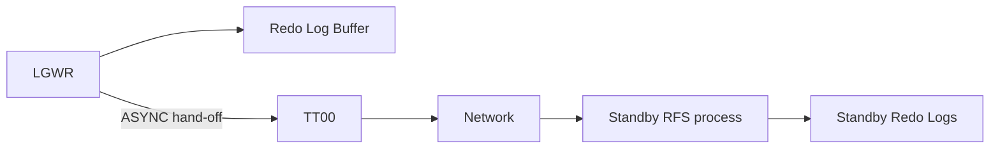

# TT00 — Redo Transport Slaves

## Overview

**TT00** through **TT99** are the redo transport slave processes used by Data Guard. When the primary ships redo to a standby database using `SYNC` or `ASYNC` transport, TT00 and its siblings do the network I/O so that LGWR itself doesn't block.

`TT00` handles the transport for the first configured Data Guard destination; `TT01` for the second, and so on.

## Architecture



## Internal Working

### Transport Modes

Data Guard has three redo transport modes:

- **SYNC (AFFIRM)** — LGWR waits for standby ack before commit returns. Adds network round-trip latency to `log file sync`.
- **ASYNC** — LGWR ships to TT00, which forwards asynchronously. Commit does not wait on network.
- **FASTSYNC (SYNC/NOAFFIRM)** — Standby confirms receipt without waiting for disk flush.

TT00 is used primarily for ASYNC. For SYNC, LGWR does the send inline (or via a dedicated NSSn process) so it can wait for the ack.

### Cascading

Cascaded standbys have TT slaves shipping to downstream targets.

### 12c+ Simplification

12c added the option to use `LGWR` directly for SYNC and `LGWR ASYNC` with dedicated network server processes (`NSSn`, `NSAn`). TT00 remains for compatibility and specific configurations.

## Components

- `ora_tt00_<sid>` .. `ora_tt99_<sid>` — one per DG destination as needed.
- Related: `ora_nsan_<sid>` (network server async), `ora_nssn_<sid>` (network server sync).

## Important Parameters

| Parameter                   | Purpose                                 |
| --------------------------- | --------------------------------------- |
| `log_archive_dest_n`        | Destination with `SERVICE=` for standby |
| `log_archive_dest_state_n`  | ENABLE / DEFER                          |
| `log_archive_max_processes` | Max archive/transport processes         |

Destination attributes:

- `SYNC | ASYNC | FASTSYNC`
- `AFFIRM | NOAFFIRM`
- `DB_UNIQUE_NAME=<standby_name>`
- `VALID_FOR=(ONLINE_LOGFILE,PRIMARY_ROLE)`
- `NET_TIMEOUT=<seconds>`
- `MAX_CONNECTIONS=<n>`

## Important Views

| View                    | Purpose                            |
| ----------------------- | ---------------------------------- |
| `V$ARCHIVE_DEST`        | Destination configuration + status |
| `V$ARCHIVE_DEST_STATUS` | Runtime state                      |
| `V$DATAGUARD_STATS`     | Lag statistics                     |
| `V$ARCHIVE_PROCESSES`   | ARCn/transport process state       |
| `V$MANAGED_STANDBY`     | RFS and MRP0 on standby            |

## Diagnostic Queries

```sql
-- Redo transport destinations
SELECT dest_id, dest_name, status, target, transmit_mode, affirm,
       async_blocks, net_timeout
FROM   v$archive_dest
WHERE  dest_id > 1 AND status <> 'INACTIVE';

-- Runtime status
SELECT dest_id, destination, status, error, gap_status
FROM   v$archive_dest_status
WHERE  status <> 'INACTIVE';

-- Lag
SELECT name, value, unit
FROM   v$dataguard_stats
WHERE  name IN ('transport lag','apply lag');

-- TT processes running
SELECT name, description, paddr
FROM   v$bgprocess
WHERE  name LIKE 'TT%' AND paddr <> '00';
```

## Common Issues

- **`ORA-16401: archivelog rejected by RFS`** — Standby has already received this log.
- **`ORA-16086: standby database does not contain available standby log files`** — Standby lacks Standby Redo Logs.
- **Transport lag growing** — Network slow, TT00 unable to keep up. Check `V$DATAGUARD_STATS.transport lag`.
- **`ORA-03135: connection lost contact`** — Network flap. Increase `NET_TIMEOUT`.

## Troubleshooting

1. `V$ARCHIVE_DEST_STATUS.ERROR` — root cause of destination failure.
2. `V$DATAGUARD_STATS` — lag numeric.
3. Standby side: `V$MANAGED_STANDBY` shows RFS activity.
4. Network: `tnsping <standby>`; measure with `traceroute`.
5. For SYNC lag, verify Standby Redo Logs exist and are large enough (`V$STANDBY_LOG`).

## Best Practices

1. Use LGWR ASYNC as default for most Data Guard configurations.
2. Use SYNC/AFFIRM (Maximum Protection or Maximum Availability) only when data loss guarantee is required and network latency is acceptable.
3. Set `NET_TIMEOUT` to 30 seconds to avoid indefinite hangs on network issues.
4. Deploy Standby Redo Logs on the standby matching primary log group sizes.
5. Monitor `V$DATAGUARD_STATS` — alert on transport lag > 60 seconds.
6. Use Data Guard Broker (`dgmgrl`) — simplifies configuration and monitoring.

## Interview Questions

1. **Q:** What does TT00 do?
   **A:** Ships redo to a Data Guard standby destination on behalf of LGWR (or ARCn in ARCH transport).

2. **Q:** Difference between SYNC, ASYNC, FASTSYNC?
   **A:** SYNC (AFFIRM) waits for disk-flush ack. FASTSYNC (SYNC/NOAFFIRM) waits for receipt only. ASYNC does not wait.

3. **Q:** Do you always need a TT slave?
   **A:** 12c+ can use NSAn/NSSn instead. TT00 remains for legacy and some scenarios.

4. **Q:** How do you monitor transport lag?
   **A:** `V$DATAGUARD_STATS.transport lag`.

5. **Q:** What is Standby Redo Log?
   **A:** Log group on the standby that RFS writes incoming redo into. Needed for real-time apply and reduces gap after failover.

## References

- Oracle Data Guard Concepts and Administration 19c
- Oracle Data Guard Broker 19c
- MOS Doc ID 220970.1 — Redo Transport Troubleshooting
- MOS Doc ID 1265700.1 — Data Guard Best Practices
