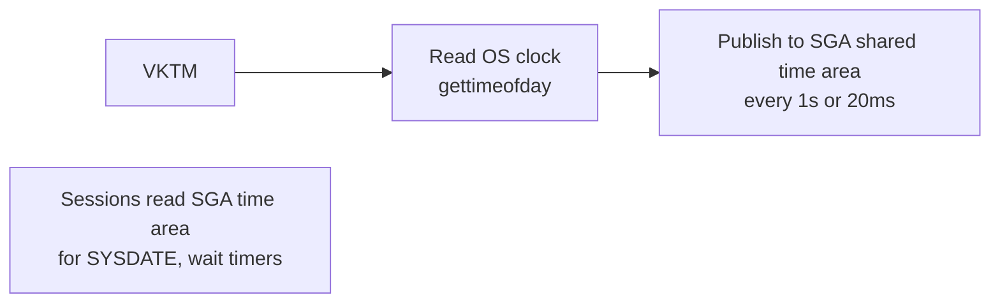

# VKTM — Virtual Keeper of Time

## Overview

**VKTM** is the background process that provides the internal time-keeping service for the Oracle instance. Every process that queries `SYSDATE`, `SYSTIMESTAMP`, or that uses timeouts depends on VKTM. VKTM samples the OS clock and publishes the result at high frequency into shared memory so that Oracle processes don't each call `gettimeofday()`.

## Architecture



## Internal Working

VKTM has two priority modes:

- **1-second resolution** — default. VKTM runs at normal priority, updates every 1 second.
- **20-millisecond resolution** — when Oracle detects highly time-sensitive workloads (Data Guard, RAC heartbeats), VKTM elevates priority and runs at 20 ms.

This dual-mode approach reduces syscall overhead — a query using `SYSDATE` many times per second doesn't hit the OS clock each time.

VKTM also drives certain **wait event timeouts** — if VKTM is delayed, waits may last longer than expected.

## Components

Single process: `ora_vktm_<sid>`.

## Important Parameters

None user-facing. Hidden:

- `_high_priority_processes` — list of processes to run at RT priority.
- `_disable_highres_ticks` — disable 20 ms resolution.

## Important Views

| View             | Purpose                   |
| ---------------- | ------------------------- |
| `V$BGPROCESS`    | VKTM PID                  |
| `V$SESSION_WAIT` | Uses VKTM for wait timing |

## Diagnostic Queries

```sql
-- VKTM alive?
SELECT name, description, paddr FROM v$bgprocess WHERE name = 'VKTM';

-- OS PID
SELECT p.spid FROM v$process p, v$bgprocess bg
WHERE bg.name = 'VKTM' AND p.addr = bg.paddr;
```

## Common Issues

- **`WARNING: VKTM detected a time drift of ...` in alert log** — OS clock jumped (NTP correction or VM suspend/resume). Persistent messages hint at chronic time-keeping issues.
- **VKTM dies** — Instance crashes.
- **High VKTM CPU** — Rare; usually another CPU issue is stealing cycles from VKTM.

## Troubleshooting

1. If alert log shows time-drift warnings, verify NTP/chrony is running and not making large corrections. `chronyc tracking` on Linux.
2. Avoid VM suspend/resume for Oracle VMs — clock jumps unsettle VKTM.
3. Check host clock: `date -u` on all RAC nodes should agree within seconds.

## Best Practices

1. Use NTP or chrony on all Oracle hosts. Enable `slew` mode (small continuous adjustments) instead of `step` mode (jumps).
2. In RAC, tightly sync clocks — even sub-second drift can cause issues.
3. Never manually set the clock backward on a running instance.
4. Alert on any VKTM time-drift message in the alert log.

## Interview Questions

1. **Q:** What does VKTM do?
   **A:** Provides Oracle's internal time-of-day service, sampling the OS clock and publishing it to shared memory.

2. **Q:** Why does Oracle have VKTM instead of each process calling `gettimeofday()`?
   **A:** Efficiency — avoids millions of syscalls; single sampler publishes to SGA.

3. **Q:** What resolutions does VKTM operate at?
   **A:** 1-second default; 20 ms high-resolution when Data Guard / RAC or other time-critical workloads demand.

4. **Q:** What causes VKTM time-drift warnings?
   **A:** OS clock jumps (NTP correction, VM suspend, manual `date` change).

## References

- Oracle Database Concepts 19c — Process Architecture
- MOS Doc ID 1287183.1 — VKTM warnings
- MOS Doc ID 759143.1 — Time synchronization for RAC
