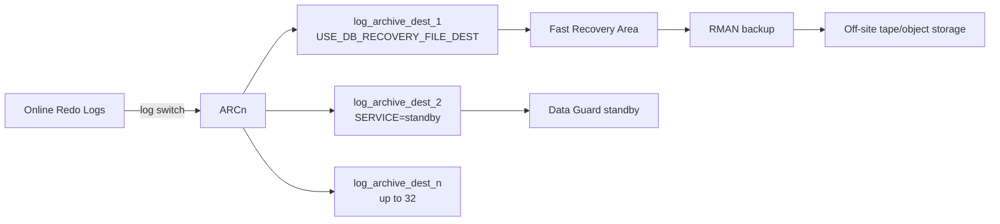

# Archive Logs

## Overview

**Archive logs** are copies of filled online redo logs, made by ARCn processes and used for media recovery, Data Guard shipping, LogMiner analysis, and point-in-time recovery. Running in ARCHIVELOG mode (mandatory for production) means every log switch produces a permanent archive file.

Without archive logs, you cannot recover past the last online redo group's contents — meaning any datafile restore is limited to the SCN of your last full backup.

## Architecture



## Internal Working

### Enabling ARCHIVELOG Mode

```sql
-- Requires SHUTDOWN and MOUNT
SHUTDOWN IMMEDIATE
STARTUP MOUNT
ALTER DATABASE ARCHIVELOG;
ALTER DATABASE OPEN;

-- Verify
SELECT log_mode FROM v$database;
ARCHIVE LOG LIST;
```

### Archive Destinations

Set with `LOG_ARCHIVE_DEST_n` — up to 32 destinations. Attributes:

- `LOCATION=/path` — filesystem or ASM
- `SERVICE=alias` — network destination (Data Guard)
- `MANDATORY` / `OPTIONAL`
- `MAX_FAILURE=n` — retries before giving up
- `REOPEN=n` — seconds to wait before retry
- `NET_TIMEOUT=n` — network timeout
- `VALID_FOR=(ONLINE_LOGFILE,PRIMARY_ROLE)` — role/type filter
- `SYNC` / `ASYNC` / `FASTSYNC` for DG destinations

Recommended:

```sql
ALTER SYSTEM SET db_recovery_file_dest = '/u03/fra' SCOPE = SPFILE;
ALTER SYSTEM SET db_recovery_file_dest_size = 200G SCOPE = SPFILE;
ALTER SYSTEM SET log_archive_dest_1 = 'LOCATION=USE_DB_RECOVERY_FILE_DEST' SCOPE = SPFILE;
ALTER SYSTEM SET log_archive_format = '%t_%s_%r.arc' SCOPE = SPFILE;
```

### Filename Format

`log_archive_format` uses:

- `%t` — thread number
- `%s` — sequence number
- `%r` — RESETLOGS ID
- `%d` — DBID
- Mandatory in ARCHIVELOG mode: at least `%s`, `%t`, `%r`.

### Applied vs Archived vs Deleted

`V$ARCHIVED_LOG` columns:

- `ARCHIVED = 'YES'` — successfully archived.
- `APPLIED = 'YES'` — applied to standby (Data Guard).
- `DELETED = 'YES'` — physically deleted from destination.

## Components

| Component           | Purpose                                       |
| ------------------- | --------------------------------------------- |
| ARCn                | Copies filled online redo to destinations     |
| Archive destination | Path or service                               |
| FRA                 | Managed pool for archive + backup + flashback |
| RMAN retention      | Governs when RMAN deletes archives            |

## Important Parameters

| Parameter                      | Purpose                      |
| ------------------------------ | ---------------------------- |
| `log_archive_dest_n`           | Destination n                |
| `log_archive_dest_state_n`     | ENABLE / DEFER / ALTERNATE   |
| `log_archive_format`           | Filename template            |
| `log_archive_max_processes`    | ARCn count                   |
| `log_archive_min_succeed_dest` | Min destinations for success |
| `db_recovery_file_dest`        | FRA path                     |
| `db_recovery_file_dest_size`   | FRA size                     |
| `archive_lag_target`           | Force switch every N seconds |

## Important Views

| View                       | Purpose                          |
| -------------------------- | -------------------------------- |
| `V$DATABASE.LOG_MODE`      | ARCHIVELOG or NOARCHIVELOG       |
| `V$ARCHIVE_DEST`           | Configured destinations          |
| `V$ARCHIVE_DEST_STATUS`    | Runtime state                    |
| `V$ARCHIVED_LOG`           | Every archived log ever recorded |
| `V$RECOVERY_AREA_USAGE`    | FRA composition                  |
| `V$LOG_HISTORY`            | Log switch history               |
| `V$FLASHBACK_DATABASE_LOG` | Flashback log info (in FRA)      |

## Diagnostic Queries

```sql
-- Archivelog mode + destinations
SELECT log_mode FROM v$database;

SELECT dest_id, dest_name, status, target, log_sequence, error, destination
FROM   v$archive_dest
WHERE  status <> 'INACTIVE'
ORDER  BY dest_id;

-- Recent archives
SELECT thread#, sequence#, first_time, next_time,
       ROUND(blocks*block_size/1024/1024, 1) AS mb,
       archived, applied, deleted, name
FROM   v$archived_log
WHERE  first_time > SYSDATE - 1
ORDER  BY first_time DESC;

-- Volume per day
SELECT TO_CHAR(first_time,'YYYY-MM-DD') AS day,
       COUNT(*) AS logs,
       ROUND(SUM(blocks*block_size)/1024/1024/1024, 2) AS gb
FROM   v$archived_log
WHERE  dest_id = 1 AND first_time > SYSDATE - 30
GROUP  BY TO_CHAR(first_time,'YYYY-MM-DD')
ORDER  BY day;

-- FRA usage
SELECT file_type, percent_space_used, percent_space_reclaimable,
       number_of_files
FROM   v$recovery_area_usage;

-- Any gaps? (Data Guard)
SELECT * FROM v$archive_gap;
```

## Common Issues

- **`ORA-00257: archiver error. Connect internal only, until freed`** — Archive destination full or unreachable. Free FRA or fix destination.
- **`ORA-19809: limit exceeded for recovery files`** — FRA size cap reached.
- **`ORA-16038: log X, sequence Y cannot be archived`** — ARCn cannot write to a destination. Check `v$archive_dest.error`.
- **`log file switch (archiving needed)`** — LGWR blocked; can't wrap because oldest online log not yet archived.
- **Gaps on standby** — Missing sequence numbers on standby; check primary sends and network.

## Troubleshooting

1. `SELECT status, error FROM v$archive_dest;` — root error message.
2. FRA full: `SELECT * FROM v$recovery_area_usage;` — what filled it?
3. RMAN cleanup: `RMAN> DELETE ARCHIVELOG UNTIL TIME 'SYSDATE-3';` (after backup).
4. Never `rm` archives at OS level without first: `RMAN> CROSSCHECK ARCHIVELOG ALL; DELETE EXPIRED ARCHIVELOG ALL;`
5. Deferred a failing destination as emergency: `ALTER SYSTEM SET log_archive_dest_state_2 = DEFER;`

## Best Practices

1. **Always in ARCHIVELOG mode** for production.
2. Route archives to FRA: `log_archive_dest_1 = 'LOCATION=USE_DB_RECOVERY_FILE_DEST'`.
3. Size FRA to hold **3–7 days** of archives + backups + flashback.
4. Automate archive backup: RMAN daily, cross-check weekly, delete input.
5. Alert on `V$ARCHIVE_DEST.STATUS != 'VALID'`.
6. `archive_lag_target = 900` — bounds Data Guard lag during quiet periods.
7. `log_archive_max_processes = 4` minimum; more for high-transaction / Data Guard.
8. Verify archive backup integrity monthly: `RMAN> RESTORE ARCHIVELOG ALL VALIDATE;`.
9. Ship archives to a secondary site (Data Guard or object storage) — local FRA loss = lost recovery window.

## Interview Questions

1. **Q:** What's the difference between online redo and archive log?
   **A:** Online redo is a cyclic set of files LGWR writes to. Archive logs are permanent copies made by ARCn after a log switch.

2. **Q:** Why is ARCHIVELOG mode required for hot backups?
   **A:** Hot (open) backups need redo generated during the backup to be preserved for recovery. Archive logs preserve historical redo beyond the online logs.

3. **Q:** What is `LOG_ARCHIVE_MIN_SUCCEED_DEST`?
   **A:** Minimum number of destinations that must archive a group before it can be reused.

4. **Q:** What's a mandatory vs optional destination?
   **A:** Mandatory must succeed; blocks LGWR when it fails. Optional retries but doesn't block online redo reuse.

5. **Q:** How do you delete archives safely?
   **A:** After RMAN backup: `RMAN> DELETE ARCHIVELOG UNTIL TIME 'SYSDATE-N';`. Never `rm` at OS without `crosscheck + delete expired` afterward.

6. **Q:** What's in the FRA besides archives?
   **A:** RMAN backups, flashback logs, control file autobackups, image copies.

7. **Q:** How do you switch from NOARCHIVELOG to ARCHIVELOG?
   **A:** SHUTDOWN IMMEDIATE → STARTUP MOUNT → `ALTER DATABASE ARCHIVELOG` → `ALTER DATABASE OPEN`. Set `log_archive_dest_1` first.

## References

- Oracle Database Backup and Recovery User's Guide 19c
- Oracle Database Administrator's Guide 19c — Managing Archived Redo Log Files
- MOS Doc ID 371139.1 — Managing Archiving
- MOS Doc ID 305648.1 — What to do when FRA is full
- Runbook: [Archive Destination Full](../27-runbooks/archive-destination-full.md)
