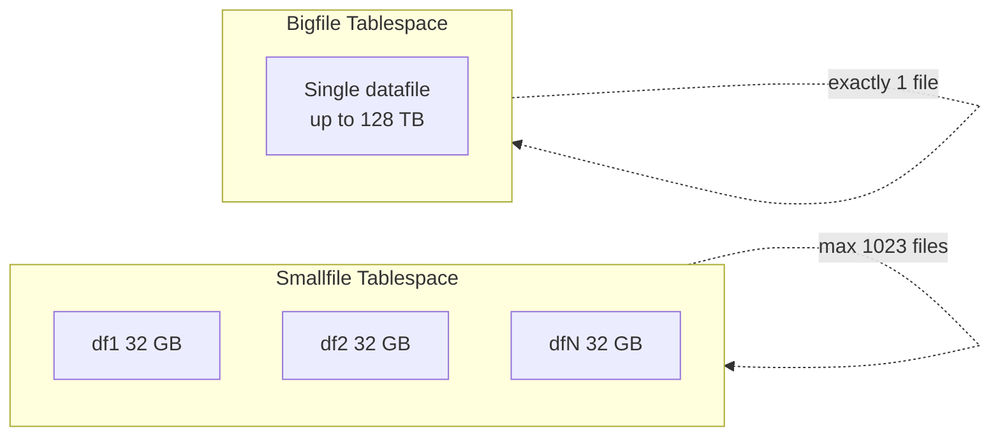

# Bigfile Tablespaces

## Overview

A **bigfile tablespace** contains exactly **one** datafile, but that file can be extremely large — up to 128 TB with a 32 KB block size. Contrast with smallfile tablespaces (default) which support up to 1023 datafiles of ~32 GB each (with 8 KB blocks).

Bigfile tablespaces simplify management for large data warehouses: fewer files to back up, monitor, and rename; simpler capacity planning; and directly compatible with ASM's rebalance model.

## Architecture



## Internal Working

### Address Space

- **Smallfile** — `data_object_id (DBA)` includes file# in 10 bits (1023 files) and block# in 22 bits.
- **Bigfile** — file# is always 1, block# uses 32 bits — 4 billion blocks × block size.

Maximum bigfile sizes:

| Block size | Max size |
| ---------- | -------- |
| 2 KB       | 8 TB     |
| 4 KB       | 16 TB    |
| 8 KB       | 32 TB    |
| 16 KB      | 64 TB    |
| 32 KB      | 128 TB   |

### Creation

```sql
CREATE BIGFILE TABLESPACE dw_facts
  DATAFILE '+DATA' SIZE 200G AUTOEXTEND ON NEXT 10G MAXSIZE 4T
  EXTENT MANAGEMENT LOCAL AUTOALLOCATE
  SEGMENT SPACE MANAGEMENT AUTO;
```

Cannot add more datafiles:

```sql
-- Error: bigfile tablespace supports only one datafile
ALTER TABLESPACE dw_facts ADD DATAFILE '+DATA' SIZE 100G;
-- ORA-32771
```

### Resize

```sql
-- Resize the (single) datafile at the tablespace level
ALTER TABLESPACE dw_facts RESIZE 3T;
```

### Compatibility

- Bigfile requires LMT + ASSM (auto in 19c).
- All tablespace types support bigfile: permanent, temporary, undo.
- OMF and ASM handle bigfile seamlessly.

## Components

| Component       | Purpose               |
| --------------- | --------------------- |
| Single datafile | Physical container    |
| Bitmap          | LMT extent management |
| Segments        | Same as smallfile     |

## Important Parameters

Same as smallfile. Key difference:

- Cannot use `AUTOEXTEND OFF` and then `ADD DATAFILE` — you have to enlarge the single file.

## Important Views

| View                      | Purpose                 |
| ------------------------- | ----------------------- |
| `DBA_TABLESPACES.BIGFILE` | `YES` or `NO`           |
| `V$TABLESPACE.BIGFILE`    | Same, control file view |

## Diagnostic Queries

```sql
-- Which tablespaces are bigfile?
SELECT tablespace_name, bigfile, contents, block_size, status
FROM   dba_tablespaces
WHERE  bigfile = 'YES';

-- Bigfile tablespace size
SELECT tablespace_name, bytes/1024/1024/1024 AS gb, autoextensible,
       maxbytes/1024/1024/1024 AS max_gb
FROM   dba_data_files
WHERE  tablespace_name IN (
  SELECT tablespace_name FROM dba_tablespaces WHERE bigfile='YES');
```

## Common Issues

- **Cannot add datafile** — By design. Resize instead.
- **File size approaching cap** — With 8K blocks, cap is 32 TB. If you're near that, migrate to 32K block size or split segments across smallfile tablespaces.
- **Backup time / parallelism** — RMAN parallelism is per-file; a huge bigfile can be slower to backup single-threaded. Use `SECTION SIZE` in RMAN backup command to split.

## Troubleshooting

1. To split a large bigfile into multiple files: not possible in place. Move segments to a new smallfile tablespace, then drop the original.
2. `RMAN> BACKUP SECTION SIZE 32G DATAFILE 5;` — parallelize the single-file backup.

## Best Practices

1. Use bigfile for **very large tablespaces** (> 500 GB) that hold a single logical set (DW facts, ILM archives).
2. Match block size to expected max size:
   - Facts / archives ≥ 64 TB → 32K block size.
   - Standard DW ≤ 32 TB → 8K default.
3. Enable RMAN section-size backup: `CONFIGURE MAX PIECE SIZE FOR CHANNEL DEVICE TYPE DISK TO 32G;`
4. On ASM, bigfile leverages rebalance across all disks — great for I/O parallelism.
5. Do not mix bigfile with legacy MSSM (won't compile).
6. Do not use bigfile for `SYSTEM` — it's not needed and complicates recovery.
7. Consider bigfile for `TEMP` when heavy PGA spillage occurs (single large temp is easier to grow than many tempfiles).

## Interview Questions

1. **Q:** How many datafiles does a bigfile tablespace have?
   **A:** Exactly one.

2. **Q:** What's the max size of a bigfile tablespace?
   **A:** 128 TB with 32 KB block size.

3. **Q:** Can you convert smallfile to bigfile?
   **A:** No direct conversion. Create a bigfile tablespace, move segments over (via `ALTER TABLE ... MOVE TABLESPACE`), drop original.

4. **Q:** What tablespaces should not be bigfile?
   **A:** SYSTEM, small utility tablespaces. Anywhere you'd naturally want multi-file separation.

5. **Q:** How does RMAN back up a huge bigfile efficiently?
   **A:** With `SECTION SIZE` — splits a single large file into multiple pieces backed up in parallel.

## References

- Oracle Database Concepts 19c — Bigfile Tablespaces
- Oracle Database Administrator's Guide 19c — Managing Bigfile Tablespaces
- MOS Doc ID 262472.1 — Bigfile Tablespace FAQ
