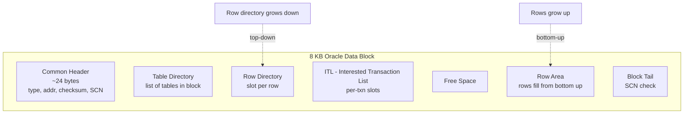

# Block Structure

## Overview

The Oracle **data block** is the smallest unit of I/O. `db_block_size` (typically 8 KB) is set at database creation and cannot change. Every read from a datafile is a multiple of the block size; every write is at least one block. Understanding the block layout is essential to reason about row storage, ITL contention, `PCTFREE`, chaining, and migration.

## Architecture



## Internal Working

### Block Header

- **Common Header** — block type (table, index, undo, etc.), DBA (file# + block#), SCN, checksum, format.
- **Transaction Layer** — begins with the ITL slots.
- **Data Layer** — table directory, row directory, and rows.

### ITL — Interested Transaction List

Each ITL slot records one transaction that has modified this block:

- **XID** (transaction id: undo segment#, slot#, sequence)
- **UBA** (undo block address for this transaction's undo record)
- **Flag** (active, committed, rolled back)
- **Lock count** (rows locked by this transaction)

`INITRANS` sets the initial ITL slot count (default 1 for tables, 2 for indexes). `MAXTRANS` is deprecated (unlimited in modern versions). When a new transaction touches the block and no free slot exists, one is allocated from free space. If no free space, `enq: TX - allocate ITL entry` wait.

### Row Directory

An array of offsets, one per row in the block. `ROWID` decodes to (file, block, row#) — the row# indexes into the row directory.

### Row Area (Bottom-Up)

Rows are stored from the bottom of the block upward. Each row starts with:

- Row header (2 bytes: flag + lock byte)
- Column count (1 byte)
- ROWID of chained-to piece (if chained/migrated, 6 bytes)
- Per-column: length byte(s) + value

Fixed-width columns (`NUMBER`, `DATE`) still store variable-length internally.

### Free Space

Between the row directory (top) and the row area (bottom). `PCTFREE` reserves space for row updates that expand.

### `PCTFREE` and `PCTUSED`

- **`PCTFREE`** — % of block reserved for updates. Default 10 for tables, 10 for indexes. Higher for update-heavy tables to reduce row migration.
- **`PCTUSED`** — (MSSM only) block becomes eligible for inserts again when usage drops below this %. Not used under ASSM (default).

### Block Cleanout

When a transaction commits, it usually cannot update every block it modified — too expensive. Instead, the commit SCN is recorded in the transaction table (undo segment header). Subsequent readers detect the "delayed block cleanout" and update the ITL/row lock byte in the block header. Symptoms: unexpected redo generation on the first SELECT after a large DML.

## Components

| Component       | Bytes        | Purpose                           |
| --------------- | ------------ | --------------------------------- |
| Common header   | ~24          | Block metadata                    |
| Table directory | ~4 per table | Table membership                  |
| Row directory   | 2 per row    | Offset to row data                |
| ITL             | 24 per slot  | Transaction slots                 |
| Free space      | variable     | Reserved by PCTFREE               |
| Row area        | variable     | Actual rows                       |
| Tail            | 4            | Trailing SCN for corruption check |

## Important Parameters

| Parameter               | Purpose                                                |
| ----------------------- | ------------------------------------------------------ |
| `db_block_size`         | Block size (2K/4K/8K/16K/32K)                          |
| `db_block_checking`     | OFF / LOW / MEDIUM / FULL — in-memory block validation |
| `db_block_checksum`     | OFF / TYPICAL / FULL — physical checksum               |
| `db_lost_write_protect` | Shadow copy for lost-write detection                   |

### Storage Attributes

Set at CREATE TABLE:

- `PCTFREE n`
- `INITRANS n`
- `TABLESPACE ...`
- `STORAGE (...)`

## Important Views

| View                               | Purpose                             |
| ---------------------------------- | ----------------------------------- |
| `V$BH` / `X$BH`                    | Buffer header for each cached block |
| `DBA_TABLES.PCT_FREE`, `INI_TRANS` | Storage attributes                  |
| `V$WAITSTAT`                       | Block-class wait stats              |

## Diagnostic Queries

```sql
-- Storage attributes
SELECT owner, table_name, pct_free, ini_trans, max_trans,
       tablespace_name, num_rows, blocks, empty_blocks, chain_cnt
FROM   dba_tables
WHERE  owner = 'HR' AND table_name = 'EMPLOYEES';

-- Block waits by class
SELECT class, count, time
FROM   v$waitstat
ORDER  BY count DESC;

-- Detect chained/migrated rows
SELECT owner, table_name, chain_cnt, num_rows,
       ROUND(chain_cnt/DECODE(num_rows,0,1,num_rows)*100, 2) AS pct
FROM   dba_tables
WHERE  chain_cnt > 0
ORDER  BY chain_cnt DESC;

-- Statistics that reveal chained fetches
SELECT name, value FROM v$sysstat
WHERE  name IN ('table fetch continued row', 'table fetch by rowid');

-- Analyze a block for detail (rare; only dev/test)
-- ALTER SYSTEM DUMP DATAFILE 4 BLOCK 123;
-- Then check trace file
```

## Common Issues

- **`enq: TX - allocate ITL entry`** — Not enough ITL slots for concurrent modifiers. Fix: `ALTER TABLE ... INITRANS 10 PCTFREE 20; -- rebuild/move`.
- **Chained/migrated rows** — Row too big or updated to no longer fit. Increases `table fetch continued row`.
- **Block corruption** — `ORA-01578`. Restore + recover the block.
- **Row lock contention on hot block** — Concurrent updates to same row → `enq: TX - row lock`.
- **Delayed block cleanout redo** — First read after bulk DML shows unexpected redo. Normal; can be mitigated by running a scan post-commit.

## Troubleshooting

1. `ANALYZE TABLE ... LIST CHAINED ROWS INTO chained_rows;` — populates a table with chained ROWIDs. Use to identify migration candidates.
2. `V$WAITSTAT` shows per-block-class waits.
3. For `ORA-01578`, `dbverify` (`dbv`) inspects a datafile offline.
4. For persistent ITL contention, `ALTER TABLE ... MOVE INITRANS 20`.

## Best Practices

1. Default `db_block_size = 8 KB`. Only deviate for specific known workloads.
2. `PCTFREE 10–20` for OLTP; `PCTFREE 0` for insert-only tables (staging, append-only historical).
3. `INITRANS 10+` for tables with high concurrent DML on same block.
4. Enable `db_block_checking = MEDIUM` and `db_block_checksum = TYPICAL` — cheap corruption detection.
5. Enable **Block Change Tracking** for RMAN incrementals.
6. In multitenant environments, block size is per-database — cannot mix in one CDB unless using multiple block-size caches.
7. Investigate any `enq: TX - allocate ITL entry` waits — INITRANS is undersized.
8. Monitor `chain_cnt` after `DBMS_STATS.GATHER_TABLE_STATS`.

## Interview Questions

1. **Q:** What's inside an Oracle block?
   **A:** Common header, table directory, row directory, ITL, free space, row area, block tail.

2. **Q:** What is the ITL?
   **A:** Interested Transaction List — slots recording active transactions modifying the block.

3. **Q:** What does `INITRANS` control?
   **A:** Initial ITL slot count. More slots reduce contention for concurrent modifiers.

4. **Q:** `PCTFREE` — what and default?
   **A:** % of block reserved for row updates. Default 10.

5. **Q:** What is delayed block cleanout?
   **A:** After a large committed DML, subsequent readers finish committing the block's ITL — first read shows small redo generation.

6. **Q:** Chained vs migrated row?
   **A:** Chained: row too big for one block, spans multiple. Migrated: row updated to no longer fit, moved to a new block; original ROWID points to a forwarding pointer.

7. **Q:** What is `db_block_checking`?
   **A:** In-memory block validation. LOW/MEDIUM/FULL trade CPU for corruption detection.

## References

- Oracle Database Concepts 19c — Data Blocks
- Oracle Database Administrator's Guide 19c — Managing Space in Blocks
- Jonathan Lewis, _Oracle Core_, Chapter 4 — Buffers
- MOS Doc ID 122020.1 — Row Chaining and Migration
- MOS Doc ID 122183.1 — Detecting and Diagnosing Corrupt Blocks
