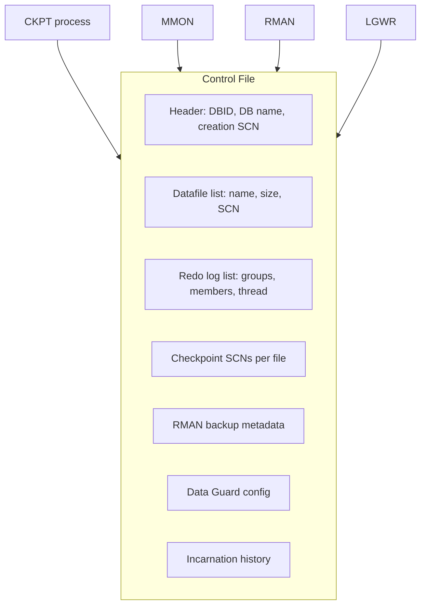

# Control Files

## Overview

The **control file** is a small binary file that catalogs the physical structure of the Oracle database: database name, DBID, all datafile locations and sizes, all redo log locations, current log sequence, checkpoint SCN, RMAN backup metadata, and Data Guard configuration. Without a control file, the instance cannot mount — this is the single most critical file per byte in the database.

Control files are always multiplexed. Every production Oracle database should have at least two, ideally three, on physically independent storage.

## Architecture



## Internal Working

### What the Control File Records

- Database name and DBID (unique identifier)
- Timestamp of creation
- Names and locations of all datafiles and online redo logs
- Tablespace and datafile status
- Current log sequence number
- Checkpoint SCN per datafile
- Backup / archive log metadata (if using RMAN without recovery catalog)
- Data Guard configuration
- Flashback logs and restore point info
- Incarnation history (OPEN RESETLOGS creates a new incarnation)

### Multiplexing

`CONTROL_FILES` parameter is a comma list of paths. Oracle writes to all copies synchronously — every checkpoint update, every log switch, every datafile add/rename touches every control file. On startup, Oracle reads only the first control file and validates against the others.

### Size Growth

Control files auto-extend within an internal record ceiling. Grows most rapidly when RMAN backups are added. Old RMAN records age out per `CONTROL_FILE_RECORD_KEEP_TIME` (days).

### Backup

- **Autobackup** — RMAN automatically backs up control file after any structural change: `CONFIGURE CONTROLFILE AUTOBACKUP ON;`
- **Manual** — `RMAN> BACKUP CURRENT CONTROLFILE;` or `SQL> ALTER DATABASE BACKUP CONTROLFILE TO '/path';`
- **Trace** — text form: `ALTER DATABASE BACKUP CONTROLFILE TO TRACE;` produces a `CREATE CONTROLFILE` script.

## Components

| Component                 | Purpose                                                                     |
| ------------------------- | --------------------------------------------------------------------------- |
| File header               | Identifies file, DBID, version                                              |
| Circular record types     | Redo log history, archive log history, backup metadata (aged out over time) |
| Non-circular record types | Datafile list, tablespace list (permanent)                                  |

## Important Parameters

| Parameter                       | Purpose                                        |
| ------------------------------- | ---------------------------------------------- |
| `control_files`                 | Comma-separated list of control file paths     |
| `control_file_record_keep_time` | Days to retain reusable records (default 7)    |
| `db_create_file_dest`           | If set, OMF creates control file automatically |

## Important Views

| View                           | Purpose                                        |
| ------------------------------ | ---------------------------------------------- |
| `V$CONTROLFILE`                | Current control files                          |
| `V$CONTROLFILE_RECORD_SECTION` | Record type usage and space                    |
| `V$DATABASE`                   | DBID, name, incarnation info from control file |
| `V$LOG`, `V$LOGFILE`           | Redo log info from control file                |
| `V$BACKUP`, `V$BACKUP_SET`     | RMAN records in control file                   |

## Diagnostic Queries

```sql
-- Current control files
SELECT name, status, is_recovery_dest_file, block_size, file_size_blks
FROM   v$controlfile;

-- Record sections and their sizing
SELECT type, record_size, records_total, records_used,
       ROUND(records_used/records_total*100, 1) AS pct_used
FROM   v$controlfile_record_section
ORDER  BY records_used DESC;

-- DBID, incarnation, mode
SELECT dbid, name, resetlogs_change#, resetlogs_time, log_mode,
       controlfile_type, database_role
FROM   v$database;

-- Control file autobackup on?
-- (RMAN)
-- SHOW CONTROLFILE AUTOBACKUP;
```

### Multiplexing After Creation

```sql
-- SPFILE: change control_files list
ALTER SYSTEM SET control_files = '+DATA/prod/control01.ctl',
                                 '+RECO/prod/control02.ctl',
                                 '+DATA/prod/control03.ctl'
                                 SCOPE = SPFILE;

-- Shutdown, copy existing control file to new locations, restart
SHUTDOWN IMMEDIATE
!cp /oldpath/control01.ctl /newpath/control02.ctl
STARTUP
```

## Common Issues

- **`ORA-00205: error in identifying control file`** — Path in `control_files` unreadable. Restore from backup or another multiplexed copy.
- **`ORA-01207: file is more recent than control file`** — Datafile SCN > control file SCN. Restore control file from a later backup or use `CREATE CONTROLFILE`.
- **`ORA-00214: control file version inconsistent`** — Two multiplexed copies out of sync. Copy latest over stale, restart.
- **Loss of all control files** — Restore from RMAN autobackup (`RESTORE CONTROLFILE FROM AUTOBACKUP`) or recreate with `CREATE CONTROLFILE`.
- **Control file record section full** — Rare; reduce `control_file_record_keep_time`.

## Troubleshooting

1. Check every path in `control_files` — permissions, mount, ASM diskgroup status.
2. If one copy is missing but others healthy, copy a healthy one over the missing path.
3. For all-copies-lost, restore with:
   ```
   RMAN> STARTUP NOMOUNT;
   RMAN> RESTORE CONTROLFILE FROM AUTOBACKUP;
   RMAN> ALTER DATABASE MOUNT;
   RMAN> RECOVER DATABASE;
   RMAN> ALTER DATABASE OPEN RESETLOGS;
   ```
4. If autobackup missing, use `CREATE CONTROLFILE` from a trace (`ALTER DATABASE BACKUP CONTROLFILE TO TRACE;` output).

## Best Practices

1. **Minimum 2 (ideally 3) control files** on separate physical storage.
2. Put control files on ASM diskgroups with HIGH redundancy or on independent SANs.
3. Enable RMAN control file autobackup: `CONFIGURE CONTROLFILE AUTOBACKUP ON;`.
4. Set `control_file_record_keep_time` ≥ RMAN backup retention.
5. Regularly export control file to trace as recovery insurance: `ALTER DATABASE BACKUP CONTROLFILE TO TRACE AS '/backup/control.sql' REUSE;`.
6. Monitor `V$CONTROLFILE_RECORD_SECTION` for sections approaching 100% usage.
7. In RAC, control files must be on shared storage (ASM diskgroup).

## Interview Questions

1. **Q:** What does the control file contain?
   **A:** Database name, DBID, datafile and redo log locations, checkpoint SCNs, RMAN metadata, Data Guard config, incarnation history.

2. **Q:** Why multiplex control files?
   **A:** They are single-file critical. Loss of all copies stops the instance; recovery requires backup or manual recreation.

3. **Q:** How do you add a multiplexed copy?
   **A:** Update `control_files` in SPFILE, shut down, copy an existing control file to the new path, restart.

4. **Q:** What does `CREATE CONTROLFILE` do?
   **A:** Rebuilds the control file from a script — used when all copies are lost and no RMAN autobackup exists.

5. **Q:** What is `CONTROL_FILE_RECORD_KEEP_TIME`?
   **A:** Days to retain reusable records (RMAN backup metadata, archive log history) in the control file.

6. **Q:** How does the control file get updated?
   **A:** CKPT updates on checkpoint. LGWR at log switch. RMAN on backup/restore. MMON periodically. Structural DDL immediately.

## References

- Oracle Database Concepts 19c — Control Files
- Oracle Database Backup and Recovery User's Guide 19c
- MOS Doc ID 735106.1 — Managing Control Files
- MOS Doc ID 1526174.1 — Loss of All Control Files
