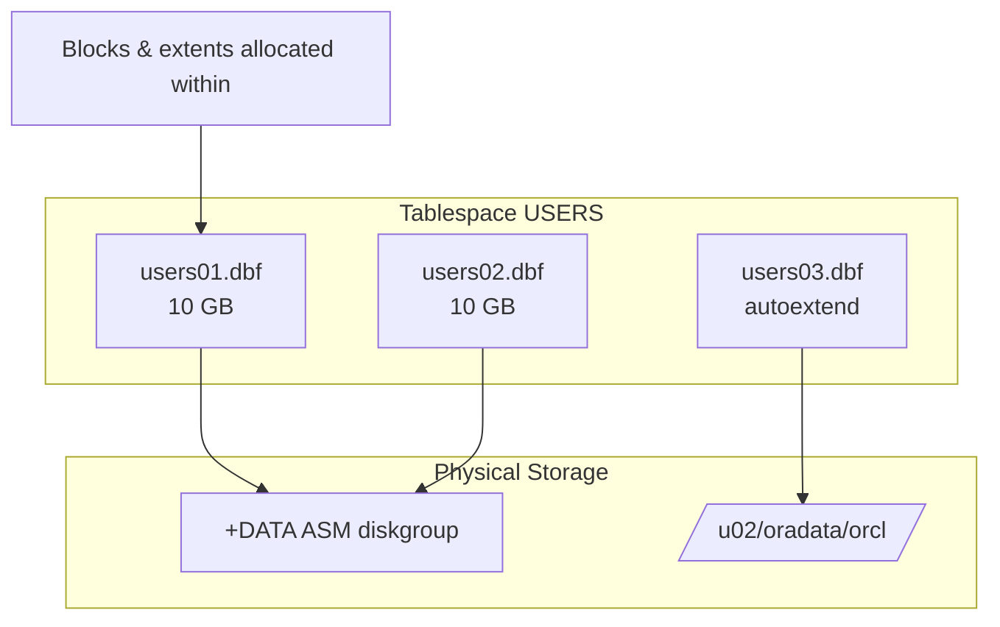

# Datafiles

## Overview

A **datafile** is a physical file on disk that provides persistent storage for one tablespace. Every segment (table, index, undo, LOB, temp) ultimately lives inside a datafile. Datafiles are grouped by tablespace, but each datafile belongs to exactly one tablespace. Sizing, autoextending, moving, renaming, and monitoring datafiles are core DBA activities.

Modern deployments use **ASM** (`+DATA/orcl/DATAFILE/...`) or Oracle Managed Files (OMF) on a filesystem. Either way, the underlying concept and management commands are the same.

## Architecture



## Internal Working

### Structure

Every datafile begins with a **file header** (blocks 0 and 1) that records:

- File number
- Tablespace name and ID
- Creation SCN and timestamp
- Current SCN and checkpoint SCN
- Block size
- Datafile size

Blocks 2+ are user data (segments, extents).

### Autoextend

Datafiles can be **autoextending** — grown automatically when a segment needs more space, up to a `MAXSIZE` limit or UNLIMITED (typically capped by filesystem/ASM):

```sql
ALTER DATABASE DATAFILE '/u02/oradata/orcl/users01.dbf'
  AUTOEXTEND ON NEXT 100M MAXSIZE 32G;
```

- **NEXT** — chunk size to add each extension.
- **MAXSIZE** — cap; `UNLIMITED` = bigfile format limit (~128 TB with 32K blocks).

### Resizing

- **Grow**: `ALTER DATABASE DATAFILE '...' RESIZE 20G;`
- **Shrink**: `ALTER DATABASE DATAFILE '...' RESIZE 5G;` — requires that no segment reaches beyond that size.

### Renaming / Moving (12c+ Online)

12c introduced **online datafile move**:

```sql
-- Move a datafile without downtime
ALTER DATABASE MOVE DATAFILE '/u02/oradata/orcl/users01.dbf'
  TO '/u03/oradata/orcl/users01.dbf' KEEP;
```

`KEEP` keeps the original file. `REUSE` overwrites destination if it exists.

For pre-12c or offline moves:

1. Shutdown or offline tablespace.
2. Copy at OS level.
3. `ALTER DATABASE RENAME FILE '/old' TO '/new';` (database in MOUNT) or `ALTER TABLESPACE ... RENAME DATAFILE`.
4. Restart or online tablespace.

### Backup Modes

- **Consistent (cold) backup** — datafiles must be closed cleanly.
- **Inconsistent (hot) backup** — datafiles in ARCHIVELOG DB. `ALTER TABLESPACE ... BEGIN BACKUP` freezes datafile header (or use RMAN which does it automatically).

## Components

| Component       | Purpose                                                 |
| --------------- | ------------------------------------------------------- |
| File header     | Metadata for the file                                   |
| File#           | Absolute file number database-wide (`V$DATAFILE.FILE#`) |
| Relative file#  | Number within tablespace (`RFILE#`)                     |
| Checkpoint SCN  | Advanced by CKPT                                        |
| Datafile status | ONLINE, OFFLINE, RECOVER, SYSTEM                        |

## Important Parameters

| Parameter               | Purpose                                                               |
| ----------------------- | --------------------------------------------------------------------- |
| `db_files`              | Max datafiles per database (default 200, max 65533 or bigfile limits) |
| `db_create_file_dest`   | OMF default for datafiles                                             |
| `db_recovery_file_dest` | FRA for backups + archives                                            |
| `db_block_size`         | Blocks per datafile chunk                                             |

## Important Views

| View                | Purpose                            |
| ------------------- | ---------------------------------- |
| `V$DATAFILE`        | Every datafile — status, size, SCN |
| `V$DATAFILE_HEADER` | Header info as read at mount       |
| `DBA_DATA_FILES`    | Datafiles + tablespace association |
| `DBA_FREE_SPACE`    | Free space per tablespace          |
| `V$RECOVER_FILE`    | Files needing media recovery       |
| `V$BACKUP`          | Datafile backup mode               |

## Diagnostic Queries

```sql
-- All datafiles with size and usage
SELECT df.tablespace_name, df.file_name,
       df.bytes/1024/1024 AS size_mb,
       (df.bytes - NVL(fs.free, 0))/1024/1024 AS used_mb,
       ROUND((df.bytes - NVL(fs.free, 0)) / df.bytes * 100, 1) AS pct_used,
       df.autoextensible, df.maxbytes/1024/1024 AS max_mb
FROM   dba_data_files df
LEFT JOIN ( SELECT tablespace_name, file_id, SUM(bytes) AS free
            FROM   dba_free_space
            GROUP  BY tablespace_name, file_id ) fs
  ON   fs.tablespace_name = df.tablespace_name AND fs.file_id = df.file_id
ORDER  BY pct_used DESC;

-- Datafiles that need media recovery
SELECT file#, name, status, error, change# FROM v$recover_file;

-- Datafiles currently in backup mode
SELECT df.file#, df.name, b.status, b.change#, b.time
FROM   v$datafile df JOIN v$backup b ON df.file# = b.file#
WHERE  b.status = 'ACTIVE';

-- I/O by datafile
SELECT df.name, fs.phyrds, fs.phyblkrd, fs.readtim,
       fs.phywrts, fs.phyblkwrt, fs.writetim
FROM   v$datafile df JOIN v$filestat fs ON df.file# = fs.file#
ORDER  BY (fs.phyblkrd + fs.phyblkwrt) DESC
FETCH FIRST 20 ROWS ONLY;
```

## Common Issues

- **`ORA-01652: unable to extend temp segment`** — TEMP full; enlarge tempfile.
- **`ORA-01653: unable to extend table by ... in tablespace ...`** — Permanent tablespace full; add space or enable autoextend.
- **`ORA-01654: unable to extend index by ...`** — Same for index segments.
- **`ORA-01157: cannot identify/lock data file`** — Datafile missing or unreadable.
- **`ORA-01113: file N needs media recovery`** — Datafile SCN behind; run `RECOVER DATAFILE N`.
- **Autoextend not extending** — Filesystem full or ASM disk group full; `df -h` or ASM utilization check.

## Troubleshooting

1. `SELECT * FROM v$datafile WHERE status != 'ONLINE';`
2. For OS-level errors, check `$ORACLE_BASE/diag/rdbms/<db>/<inst>/trace/alert_<sid>.log`.
3. For `ORA-01110`, note the file number and check `V$DATAFILE`.
4. If a datafile is renamed at OS but not in DB: `ALTER DATABASE RENAME FILE '/old' TO '/new';` in MOUNT.
5. Take offline before OS operations: `ALTER DATABASE DATAFILE N OFFLINE;` (requires ARCHIVELOG mode).

## Best Practices

1. Use **ASM** or OMF; avoid hand-managed paths.
2. Enable autoextend with a `MAXSIZE` — never `UNLIMITED` blindly.
3. Standardize datafile sizes: 8 GB, 16 GB, 32 GB — powers of 2 to simplify management.
4. Keep TEMP and UNDO tablespaces on fast storage.
5. Monitor `pct_used` — alert at 85%, page at 95%.
6. In RAC, all datafiles on shared storage (ASM).
7. Use bigfile tablespaces (see [Bigfile Tablespaces](bigfile-tablespaces.md)) for very large DW segments.
8. Test hot backup mode + RMAN online backup pipeline monthly.

## Interview Questions

1. **Q:** How many datafiles can a tablespace have?
   **A:** Smallfile: up to 1023 per tablespace, 65533 database-wide. Bigfile: exactly 1 per tablespace.

2. **Q:** How do you move a datafile online in 12c+?
   **A:** `ALTER DATABASE MOVE DATAFILE '/old' TO '/new';` — no downtime.

3. **Q:** What is the difference between `V$DATAFILE` and `DBA_DATA_FILES`?
   **A:** `V$DATAFILE` shows datafiles from the control file (mount time). `DBA_DATA_FILES` shows them from the data dictionary (requires database OPEN).

4. **Q:** Can you rename a datafile while the database is open?
   **A:** Yes for the specific tablespace: take tablespace offline → OS rename → `ALTER TABLESPACE ... RENAME DATAFILE`. Or in 12c+, online move.

5. **Q:** What's the max size of a smallfile vs bigfile datafile?
   **A:** Smallfile: 4 M blocks × block size = 32 GB with 8K blocks. Bigfile: 4 G blocks = 128 TB with 32K blocks.

6. **Q:** What does `AUTOEXTEND ON NEXT 100M MAXSIZE UNLIMITED` mean?
   **A:** Grow by 100 MB when needed, up to the file format's inherent max (~32 GB or ~128 TB).

## References

- Oracle Database Administrator's Guide 19c — Managing Datafiles
- Oracle Database Concepts 19c — Datafiles
- MOS Doc ID 1450211.1 — Online Move Datafile
- MOS Doc ID 434412.1 — Managing Autoextend
