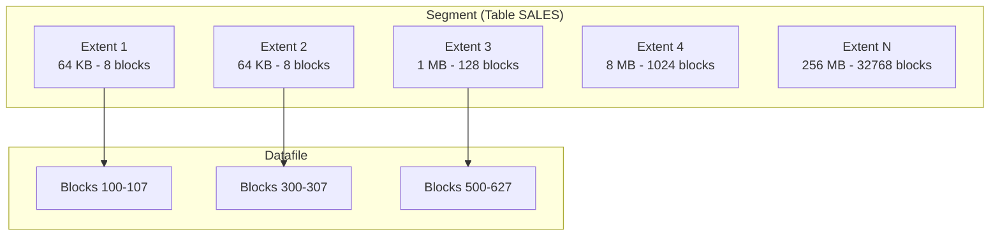

# Extents

## Overview

An **extent** is a contiguous set of Oracle blocks allocated to a segment as a single allocation unit. When a segment needs to grow, Oracle allocates a new extent. Extents are the middle layer of Oracle's storage hierarchy: segments contain extents, extents contain blocks.

The extent allocation strategy — sizing, contiguity, and management — directly affects DDL performance (especially `TRUNCATE` and segment drops), space efficiency, and datafile fragmentation.

## Architecture



## Internal Working

### Allocation Types

**AUTOALLOCATE** (default) — Oracle picks size based on segment history:

| Segment size | New extent size |
| ------------ | --------------- |
| 0 – 1 MB     | 64 KB           |
| 1 – 64 MB    | 1 MB            |
| 64 MB – 1 GB | 8 MB            |
| 1 GB – 32 GB | 64 MB           |
| > 32 GB      | 256 MB          |

**UNIFORM SIZE n** — every extent in this tablespace is exactly `n` bytes. Ideal for warehouses where all objects are large.

### Extent Header

The first block of an extent belongs to the segment; nothing distinguishes it from other data blocks at the block level. Extent-map tracking is done via:

- **LMT** — bitmap in the datafile header block(s) marks used vs free.
- **DMT** (deprecated) — rows in `SYS.UET$`.

### Contiguity

Within a datafile, an extent is guaranteed contiguous. **Across a segment**, extents are NOT contiguous — they can live in different datafiles of the same tablespace.

### High Water Mark and Extents

The [HWM](high-water-mark.md) sits within the highest-used extent. Below HWM, blocks may be used or free. Above HWM, blocks are unallocated (part of a not-yet-formatted extent).

## Components

| Component          | Purpose                                                 |
| ------------------ | ------------------------------------------------------- |
| Extent map         | Which extents belong to the segment (in segment header) |
| Free extent bitmap | Which blocks are free in the datafile (LMT)             |
| Extent size class  | Determined by tablespace + segment size                 |

## Important Parameters

Tablespace-level:

- `EXTENT MANAGEMENT LOCAL AUTOALLOCATE | UNIFORM SIZE n`
- `SEGMENT SPACE MANAGEMENT AUTO | MANUAL`

Segment-level (STORAGE clause):

- `INITIAL n` — first extent size (LMT ignores this per allocation type; still influences 1st extent).
- `NEXT n` — subsequent extent size (LMT: ignored under AUTOALLOCATE).
- `MINEXTENTS n` — minimum extents at creation.
- `MAXEXTENTS n | UNLIMITED` — cap.
- `PCTINCREASE n` — DMT-only; deprecated.

## Important Views

| View              | Purpose                           |
| ----------------- | --------------------------------- |
| `DBA_EXTENTS`     | Every extent                      |
| `DBA_FREE_SPACE`  | Every free chunk in each datafile |
| `DBA_SEGMENTS`    | Extent count per segment          |
| `DBA_TABLESPACES` | Extent management scheme          |

## Diagnostic Queries

```sql
-- Extents per segment
SELECT owner, segment_name, segment_type, tablespace_name,
       COUNT(*) AS extents,
       ROUND(SUM(bytes)/1024/1024, 1) AS mb,
       MIN(bytes)/1024 AS min_kb,
       MAX(bytes)/1024 AS max_kb
FROM   dba_extents
GROUP  BY owner, segment_name, segment_type, tablespace_name
ORDER  BY extents DESC
FETCH FIRST 20 ROWS ONLY;

-- Free space extents (fragmentation view)
SELECT tablespace_name, COUNT(*) AS free_chunks,
       ROUND(SUM(bytes)/1024/1024/1024, 2) AS free_gb,
       ROUND(MAX(bytes)/1024/1024, 1) AS max_chunk_mb
FROM   dba_free_space
GROUP  BY tablespace_name
ORDER  BY tablespace_name;

-- Extent sizes distribution in one tablespace
SELECT bytes/1024 AS kb, COUNT(*) AS free_chunks
FROM   dba_free_space
WHERE  tablespace_name = 'USERS'
GROUP  BY bytes/1024
ORDER  BY 1;
```

## Common Issues

- **`ORA-01631: max # extents (X) reached in table`** — Segment hit `MAXEXTENTS`. With LMT + UNLIMITED (default), rare. Fix: `ALTER TABLE ... STORAGE (MAXEXTENTS UNLIMITED);`.
- **Cannot allocate contiguous extent** — Under UNIFORM SIZE with heavy fragmentation, Oracle may fail. Coalesce free space or move segment.
- **Very small extents on huge segment** — With DMT and PCTINCREASE=0, thousands of tiny extents. Migrate to LMT + AUTOALLOCATE.
- **Tablespace shows lots of free space but extend fails** — Free space fragmented; no large enough chunk. Rare with AUTOALLOCATE.

## Troubleshooting

1. Count extents: `SELECT COUNT(*) FROM dba_extents WHERE segment_name='X';`
2. Check largest free chunk vs requested extent size.
3. Coalesce (LMT): automatic. DMT: `ALTER TABLESPACE ... COALESCE;`.
4. Move segment to trigger fresh allocation: `ALTER TABLE t MOVE TABLESPACE new_ts;`.

## Best Practices

1. Use LMT + AUTOALLOCATE for OLTP. Oracle picks the right size.
2. Use LMT + UNIFORM SIZE 1M (or 8M for DW) when you need predictable extent sizes.
3. Never worry about "hundreds of extents" — LMT + ASSM handles this efficiently. Don't rebuild just to reduce extent count.
4. Focus on segment-level issues (row migration, HWM, chained rows) not extent count.
5. Leave `MAXEXTENTS UNLIMITED`.
6. For very large segments (> 100 GB), consider partitioning — each partition gets its own extents and can be managed independently.

## Interview Questions

1. **Q:** What is an extent?
   **A:** A contiguous set of Oracle blocks allocated to a segment as a single unit.

2. **Q:** AUTOALLOCATE vs UNIFORM SIZE?
   **A:** AUTOALLOCATE picks extent size (64K → 256M curve). UNIFORM SIZE makes every extent the same size — predictable but potentially wasteful.

3. **Q:** How many extents in a segment?
   **A:** Depends on segment size and allocation type. With AUTOALLOCATE, most segments have far fewer extents than under old DMT+PCTINCREASE schemes.

4. **Q:** Is 1000 extents a problem?
   **A:** No — with LMT + ASSM, extent count is not a performance concern. Focus on real issues like fragmentation-within-segment.

5. **Q:** What is the extent map?
   **A:** The list of extents that belong to a segment, stored in the segment header block.

## References

- Oracle Database Concepts 19c — Extents
- Oracle Database Administrator's Guide 19c — Space Management
- MOS Doc ID 372798.1 — LMT allocation
