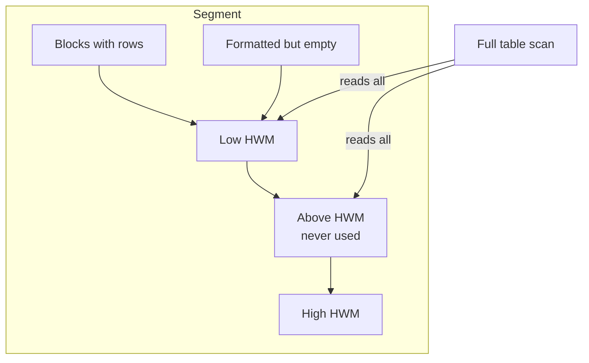

# High Water Mark

## Overview

The **High Water Mark (HWM)** is the boundary between blocks in a segment that have ever been used and blocks that have never been used. Full-table scans read up to the HWM, whether or not those blocks currently contain rows. This is the reason why heavy `DELETE` activity doesn't automatically make a table scan faster: the HWM stays put, empty blocks are still read.

Two HWMs exist in ASSM tablespaces: the **low HWM** (blocks fully formatted) and the **HWM** (blocks that may or may not be formatted).

## Architecture



## Internal Working

### HWM Behavior

- **INSERT** — extends HWM if needed; new blocks come from `PCTFREE`/`PCTUSED` logic (ASSM: bitmap).
- **UPDATE** — does not move HWM (rows may migrate but block stays used).
- **DELETE** — does not move HWM. Empty blocks remain below HWM.
- **TRUNCATE** — resets HWM to segment header (block 0). Fast; entire segment marked empty.
- **DROP TABLE** — deallocates all segments.
- **`ALTER TABLE ... SHRINK SPACE`** — moves rows down and lowers HWM.
- **`ALTER TABLE ... MOVE`** — recreates segment with a fresh (compacted) HWM.

### Low HWM (ASSM)

ASSM introduced a "low HWM" — the boundary below which every block is formatted. Between the low HWM and the HWM, blocks are allocated but might not be formatted yet. Full scans probe the block bitmap to determine which need reading.

### Deferred Segment Creation

Since 11.2, empty tables have no segment and no HWM. First INSERT allocates the initial extent.

## Components

| Component            | Purpose                               |
| -------------------- | ------------------------------------- |
| Segment header       | Records HWM                           |
| Bitmap blocks (ASSM) | Track free/used block state below HWM |
| ASSM low HWM         | Formatted-block boundary              |
| Extent map           | Extent membership                     |

## Important Parameters

Segment-level attributes:

| Attribute             | Purpose                       |
| --------------------- | ----------------------------- |
| `PCTFREE`             | Space reserved for row growth |
| `PCTUSED` (MSSM only) | Block re-insert threshold     |
| `INITRANS`            | Initial ITL slots             |
| `ROW MOVEMENT`        | Required for SHRINK SPACE     |

## Important Views

| View                      | Purpose                                 |
| ------------------------- | --------------------------------------- |
| `DBA_TABLES.BLOCKS`       | Blocks below HWM                        |
| `DBA_TABLES.EMPTY_BLOCKS` | Blocks above HWM (in allocated extents) |
| `DBA_SEGMENTS.BLOCKS`     | Total blocks allocated                  |
| `DBMS_SPACE.SPACE_USAGE`  | ASSM block-state breakdown              |
| `DBMS_SPACE.UNUSED_SPACE` | Space above HWM                         |

## Diagnostic Queries

```sql
-- HWM vs total blocks
SELECT owner, table_name, num_rows, blocks, empty_blocks, avg_space,
       chain_cnt, last_analyzed
FROM   dba_tables
WHERE  owner = 'HR' AND table_name = 'EMPLOYEES';

-- Space above HWM
DECLARE
  total_blocks NUMBER; total_bytes NUMBER;
  unused_blocks NUMBER; unused_bytes NUMBER;
  last_used_file NUMBER; last_used_block NUMBER;
  last_used_ext NUMBER;
BEGIN
  DBMS_SPACE.UNUSED_SPACE(
    segment_owner => 'HR', segment_name => 'EMPLOYEES', segment_type => 'TABLE',
    total_blocks => total_blocks, total_bytes => total_bytes,
    unused_blocks => unused_blocks, unused_bytes => unused_bytes,
    last_used_extent_file_id => last_used_file,
    last_used_extent_block_id => last_used_block,
    last_used_block => last_used_ext);
  DBMS_OUTPUT.PUT_LINE(
    'Total blocks:  ' || total_blocks ||
    ', unused:  ' || unused_blocks);
END;
/

-- ASSM space distribution
DECLARE
  fs1 NUMBER; fs2 NUMBER; fs3 NUMBER; fs4 NUMBER;
  fs1b NUMBER; fs2b NUMBER; fs3b NUMBER; fs4b NUMBER;
  fullb NUMBER; fullbytes NUMBER;
  unfmt NUMBER; unfmtbytes NUMBER;
BEGIN
  DBMS_SPACE.SPACE_USAGE(
    segment_owner => 'HR', segment_name => 'EMPLOYEES', segment_type => 'TABLE',
    unformatted_blocks => unfmt, unformatted_bytes => unfmtbytes,
    fs1_blocks => fs1, fs1_bytes => fs1b,
    fs2_blocks => fs2, fs2_bytes => fs2b,
    fs3_blocks => fs3, fs3_bytes => fs3b,
    fs4_blocks => fs4, fs4_bytes => fs4b,
    full_blocks => fullb, full_bytes => fullbytes);
  DBMS_OUTPUT.PUT_LINE(
    'Full: ' || fullb || ', 75-100% free: ' || fs4 ||
    ', 50-75% free: ' || fs3 || ', 25-50%: ' || fs2 ||
    ', 0-25%: ' || fs1 || ', unformatted: ' || unfmt);
END;
/
```

## Common Operations

### Reclaim space with SHRINK

```sql
-- Row movement required
ALTER TABLE orders ENABLE ROW MOVEMENT;

-- Phase 1: move rows (no HWM change; keeps DML online)
ALTER TABLE orders SHRINK SPACE COMPACT;

-- Phase 2: lower HWM (brief lock; brings full compaction)
ALTER TABLE orders SHRINK SPACE;

-- Cascade to LOBs and indexes
ALTER TABLE orders SHRINK SPACE CASCADE;
```

### Reset HWM with MOVE

```sql
ALTER TABLE orders MOVE ONLINE;
-- Rebuild indexes afterward if not using UPDATE INDEXES
ALTER INDEX orders_pk REBUILD ONLINE;
```

### TRUNCATE

```sql
TRUNCATE TABLE staging_table;   -- HWM back to segment header
```

## Common Issues

- **Full scans too slow after mass DELETE** — HWM unchanged; scan still reads all blocks.
- **`ORA-10635: Invalid segment or tablespace type`** — SHRINK requires ASSM tablespace, not IOT or clustered table.
- **`ORA-14150`** — SHRINK not allowed on partition without row movement.
- **HWM not moving after SHRINK COMPACT** — SHRINK COMPACT alone doesn't lower HWM. Follow with SHRINK SPACE.

## Troubleshooting

1. `DBA_TABLES.BLOCKS` vs `AVG_ROW_LEN × NUM_ROWS / block_size` — how much space is "wasted."
2. `DBMS_SPACE.SPACE_USAGE` gives fine-grained view.
3. Segment Advisor: `EXEC dbms_space.auto_space_advisor_job_proc;`.
4. For temp segment HWM issues, drop and recreate TEMP tablespace.

## Best Practices

1. **TRUNCATE for staging tables** — instant HWM reset.
2. Regularly SHRINK or MOVE tables with high DELETE churn.
3. Enable **Segment Advisor** to identify candidates.
4. Match `PCTFREE` to update patterns — too low causes row migration, too high wastes space.
5. Partition large tables so old data can be dropped (`ALTER TABLE ... DROP PARTITION`) rather than deleted.
6. Rebuild indexes after MOVE or SHRINK (unless online with `UPDATE INDEXES`).
7. Consider `TRUNCATE PARTITION` for time-partitioned data.

## Interview Questions

1. **Q:** What is the HWM?
   **A:** High Water Mark — the boundary between blocks a segment has used and blocks never touched.

2. **Q:** Why does DELETE not reduce full-scan time?
   **A:** DELETE removes rows but doesn't lower HWM. Full scans read up to HWM regardless.

3. **Q:** How do you lower the HWM?
   **A:** `TRUNCATE`, `ALTER TABLE ... SHRINK SPACE`, or `ALTER TABLE ... MOVE`.

4. **Q:** SHRINK SPACE COMPACT vs SHRINK SPACE?
   **A:** COMPACT moves rows down without lowering HWM (online-safe). SHRINK SPACE lowers HWM (brief lock).

5. **Q:** What's the low HWM in ASSM?
   **A:** The boundary below which every block is formatted. Blocks between low HWM and HWM may need formatting checks.

6. **Q:** Prerequisite for SHRINK SPACE?
   **A:** `ROW MOVEMENT` enabled and ASSM tablespace.

## References

- Oracle Database Administrator's Guide 19c — Reclaiming Wasted Space
- Oracle Database Concepts 19c — Segments
- MOS Doc ID 130866.1 — Reclaiming Unused Space
- MOS Doc ID 242090.1 — SHRINK SPACE
