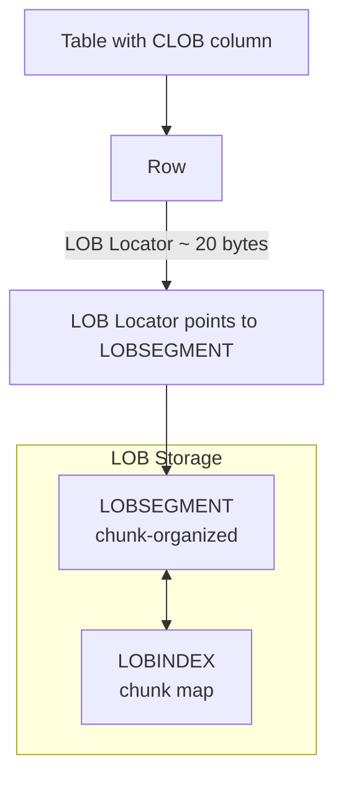

# LOB Storage

## Overview

Oracle stores large character or binary objects (LOBs) as **CLOB**, **NCLOB**, **BLOB**, or **BFILE**. Each LOB column has an associated **LOBSEGMENT** (data) and **LOBINDEX** (metadata). The critical choice is **BasicFiles** (legacy) vs **SecureFiles** (11g+, recommended) — SecureFiles support compression, deduplication, encryption, and are more space-efficient.

For all new development, use **SecureFiles**.

## Architecture



## Internal Working

### Inline vs Out-of-Line

- **Inline** — LOB < 3964 bytes stored directly in the row (default `ENABLE STORAGE IN ROW`).
- **Out-of-line** — LOB stored in LOBSEGMENT; the row keeps only a 20-byte locator.

Threshold ~3964 bytes on 8K blocks (depends on row overhead).

### Chunk

LOB data is stored in **chunks** — a multiple of the tablespace's block size, up to 32 KB. Set at creation:

```sql
CREATE TABLE docs (id NUMBER, content CLOB)
LOB (content) STORE AS SECUREFILE (
  CHUNK 8192          -- match block size
  CACHE
  ENABLE STORAGE IN ROW
);
```

### BasicFiles vs SecureFiles

| Feature          | BasicFiles | SecureFiles              |
| ---------------- | ---------- | ------------------------ |
| Introduced       | 8i         | 11g                      |
| Compression      | No         | Yes (LOW/MEDIUM/HIGH)    |
| Deduplication    | No         | Yes                      |
| Encryption       | No         | Yes (TDE)                |
| Migration        | —          | Automatic (12c+ default) |
| Performance      | OK         | 2–3× faster              |
| Space efficiency | Poor       | Excellent                |

### `db_securefile` Parameter

```sql
ALTER SYSTEM SET db_securefile = 'ALWAYS';   -- Force SecureFiles
```

Values: `PERMITTED` (default, allows both), `PREFERRED` (SecureFile by default), `ALWAYS` (SecureFile only), `IGNORE`, `NEVER`.

### CACHE vs NOCACHE

- `CACHE` — LOB reads/writes go through buffer cache.
- `NOCACHE` — direct-path I/O; better for large streaming reads.
- `CACHE READS` — cache reads only.

## Components

| Component   | Purpose                             |
| ----------- | ----------------------------------- |
| LOB locator | ~20 bytes in the row; points to LOB |
| LOBSEGMENT  | LOB data in chunks                  |
| LOBINDEX    | Chunk-to-block map                  |
| Chunk       | Multiple of block size, up to 32K   |

## Important Parameters

| Parameter       | Purpose                                           |
| --------------- | ------------------------------------------------- |
| `db_securefile` | Global SecureFile behavior                        |
| Storage clause  | Table-level `LOB (col) STORE AS SECUREFILE (...)` |

## Important Views

| View                    | Purpose                       |
| ----------------------- | ----------------------------- |
| `DBA_LOBS`              | LOB column metadata           |
| `DBA_LOB_SUBPARTITIONS` | Partitioned LOB info          |
| `DBA_SEGMENTS`          | LOBSEGMENT and LOBINDEX sizes |
| `V$SEGMENT_STATISTICS`  | LOB I/O stats                 |

## Diagnostic Queries

```sql
-- All LOB columns and their storage
SELECT owner, table_name, column_name, segment_name, index_name,
       chunk, pctversion, cache, in_row, format, securefile,
       compression, encrypt, deduplication
FROM   dba_lobs
ORDER  BY owner, table_name;

-- LOBSEGMENT sizes
SELECT s.owner, s.segment_name, s.tablespace_name,
       ROUND(s.bytes/1024/1024/1024, 2) AS gb, l.compression,
       l.securefile
FROM   dba_segments s
JOIN   dba_lobs l ON l.segment_name = s.segment_name
WHERE  s.segment_type LIKE 'LOB%'
ORDER  BY s.bytes DESC
FETCH FIRST 20 ROWS ONLY;

-- LOB reads/writes
SELECT owner, object_name, statistic_name, value
FROM   v$segment_statistics
WHERE  object_type LIKE 'LOB%'
   AND statistic_name IN ('physical reads', 'physical writes')
   AND value > 0
ORDER  BY value DESC;
```

## Common Operations

### Create SecureFile LOB

```sql
CREATE TABLE documents (
  id NUMBER PRIMARY KEY,
  metadata VARCHAR2(4000),
  content BLOB,
  content_txt CLOB
)
LOB (content) STORE AS SECUREFILE content_lob (
  TABLESPACE lob_data
  CHUNK 8192
  CACHE
  COMPRESS MEDIUM
  ENABLE STORAGE IN ROW
)
LOB (content_txt) STORE AS SECUREFILE (
  TABLESPACE lob_data
  DEDUPLICATE
  COMPRESS MEDIUM
);
```

### Migrate BasicFile to SecureFile

```sql
-- 12c+ online move
ALTER TABLE documents MOVE ONLINE LOB (content)
  STORE AS SECUREFILE (COMPRESS HIGH DEDUPLICATE);
```

### Reclaim space

```sql
-- SHRINK LOB segment (SecureFile only)
ALTER TABLE documents MODIFY LOB (content) (SHRINK SPACE);
```

## Common Issues

- **`ORA-22297: warning: Old LOB value ...`** — Attempting to update SecureFile with a locator from a different session.
- **Massive LOB growth without corresponding row growth** — BasicFile fragmentation or lack of compression. Migrate to SecureFile.
- **Slow LOB reads under NOCACHE** — For random access pattern, use CACHE.
- **`ORA-01555` on LOB read** — Undo pressure from long-running read. Enlarge undo or use SecureFile.

## Troubleshooting

1. `DBA_LOBS.SECUREFILE = 'NO'` — migrate to SecureFile.
2. `DBA_LOBS.COMPRESSION` — enable if not compressed.
3. Space usage: `DBA_SEGMENTS` for LOBSEGMENT bytes vs actual data volume.
4. For chained fetches on LOB: enable STORAGE IN ROW for small LOBs.

## Best Practices

1. **Use SecureFiles for all new LOBs.** Set `db_securefile = 'ALWAYS'`.
2. **Compress** (`COMPRESS MEDIUM`) — Advanced Compression Option required. Typical 30–70% savings.
3. **Deduplicate** for LOBs with repeated content (attachments, boilerplate).
4. **CHUNK** = tablespace block size (usually 8 KB) for random access; larger (16K–32K) for streaming.
5. **CACHE** for small/frequent LOBs; **NOCACHE** for large streaming.
6. Separate LOB tablespace for isolated backup and compression policies.
7. **Encrypt** sensitive LOB columns (`ENCRYPT USING 'AES256'` — TDE required).
8. Migrate BasicFiles to SecureFiles during upgrade windows — significant space/perf gains.
9. Monitor LOB segment growth — often the fastest-growing data class.

## Interview Questions

1. **Q:** BasicFile vs SecureFile?
   **A:** SecureFile (11g+) supports compression, deduplication, encryption; ~2–3× faster than BasicFile. Use SecureFile for all new LOBs.

2. **Q:** When is a LOB stored inline vs out-of-line?
   **A:** Inline if < 3964 bytes and `ENABLE STORAGE IN ROW`; otherwise in LOBSEGMENT.

3. **Q:** What is a LOB chunk?
   **A:** The allocation unit of a LOB — multiple of the tablespace block size, up to 32 KB.

4. **Q:** How do you migrate BasicFile to SecureFile?
   **A:** `ALTER TABLE ... MOVE ONLINE LOB (col) STORE AS SECUREFILE (...);` in 12c+.

5. **Q:** What does DEDUPLICATE do?
   **A:** Stores identical LOB values only once — significant savings when LOBs contain repeated content.

6. **Q:** Cost of `CACHE` on LOB?
   **A:** Buffer cache pressure, especially for large LOBs. Use NOCACHE for streaming; CACHE for frequent small LOBs.

7. **Q:** What is a LOB locator?
   **A:** ~20-byte pointer stored in the row that references the LOBSEGMENT location. Sessions manipulate LOBs via locators.

## References

- Oracle Database SecureFiles and Large Objects Developer's Guide 19c
- Oracle Database Advanced Application Developer's Guide — LOB best practices
- MOS Doc ID 391559.1 — SecureFile LOB
- MOS Doc ID 262472.1 — LOB Storage Options
