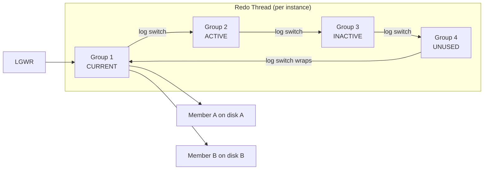

# Redo Logs

## Overview

**Online redo logs** are the append-only journal of every change made to Oracle data. Before a modification is persisted to a datafile, its **change vector** (redo entry) is written to the redo log by LGWR. On instance crash, SMON replays these entries to bring the datafiles up to date — this is Oracle's core durability mechanism.

Redo logs are organized as **groups**, each group containing one or more **members** (files). LGWR writes to all members of the current group simultaneously.

## Architecture



## Internal Working

### Group Members

Each group can have multiple members. Members within a group hold identical content — Oracle writes to all members simultaneously. This is **multiplexing** for redundancy:

- Loss of one member: LGWR continues on the surviving members (with warning).
- Loss of all members of a group: instance crashes if that group is current or active.

### Log States

| State      | Meaning                                                                                        |
| ---------- | ---------------------------------------------------------------------------------------------- |
| `CURRENT`  | Actively being written                                                                         |
| `ACTIVE`   | Filled but not yet checkpointed — DBWn still writing dirty buffers whose redo is in this group |
| `INACTIVE` | All associated dirty buffers written; group is safe to reuse                                   |
| `UNUSED`   | Newly added, never written                                                                     |
| `CLEARING` | Manually being cleared                                                                         |

### Log Switch

When the current group fills, LGWR performs a **log switch**:

1. Marks current group ACTIVE (or INACTIVE if checkpoint complete).
2. Moves to the next group.
3. Triggers an implicit **checkpoint**.
4. Signals ARCn (if ARCHIVELOG mode) to archive the just-filled group.

### Log Sequence

Every log switch increments the **sequence number**. Sequence + thread# uniquely identifies each archived log.

## Components

| Component    | Purpose                                                |
| ------------ | ------------------------------------------------------ |
| Redo Group   | Logical bucket for redo                                |
| Redo Member  | Physical file on disk                                  |
| Redo Thread  | Per-instance stream (1 for single-instance, N for RAC) |
| Log Sequence | Monotonically increasing per thread                    |

## Important Parameters

| Parameter                     | Purpose                                   |
| ----------------------------- | ----------------------------------------- |
| `log_buffer`                  | Redo log buffer in SGA (fixed at startup) |
| `archive_lag_target`          | Force log switch every N seconds          |
| `db_create_online_log_dest_n` | OMF directories for online redo           |
| `_use_single_log_writer`      | (hidden) Scalable LGWR toggle             |

## Important Views

| View             | Purpose                                                             |
| ---------------- | ------------------------------------------------------------------- |
| `V$LOG`          | Redo groups: sequence, size, status                                 |
| `V$LOGFILE`      | Members per group                                                   |
| `V$LOG_HISTORY`  | Log switch history                                                  |
| `V$SYSSTAT`      | `redo size`, `redo writes`                                          |
| `V$SYSTEM_EVENT` | `log file sync`, `log file parallel write`, `log file switch (...)` |

## Diagnostic Queries

```sql
-- Redo log groups and members
SELECT lg.group#, lg.thread#, lg.sequence#,
       lg.bytes/1024/1024 AS mb, lg.members, lg.archived, lg.status,
       lf.member
FROM   v$log lg JOIN v$logfile lf ON lg.group# = lf.group#
ORDER  BY lg.group#, lf.member;

-- Recent log switch frequency
SELECT TO_CHAR(first_time,'YYYY-MM-DD HH24') AS hour,
       COUNT(*) AS switches
FROM   v$log_history
WHERE  first_time > SYSDATE - 3
GROUP  BY TO_CHAR(first_time,'YYYY-MM-DD HH24')
ORDER  BY hour DESC;

-- Redo throughput per day
SELECT TO_CHAR(first_time,'YYYY-MM-DD') AS day,
       COUNT(*) AS switches,
       ROUND(SUM(blocks*block_size)/1024/1024/1024, 2) AS gb
FROM   v$archived_log
WHERE  dest_id = 1 AND first_time > SYSDATE - 7
GROUP  BY TO_CHAR(first_time,'YYYY-MM-DD')
ORDER  BY day;

-- Are all members healthy?
SELECT group#, member, status, type
FROM   v$logfile
WHERE  status IS NOT NULL AND status <> 'STALE';
```

### Add / Drop Groups and Members

```sql
-- Add a new group
ALTER DATABASE ADD LOGFILE GROUP 5
  ('+DATA/prod/redo05a.log', '+RECO/prod/redo05b.log') SIZE 2G;

-- Add a member to an existing group
ALTER DATABASE ADD LOGFILE MEMBER '+RECO/prod/redo01c.log' TO GROUP 1;

-- Drop a group (must be INACTIVE)
ALTER DATABASE DROP LOGFILE GROUP 5;

-- Drop a member
ALTER DATABASE DROP LOGFILE MEMBER '+RECO/prod/redo01c.log';

-- Force a log switch
ALTER SYSTEM SWITCH LOGFILE;

-- Force a global checkpoint
ALTER SYSTEM CHECKPOINT;

-- Resize (drop + add with new size)
```

### Resize Workflow

There is no direct resize. To resize:

1. Add new groups with new size.
2. Force switches until old groups become INACTIVE.
3. Drop old groups.

## Common Issues

- **`log file switch (checkpoint incomplete)`** — Next group is still ACTIVE (DBWn hasn't finished). Enlarge groups or add DBWn workers.
- **`log file switch (archiving needed)`** — ARCn hasn't archived the next group. Enlarge FRA or fix archive destination.
- **`ORA-00312: online log ... thread ... member ...`** — Missing member. Fix path, then `ALTER DATABASE CLEAR UNARCHIVED LOGFILE GROUP N;` (only if truly cannot recover; typically restore from backup).
- **Log switches every minute** — Groups too small; enlarge.
- **Log switches every 4 hours** — Groups too large or workload low; may violate `archive_lag_target`.

## Troubleshooting

1. `V$LOG.STATUS` — expected: 1 CURRENT, 0–2 ACTIVE, rest INACTIVE. Persistent ACTIVE state indicates DBWn lag.
2. Log switch frequency: target 4 switches/hour at peak. Adjust group size.
3. If a member is missing but group has other members, drop the missing member and add a new one on healthy storage.
4. For loss of all members of an INACTIVE group: `ALTER DATABASE CLEAR LOGFILE GROUP N;` (does not require recovery).
5. For loss of all members of CURRENT/ACTIVE: media recovery required, potentially data loss to last checkpoint.

## Best Practices

1. **Multiplex** — 2 members per group, on independent disks.
2. **3+ groups per thread**. 4 is safer.
3. **Size for 15-minute log switch at peak**. Typical: 1–4 GB per group.
4. Place redo on **low-latency storage** — NVMe or ASM diskgroup with HIGH redundancy, sync writes.
5. `archive_lag_target = 900` forces switches every 15 minutes even when quiet — bounds Data Guard lag.
6. RMAN backup archives regularly with `DELETE INPUT` — prevents FRA fill.
7. Alert on `log file switch (checkpoint incomplete)` or `... (archiving needed)`.
8. In RAC, size per-thread redo identically across instances.

## Interview Questions

1. **Q:** What is a redo log group vs member?
   **A:** Group = logical bucket LGWR writes to. Members = physical files within a group (multiplexed copies).

2. **Q:** How does Oracle guarantee durability?
   **A:** LGWR flushes redo to disk on commit; only then does the transaction complete. On crash, SMON replays redo from the last checkpoint SCN.

3. **Q:** What is a log switch?
   **A:** LGWR rotates from a full group to the next available group; triggers a checkpoint and (in ARCHIVELOG) archiving.

4. **Q:** Why size redo groups for ~15-minute switches?
   **A:** Too small → too many switches, thrashing checkpoints. Too large → long apply time on Data Guard, long recovery.

5. **Q:** What does `ALTER DATABASE CLEAR LOGFILE` do?
   **A:** Re-initializes the log group. `CLEAR UNARCHIVED` allows clearing without archiving (only in emergencies; may need `RESETLOGS` afterward).

6. **Q:** How do you resize redo logs?
   **A:** Add new-sized groups, force switches, drop old groups.

7. **Q:** In RAC, how many threads?
   **A:** One redo thread per instance. All threads' logs are needed for recovery.

## References

- Oracle Database Administrator's Guide 19c — Managing Redo Log Files
- Oracle Database Concepts 19c — Redo Logs
- MOS Doc ID 1035935.6 — Redo Log Sizing Advisor
- MOS Doc ID 601316.1 — Redo Log Best Practices
