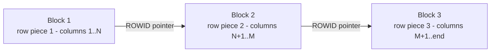

# Row Chaining

## Overview

A **chained row** is one whose data cannot fit in a single Oracle block because the row itself is too large. Oracle stores the row in multiple pieces linked by ROWID pointers (**row pieces**). Every SELECT of a chained row requires reading multiple blocks, incrementing `table fetch continued row` in `V$SYSSTAT`.

Chained rows are distinct from [migrated rows](row-migration.md), which are rows that once fit in a block but were UPDATE'd to no longer fit — the original ROWID becomes a forwarding pointer to the row's new location.

## Architecture



## Internal Working

### Causes

1. **Row length > block size** — e.g., row with many wide `VARCHAR2` or LONG columns, block size only 8 KB.
2. **Row with > 255 columns** — Oracle stores the first 255 columns and the rest in a separate row piece, always chained.

### Row Format

Each piece includes:

- Row header
- `HRID` (head-of-row-id) pointer to next piece (if not final)
- Column count in this piece
- Column data

### Cost

Every physical read of a chained row adds an additional block read. In an OLTP workload with heavy chained rows, `db file sequential read` and `table fetch continued row` both climb.

### How to Detect

`ANALYZE TABLE t LIST CHAINED ROWS INTO chained_rows;` populates a table with ROWIDs:

```sql
-- Create the chained_rows helper table once
@?/rdbms/admin/utlchain.sql

-- Analyze
ANALYZE TABLE hr.employees LIST CHAINED ROWS;

-- Inspect
SELECT owner_name, table_name, head_rowid, analyze_timestamp
FROM   chained_rows
WHERE  table_name = 'EMPLOYEES';
```

Or check `DBA_TABLES.CHAIN_CNT` (populated by `DBMS_STATS.GATHER_TABLE_STATS(..., estimate_percent => 100)` or `ANALYZE`).

## Components

| Component                        | Purpose                                                      |
| -------------------------------- | ------------------------------------------------------------ |
| Head row piece                   | Contains ROWID pointer to next piece; retains original ROWID |
| Continued row pieces             | Rest of the row; internal ROWID                              |
| `table fetch continued row` stat | Counts extra block fetches from chained/migrated reads       |

## Important Parameters

| Parameter       | Purpose                           |
| --------------- | --------------------------------- |
| `db_block_size` | Block size — fixed at DB creation |

## Important Views

| View                                      | Purpose                                  |
| ----------------------------------------- | ---------------------------------------- |
| `DBA_TABLES.CHAIN_CNT`                    | Chained row count (populated by ANALYZE) |
| `V$SYSSTAT` — `table fetch continued row` | Total continued-row fetches              |
| `V$SEGMENT_STATISTICS`                    | Per-segment I/O stats                    |

## Diagnostic Queries

```sql
-- Global chained-row impact
SELECT name, value FROM v$sysstat
WHERE  name IN ('table fetch continued row', 'table fetch by rowid');

-- Tables with high chain count
SELECT owner, table_name, num_rows, chain_cnt,
       ROUND(chain_cnt / DECODE(num_rows, 0, 1, num_rows) * 100, 2) AS pct
FROM   dba_tables
WHERE  chain_cnt > 0
ORDER  BY pct DESC;

-- Populate chained_rows for a target
-- @?/rdbms/admin/utlchain.sql   -- once, creates CHAINED_ROWS table
DELETE FROM chained_rows WHERE table_name = 'EMPLOYEES';
ANALYZE TABLE hr.employees LIST CHAINED ROWS;

SELECT COUNT(*) AS chained
FROM   chained_rows
WHERE  table_name = 'EMPLOYEES';
```

## Common Operations

### For "true" chained rows (row > block size)

1. Move the table to a tablespace with a **larger block size**:

   ```sql
   -- One-time DBA setup: enable non-default block size cache
   ALTER SYSTEM SET db_16k_cache_size = 4G;

   -- Create 16K tablespace
   CREATE TABLESPACE big_blocks
     DATAFILE '+DATA/prod/big.dbf' SIZE 10G
     BLOCKSIZE 16384;

   -- Move
   ALTER TABLE hr.employees MOVE TABLESPACE big_blocks;
   ALTER INDEX employees_pk REBUILD;
   ```

2. Redesign schema — split wide columns to a separate table, or use LOB with STORAGE IN ROW.

3. For > 255 columns, restructure — this chaining is intrinsic to the row format.

### For migrated rows misidentified as chained

Fix with MOVE + `PCTFREE`. See [Row Migration](row-migration.md).

## Common Issues

- **High `table fetch continued row`** — Chained or migrated. Check `chain_cnt` and row width.
- **Slow reports** — Continued-row fetches multiply I/O.
- **`ORA-01450: maximum key length exceeded`** — Row too wide for index key size — not chaining, but related to block/row sizing.

## Troubleshooting

1. Determine chained vs migrated:
   - **Row length ≥ block size** or **> 255 columns** → truly chained.
   - **Row length < block size** but chain_cnt > 0 → migrated.
2. `V$SEGMENT_STATISTICS` for `table fetch continued row` per segment.
3. Use `ANALYZE ... LIST CHAINED ROWS` for a rowid-level list.
4. For real chaining, move to larger block size or redesign.
5. For migrated rows, `PCTFREE` change + MOVE.

## Best Practices

1. **Design rows to fit in a block.** Assume ~7 KB usable per 8 KB block (block overhead + PCTFREE).
2. Use LOBs for very wide text/binary data (with `STORAGE IN ROW`).
3. Consider **larger block size** (16 KB or 32 KB) for tables with wide rows if consistently chained.
4. Tables with > 255 columns are inherently chained — evaluate schema.
5. Monitor `table fetch continued row` — spike after schema change signals new chaining.
6. Don't confuse chaining with migration — the fix is different.

## Interview Questions

1. **Q:** What is a chained row?
   **A:** A row whose data is too large for a single block, so it's split into pieces linked by ROWID pointers.

2. **Q:** Cause of chaining?
   **A:** (1) Row length > block size. (2) Row with more than 255 columns.

3. **Q:** Chained vs migrated row?
   **A:** Chained: row too big for one block from the start. Migrated: row once fit but grew via UPDATE and moved.

4. **Q:** How do you detect chained rows?
   **A:** `ANALYZE TABLE ... LIST CHAINED ROWS INTO chained_rows;` or check `DBA_TABLES.CHAIN_CNT`.

5. **Q:** Which wait event / stat reveals chained-row cost?
   **A:** `table fetch continued row` in `V$SYSSTAT`.

6. **Q:** How do you fix chained rows?
   **A:** Move table to larger-block-size tablespace, or redesign schema (split wide columns, use LOB with in-row storage).

7. **Q:** Is chaining fixed by `PCTFREE`?
   **A:** No — that fixes migration, not chaining.

## References

- Oracle Database Concepts 19c — Row Format and Size
- Oracle Database Performance Tuning Guide 19c — Chained Rows
- MOS Doc ID 122020.1 — Row Chaining and Migration
- MOS Doc ID 68370.1 — ANALYZE LIST CHAINED ROWS
