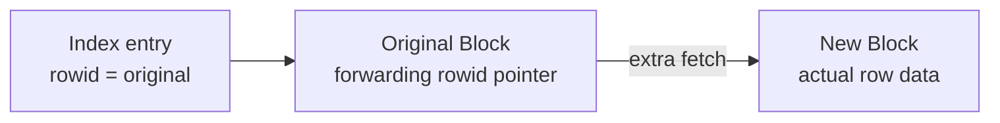

# Row Migration

## Overview

A **migrated row** is a row that used to fit in its block but was UPDATE'd to become too big for the remaining free space. Oracle moves the row to a new block with room, but leaves a **forwarding pointer** at the original ROWID. All indexes still point to the original ROWID; readers follow the pointer to fetch the actual data — an extra block read per access.

Row migration is the most common cause of unexplained `table fetch continued row` in OLTP databases. It is directly controllable by `PCTFREE`.

## Architecture



## Internal Working

### How Migration Happens

1. A row is inserted; it fits in a block with 10% `PCTFREE`.
2. Later, an UPDATE adds a column value that increases the row size beyond `PCTFREE`.
3. Oracle cannot expand the row in place.
4. Oracle allocates space in a different block, writes the row there.
5. The original block header retains a **forwarding pointer** to the new location.
6. Indexes still contain the original ROWID.

### Reader Cost

- Index lookup returns original ROWID → block A.
- Read block A → forwarding pointer → block B.
- Read block B for actual data.
- Two block reads instead of one.

### `PCTFREE`

The single most important parameter. `PCTFREE 10` means when a block reaches 90% used, Oracle stops inserting to leave 10% for row growth. Higher `PCTFREE` prevents migration; lower wastes less space.

For UPDATE-heavy tables (variable-length columns being enlarged, NULL columns being set): `PCTFREE 20–30`.

For insert-only / append-only: `PCTFREE 0`.

### Detection

Same as chained rows — `table fetch continued row` counter and `ANALYZE LIST CHAINED ROWS`. Distinguishing:

- Row length < block size → migration.
- Row length ≥ block size → chaining.

Sometimes both coexist.

## Components

| Component          | Purpose                           |
| ------------------ | --------------------------------- |
| Original block     | Retains forwarding pointer        |
| Forwarding pointer | Small entry pointing to new ROWID |
| New block          | Actual row data                   |
| Index entries      | Still reference original ROWID    |

## Important Parameters

Segment-level:

| Parameter   | Purpose                        |
| ----------- | ------------------------------ |
| `PCTFREE n` | % reserved for row growth      |
| `PCTUSED n` | (MSSM only) reinsert threshold |

## Important Views

| View                                              | Purpose                          |
| ------------------------------------------------- | -------------------------------- |
| `DBA_TABLES.CHAIN_CNT`                            | Includes migrated + chained rows |
| `V$SYSSTAT` — `table fetch continued row`         | Extra fetches                    |
| `CHAINED_ROWS` (helper table from `utlchain.sql`) | Per-row detail                   |

## Diagnostic Queries

```sql
-- Rate of continued-row fetches
SELECT name, value FROM v$sysstat WHERE name = 'table fetch continued row';

-- Tables with migration/chaining
SELECT owner, table_name, num_rows, chain_cnt, avg_row_len, pct_free,
       ROUND(chain_cnt/DECODE(num_rows,0,1,num_rows)*100, 2) AS pct
FROM   dba_tables
WHERE  chain_cnt > 0
ORDER  BY pct DESC;

-- Identify per-row migration for a specific table
-- One-time: @?/rdbms/admin/utlchain.sql
DELETE FROM chained_rows WHERE table_name = 'ORDERS';
ANALYZE TABLE hr.orders LIST CHAINED ROWS;
SELECT COUNT(*) FROM chained_rows WHERE table_name = 'ORDERS';

-- Are these true chains (rows too big) or migrations (updates)?
SELECT MAX(row_size) FROM (
  SELECT VSIZE(col1) + VSIZE(col2) + ... AS row_size FROM hr.orders
);
-- Compare to db_block_size × (1 - pct_free/100).
```

## Common Operations

### Fix migration with MOVE

```sql
-- Increase PCTFREE first
ALTER TABLE hr.orders PCTFREE 25;

-- Rewrite the table (compact + apply new PCTFREE)
ALTER TABLE hr.orders MOVE ONLINE;

-- Rebuild indexes (or use UPDATE INDEXES online in some cases)
ALTER INDEX hr.orders_pk REBUILD ONLINE;
```

### Fix per-row migration (targeted)

```sql
-- Move only migrated rows
DELETE FROM chained_rows WHERE table_name = 'ORDERS';
ANALYZE TABLE hr.orders LIST CHAINED ROWS INTO chained_rows;

-- Copy migrated rows out, delete, reinsert
CREATE TABLE tmp_orders AS
SELECT * FROM hr.orders
WHERE ROWID IN (SELECT head_rowid FROM chained_rows WHERE table_name = 'ORDERS');

DELETE FROM hr.orders
WHERE ROWID IN (SELECT head_rowid FROM chained_rows WHERE table_name = 'ORDERS');

INSERT INTO hr.orders SELECT * FROM tmp_orders;
DROP TABLE tmp_orders;

-- Re-analyze
DELETE FROM chained_rows WHERE table_name = 'ORDERS';
ANALYZE TABLE hr.orders LIST CHAINED ROWS INTO chained_rows;
```

### Reduce future migration

```sql
-- Higher PCTFREE for UPDATE-heavy tables
ALTER TABLE hr.orders PCTFREE 25;

-- New inserts benefit; existing rows fixed via MOVE
ALTER TABLE hr.orders MOVE ONLINE;
```

## Common Issues

- **`table fetch continued row` climbing** — Recent UPDATE-heavy workload creating migrations.
- **Performance regression after adding column with UPDATE** — Row lengths grew; PCTFREE inadequate.
- **PCTFREE too high** — Wasted space; monitor via `DBA_TABLES.AVG_SPACE`.
- **Indexes stale after MOVE** — Rebuild required (unless online with `UPDATE INDEXES`).

## Troubleshooting

1. Compare `table fetch by rowid` and `table fetch continued row` to gauge severity.
2. Segment Advisor identifies migration candidates:
   ```sql
   DECLARE
     task_id NUMBER;
     obj_id  NUMBER;
   BEGIN
     DBMS_ADVISOR.CREATE_TASK('Segment Advisor', task_id, 'orders_advisor');
     DBMS_ADVISOR.CREATE_OBJECT('orders_advisor','TABLE','HR','ORDERS',null,null,obj_id);
     DBMS_ADVISOR.EXECUTE_TASK('orders_advisor');
   END;
   ```
3. `PCTFREE` tuning: watch row length trends (`AVG_ROW_LEN`) over time.

## Best Practices

1. **`PCTFREE 20–30`** for UPDATE-heavy tables with variable-length columns.
2. **`PCTFREE 10`** default for standard OLTP.
3. **`PCTFREE 0`** for append-only staging tables.
4. Reorganize (`MOVE`) migrated tables during maintenance windows.
5. Monitor `chain_cnt` after schema changes (adding columns, DDL).
6. Consider **larger block size** if migration recurs — but this is a heavy migration.
7. Batch UPDATE-heavy schema changes and follow up with MOVE.

## Interview Questions

1. **Q:** What is a migrated row?
   **A:** A row that grew via UPDATE beyond available free space in its block and was moved to a new block, leaving a forwarding pointer at the original ROWID.

2. **Q:** How does it differ from chaining?
   **A:** Chaining is inherent (row too big for any block). Migration is UPDATE-induced (row was OK but grew).

3. **Q:** Which parameter controls migration risk?
   **A:** `PCTFREE` — space reserved for row growth.

4. **Q:** Cost of a migrated row?
   **A:** One extra block read per fetch.

5. **Q:** How do you fix migration?
   **A:** Increase `PCTFREE` and `ALTER TABLE ... MOVE ONLINE`, then rebuild indexes.

6. **Q:** Which stat reveals migration?
   **A:** `table fetch continued row`.

7. **Q:** Does DELETE cause migration?
   **A:** No — DELETE reduces row count. UPDATE that enlarges rows is the trigger.

## References

- Oracle Database Concepts 19c — Row Format
- Oracle Database Performance Tuning Guide 19c
- MOS Doc ID 122020.1 — Row Chaining and Migration
- MOS Doc ID 130866.1 — Reclaiming Unused Space
