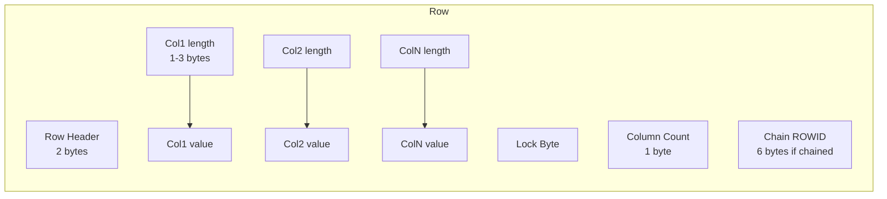

# Row Storage

## Overview

Oracle stores rows in variable-length format within data blocks. Each row consists of a header, a column count, and a sequence of column values — each prefixed by a length byte. This variable-length encoding is space-efficient but has implications for wide rows, > 255 columns, LOBs, and null handling.

## Architecture



## Internal Working

### Row Header

- **Row flag byte** — flags: deleted, chained head, key deleted, etc.
- **Lock byte** — ITL slot number if locked.

### Column Length Byte

- Length ≤ 250 bytes: single length byte (0–250).
- Length > 250: 3 bytes (255 marker + 2-byte length).
- **NULL**: length = 0xFF (0 stored bytes).

### Trailing NULLs

Trailing NULL columns take **zero storage** — Oracle stops writing at the last non-NULL column. Leading and middle NULLs consume 1 byte each.

This is why column order matters: put frequently-NULL columns last.

### > 255 Columns

For rows with more than 255 columns, Oracle splits them: first 255 columns in one row piece, next 255 in another (linked internally). Every access to columns > 255 does an extra block read — effectively chained.

### Data Types

- **NUMBER** — variable length, 1–22 bytes. Length encodes exponent + significant digits.
- **VARCHAR2(n)** — variable length up to `n` bytes/chars.
- **CHAR(n)** — space-padded to `n`.
- **DATE** — fixed 7 bytes.
- **TIMESTAMP(9)** — 11 bytes.
- **RAW/BLOB** — as-is bytes.
- **LOB** — 20-byte locator inline (or up to 3964 bytes if `ENABLE STORAGE IN ROW`).

### ROWID

Extended ROWID: 18 bytes / 10 characters (base-64):

- Data object number (6 chars)
- Relative file number (3 chars)
- Block number (6 chars)
- Row number within block (3 chars)

Example: `AAAWQ3AAJAAAA/AAAB` = object AAAWQ3, file AAJ, block AAAA/AA, row AAB.

## Components

| Component     | Bytes    | Purpose                     |
| ------------- | -------- | --------------------------- |
| Row header    | 2        | Flags + lock byte           |
| Column count  | 1        | Column count                |
| Chain ROWID   | 6        | Present if chained/migrated |
| Column length | 1 or 3   | Length prefix per column    |
| Column data   | variable | Actual value                |

## Important Parameters

Segment-level attributes:

- `PCTFREE`, `PCTUSED`, `INITRANS` — govern block-level insert behavior.
- Column order — physical, DBA responsibility at CREATE TABLE.

## Important Views

| View                     | Purpose                            |
| ------------------------ | ---------------------------------- |
| `DBA_TABLES.AVG_ROW_LEN` | Average row length (stats-derived) |
| `DBA_TAB_COLUMNS`        | Column metadata + histograms       |
| `V$SEGMENT_STATISTICS`   | Per-segment I/O                    |

## Diagnostic Queries

```sql
-- Row length distribution
SELECT owner, table_name, num_rows, avg_row_len, blocks,
       ROUND(num_rows * avg_row_len / 1024/1024, 1) AS estimated_mb,
       ROUND(blocks * (SELECT block_size FROM dba_tablespaces
                       WHERE tablespace_name = t.tablespace_name)/1024/1024, 1) AS blocks_mb
FROM   dba_tables t
WHERE  owner = 'HR'
ORDER  BY num_rows DESC;

-- Column list with sizes
SELECT column_id, column_name, data_type, data_length,
       nullable, num_nulls, avg_col_len
FROM   dba_tab_columns
WHERE  owner = 'HR' AND table_name = 'EMPLOYEES'
ORDER  BY column_id;

-- Manually measure row size for one row
SELECT VSIZE(first_name) + VSIZE(last_name) + VSIZE(email) +
       VSIZE(hire_date) + VSIZE(salary)
FROM   hr.employees WHERE employee_id = 100;

-- Find > 255 column tables (chained inherently)
SELECT owner, table_name, COUNT(*) AS cols
FROM   dba_tab_columns
GROUP  BY owner, table_name
HAVING COUNT(*) > 255
ORDER  BY cols DESC;
```

## Common Operations

### Column order optimization

```sql
-- Reorder columns via new table (Oracle doesn't allow ALTER TABLE MOVE COLUMN)
CREATE TABLE hr.employees_v2 AS
SELECT employee_id, first_name, last_name, email, hire_date, salary,
       phone_number, manager_id, department_id, commission_pct  -- less-populated last
FROM   hr.employees;
```

### Handling wide columns

```sql
-- Use LOB with in-row storage for large but occasionally used columns
ALTER TABLE hr.employees ADD (notes CLOB);
-- LOB storage clause implicit; enable in-row
```

## Common Issues

- **Rows with many NULLs stored inefficiently** — Wrong column order.
- **Row size > block size** — Chaining. Use larger block or LOB.
- **Wasted space per row from bad type choices** — `CHAR(4000)` for short strings.
- **Wide indexes** — Long VARCHAR2 columns in index bloat index size.

## Troubleshooting

1. `DBA_TABLES.AVG_ROW_LEN` from stats.
2. `VSIZE()` on live data.
3. `DBMS_STATS.GATHER_TABLE_STATS(estimate_percent => 100)` for accurate row length.

## Best Practices

1. Order columns: **frequently-NULL columns last** — reduces per-row overhead.
2. Use appropriate types: `VARCHAR2` over `CHAR`; smallest sufficient `NUMBER(p,s)`.
3. Store large text/binary as **LOB** with in-row for small values.
4. Keep row size well below block size — target < 40% of block size for OLTP.
5. Avoid > 255 columns; consider vertical split.
6. For historical / immutable data, use **Advanced Compression** or **HCC** on Exadata.
7. Set `PCTFREE` per update pattern.

## Interview Questions

1. **Q:** How is a row stored?
   **A:** Header (flags + lock byte), column count, optional chain ROWID, then a length byte + value per column.

2. **Q:** Space for trailing NULLs?
   **A:** Zero — Oracle stops writing at the last non-NULL column.

3. **Q:** Space for leading/middle NULL?
   **A:** 1 byte (length = 0xFF).

4. **Q:** > 255 columns behavior?
   **A:** Row is split into pieces of ≤ 255 columns; internally chained. Extra block read to access late columns.

5. **Q:** How large is a ROWID?
   **A:** 18 bytes internally, displayed as 10 base-64 chars.

6. **Q:** Best column order for space?
   **A:** Frequently-populated first; frequently-NULL last.

7. **Q:** Difference between `VARCHAR2(100)` and `CHAR(100)`?
   **A:** VARCHAR2 stores actual length; CHAR pads to 100 bytes/chars.

## References

- Oracle Database Concepts 19c — Data Types
- Oracle Database Concepts 19c — Row Format
- MOS Doc ID 258895.1 — Row storage internals
- Jonathan Lewis, _Oracle Core_, Chapter 4
