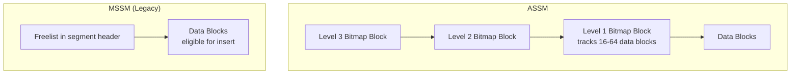

# Segment Space Management

## Overview

**Segment Space Management (SSM)** controls how Oracle tracks free space _within_ segments — specifically, which blocks have space for new rows/index entries. Two policies:

- **ASSM** (Automatic Segment Space Management) — bitmap-based, default since 10g. Concurrent-friendly.
- **MSSM** (Manual, aka Freelist) — legacy, pre-9i default. Requires manual tuning of `PCTFREE`, `PCTUSED`, `FREELISTS`, `FREELIST GROUPS`.

Every new tablespace should be ASSM.

## Architecture



## Internal Working

### ASSM

**Bitmap** at up to 3 levels tracks each block's fullness:

- **Level 1 (L1) bitmap blocks** — each tracks 16–64 data blocks. Records per-block state: `FS1` (0–25% free), `FS2` (25–50%), `FS3` (50–75%), `FS4` (75–100%), `FULL`, or `unformatted`.
- **Level 2 (L2)** — points to multiple L1 blocks.
- **Level 3 (L3)** — points to multiple L2 blocks. Used for very large segments.

When a session inserts:

1. Consult L1 bitmap for a block with sufficient free space.
2. Multiple sessions can consult different L1 blocks concurrently — no single point of contention.
3. Update the L1 bitmap after insert.

ASSM eliminates freelist contention that plagued MSSM under concurrent inserts.

### MSSM (Freelist)

Segment header maintains a **freelist** — a linked list of blocks eligible for insert (usage below `PCTUSED`). Concurrent inserters compete for the freelist:

- `FREELISTS n` sets multiple freelists to reduce contention.
- `FREELIST GROUPS n` (RAC) partitions freelists per instance.

Managing `PCTUSED` correctly is non-trivial; ASSM avoids the whole exercise.

### `PCTFREE` (both modes)

Applies in both ASSM and MSSM. Reserves per-block space for row growth. See [Row Migration](row-migration.md).

## Components

| Component                     | Purpose                   |
| ----------------------------- | ------------------------- |
| L1/L2/L3 bitmap blocks (ASSM) | Track free block state    |
| Freelist header (MSSM)        | List of insertable blocks |
| Segment header                | Per-segment metadata      |

## Important Parameters

Tablespace-level (at creation):

- `SEGMENT SPACE MANAGEMENT AUTO` — ASSM.
- `SEGMENT SPACE MANAGEMENT MANUAL` — MSSM (legacy).

Segment-level:

- `PCTFREE`, `PCTUSED`, `INITRANS`, `MAXTRANS`.
- `FREELISTS`, `FREELIST GROUPS` — MSSM only.

## Important Views

| View                                                                           | Purpose                                |
| ------------------------------------------------------------------------------ | -------------------------------------- |
| `DBA_TABLESPACES.SEGMENT_SPACE_MANAGEMENT`                                     | AUTO or MANUAL                         |
| `DBA_TABLES.PCT_FREE`, `PCT_USED`, `INI_TRANS`, `FREELISTS`, `FREELIST_GROUPS` | Segment attributes                     |
| `V$WAITSTAT`                                                                   | `buffer busy waits`, `free list` waits |
| `DBMS_SPACE.SPACE_USAGE`                                                       | ASSM detailed block state              |

## Diagnostic Queries

```sql
-- Which tablespaces are still MSSM?
SELECT tablespace_name, segment_space_management,
       extent_management, allocation_type
FROM   dba_tablespaces
WHERE  segment_space_management = 'MANUAL';

-- Segment-level attributes
SELECT owner, table_name, pct_free, pct_used, ini_trans, max_trans,
       freelists, freelist_groups
FROM   dba_tables
WHERE  owner = 'HR';

-- ASSM block distribution
DECLARE
  unfmt NUMBER; unfmtbytes NUMBER;
  fs1 NUMBER; fs1b NUMBER;
  fs2 NUMBER; fs2b NUMBER;
  fs3 NUMBER; fs3b NUMBER;
  fs4 NUMBER; fs4b NUMBER;
  fullb NUMBER; fullbytes NUMBER;
BEGIN
  DBMS_SPACE.SPACE_USAGE(
    segment_owner => 'HR', segment_name => 'EMPLOYEES', segment_type => 'TABLE',
    unformatted_blocks => unfmt, unformatted_bytes => unfmtbytes,
    fs1_blocks => fs1, fs1_bytes => fs1b,
    fs2_blocks => fs2, fs2_bytes => fs2b,
    fs3_blocks => fs3, fs3_bytes => fs3b,
    fs4_blocks => fs4, fs4_bytes => fs4b,
    full_blocks => fullb, full_bytes => fullbytes);
  DBMS_OUTPUT.PUT_LINE(
    'Full: ' || fullb || ', FS4 (>75% free): ' || fs4 ||
    ', FS3: ' || fs3 || ', FS2: ' || fs2 || ', FS1: ' || fs1 ||
    ', Unformatted: ' || unfmt);
END;
/

-- Waits related to freelist / block busy
SELECT class, count, time FROM v$waitstat
WHERE  class IN ('free list', 'data block', 'segment header')
ORDER  BY time DESC;
```

## Common Operations

### Create ASSM tablespace (default)

```sql
CREATE TABLESPACE app_data
  DATAFILE '+DATA/prod/app01.dbf' SIZE 10G
  EXTENT MANAGEMENT LOCAL AUTOALLOCATE
  SEGMENT SPACE MANAGEMENT AUTO;   -- ASSM
```

### Migrate MSSM to ASSM

You **cannot** convert an existing tablespace's SSM mode. Instead:

```sql
-- Create new ASSM tablespace
CREATE TABLESPACE app_data_v2
  DATAFILE '+DATA/prod/app_v2.dbf' SIZE 10G
  EXTENT MANAGEMENT LOCAL AUTOALLOCATE
  SEGMENT SPACE MANAGEMENT AUTO;

-- Move segments
ALTER TABLE hr.employees MOVE TABLESPACE app_data_v2;
ALTER INDEX hr.employees_pk REBUILD;
-- ... repeat for all segments in the old tablespace

-- Drop old
DROP TABLESPACE app_data INCLUDING CONTENTS AND DATAFILES;
```

## Common Issues

- **`buffer busy waits` on hot blocks in MSSM** — Freelist contention. Fix: `FREELISTS 4+` or migrate to ASSM.
- **`enq: HW - contention`** — High Water Mark contention in ASSM under parallel INSERTs on same segment. Use partitioning or reduce concurrent parallelism.
- **`enq: TX - allocate ITL entry`** — Not enough ITL slots. Increase `INITRANS` (both SSMs).
- **PCTUSED never triggers reinsert** — MSSM misconfiguration; ASSM avoids this entirely.

## Troubleshooting

1. `DBA_TABLESPACES.SEGMENT_SPACE_MANAGEMENT` — if MANUAL, migrate.
2. `V$WAITSTAT` — freelist waits indicate MSSM contention.
3. For ASSM, `DBMS_SPACE.SPACE_USAGE` shows block-state distribution.

## Best Practices

1. **Always use ASSM** for new tablespaces.
2. Migrate any remaining MSSM tablespaces (identify with `DBA_TABLESPACES`, then MOVE segments to new ASSM tablespaces).
3. For high-concurrency INSERT patterns, ASSM is a must.
4. `PCTFREE` still matters — tune for UPDATE patterns.
5. In RAC, ASSM automatically handles inter-instance space coordination — no `FREELIST GROUPS` tuning needed.
6. Avoid manual freelist tuning — it's a maintenance liability.

## Interview Questions

1. **Q:** What is Segment Space Management?
   **A:** The mechanism Oracle uses to track free space within a segment — ASSM (bitmap) or MSSM (freelist).

2. **Q:** ASSM vs MSSM?
   **A:** ASSM uses bitmap blocks (L1/L2/L3) to track per-block fullness; concurrent-safe. MSSM uses linked freelists in the segment header; suffers concurrency contention.

3. **Q:** Can you convert MSSM to ASSM?
   **A:** Not in place. Create a new ASSM tablespace and MOVE segments.

4. **Q:** What is `FREELISTS`?
   **A:** MSSM-only parameter — number of independent freelists to reduce concurrent-insert contention.

5. **Q:** Which waits indicate freelist contention?
   **A:** `buffer busy waits` on freelist class, or `free list` class in `V$WAITSTAT`.

6. **Q:** Does ASSM eliminate `PCTFREE`?
   **A:** No. `PCTFREE` still reserves per-block space for row growth in both modes.

7. **Q:** What is `enq: HW - contention`?
   **A:** High Water Mark contention — multiple parallel INSERTs racing to extend the segment. Partition or reduce parallelism.

## References

- Oracle Database Concepts 19c — Segment Space Management
- Oracle Database Administrator's Guide 19c
- MOS Doc ID 269495.1 — ASSM
- MOS Doc ID 15476.1 — Freelist contention diagnosis
