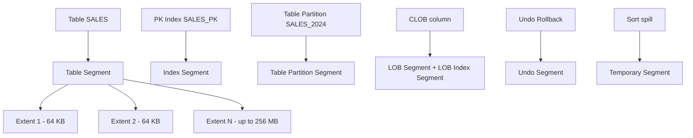

# Segments

## Overview

A **segment** is a set of extents that stores a specific database object: a table, an index, a partition, an undo segment, a temporary segment, or a LOB segment. Every persistent storage object in Oracle is ultimately a segment. A segment exists inside exactly one tablespace and is composed of one or more extents, each of which is a contiguous group of blocks.

Understanding segment types, growth patterns, and reclamation is critical for space management, performance, and cost.

## Architecture



## Internal Working

### Segment Types

| Type               | Description                                                |
| ------------------ | ---------------------------------------------------------- |
| TABLE              | Heap-organized table                                       |
| TABLE PARTITION    | One partition of a partitioned table                       |
| TABLE SUBPARTITION | Sub-partition (composite partitioning)                     |
| INDEX              | B-tree or bitmap                                           |
| INDEX PARTITION    | Partitioned index piece                                    |
| INDEX SUBPARTITION |                                                            |
| CLUSTER            | Table cluster                                              |
| LOBSEGMENT         | LOB data                                                   |
| LOBINDEX           | LOB index                                                  |
| LOB PARTITION      | Partitioned LOB                                            |
| ROLLBACK           | Legacy undo (per-transaction) — deprecated in favor of AUM |
| TYPE2 UNDO         | Auto-Undo Management undo segment                          |
| TEMPORARY          | Sort/hash spill                                            |
| DEFERRED ROLLBACK  | Legacy                                                     |
| CACHE              | Materialized view cache                                    |
| NESTED TABLE       | Nested table storage                                       |
| IOT                | Index-Organized Table                                      |

### Extents

An extent is `n × db_block_size` contiguous bytes. Extent sizes:

- **AUTOALLOCATE**: 64 KB → 1 MB → 8 MB → 64 MB → 256 MB (growth curve).
- **UNIFORM SIZE**: same size for every extent.

### Deferred Segment Creation

Since 11.2, `CREATE TABLE` does not immediately create a segment — the first INSERT triggers segment allocation. This saves space for tables that might never be used. Toggle:

```sql
ALTER SYSTEM SET deferred_segment_creation = TRUE;   -- default
```

To force segment creation for empty tables (needed for Data Pump):

```sql
ALTER TABLE emp ALLOCATE EXTENT;
```

### Growth Model

Each time a segment fills its current extents, Oracle allocates the next extent from the tablespace's free space. Under AUTOALLOCATE, extent size grows geometrically.

## Components

| Component              | Purpose                             |
| ---------------------- | ----------------------------------- |
| Extent                 | Contiguous blocks                   |
| Segment header         | Block 0 of segment; extent map, HWM |
| L1/L2/L3 bitmap blocks | ASSM free-space tracking            |
| Data blocks            | Actual rows / index entries         |

## Important Parameters

| Parameter                   | Purpose                        |
| --------------------------- | ------------------------------ |
| `deferred_segment_creation` | TRUE (default)                 |
| `db_block_size`             | Block size for new tablespaces |

Segment-level storage parameters (via `STORAGE` clause):

- `INITIAL`, `NEXT`, `PCTINCREASE`, `MINEXTENTS`, `MAXEXTENTS`
- `PCTFREE`, `PCTUSED`, `INITRANS`, `MAXTRANS`
- `FREELISTS`, `FREELIST GROUPS` (MSSM only)

## Important Views

| View                         | Purpose                                       |
| ---------------------------- | --------------------------------------------- |
| `DBA_SEGMENTS`               | Every segment with size, extents              |
| `DBA_EXTENTS`                | Per-extent detail                             |
| `DBA_LOBS`                   | LOB segments and columns                      |
| `DBA_TABLES.SEGMENT_CREATED` | 'YES'/'NO' for deferred                       |
| `V$SEGMENT_STATISTICS`       | Physical reads, buffer busy waits per segment |

## Diagnostic Queries

```sql
-- Largest segments
SELECT owner, segment_name, segment_type, tablespace_name,
       ROUND(bytes/1024/1024/1024, 2) AS gb, extents, blocks
FROM   dba_segments
ORDER  BY bytes DESC
FETCH FIRST 20 ROWS ONLY;

-- Segment count by type
SELECT segment_type, COUNT(*) AS segs,
       ROUND(SUM(bytes)/1024/1024/1024, 2) AS gb
FROM   dba_segments
GROUP  BY segment_type
ORDER  BY 3 DESC;

-- Hot segments (physical reads)
SELECT owner, object_name, object_type, value AS physical_reads
FROM   v$segment_statistics
WHERE  statistic_name = 'physical reads'
ORDER  BY value DESC
FETCH FIRST 20 ROWS ONLY;

-- Segments with buffer busy waits
SELECT owner, object_name, object_type, value AS bbw
FROM   v$segment_statistics
WHERE  statistic_name = 'buffer busy waits'
   AND value > 0
ORDER  BY value DESC
FETCH FIRST 20 ROWS ONLY;

-- Extents per segment (rare fragmentation check)
SELECT owner, segment_name, COUNT(*) AS extents
FROM   dba_extents
GROUP  BY owner, segment_name
HAVING COUNT(*) > 1000
ORDER  BY 3 DESC;
```

### Reclaiming Segment Space

```sql
-- Shrink table (requires row movement enabled)
ALTER TABLE customers ENABLE ROW MOVEMENT;
ALTER TABLE customers SHRINK SPACE COMPACT;   -- compact rows
ALTER TABLE customers SHRINK SPACE;           -- lower HWM

-- Move (rebuilds segment)
ALTER TABLE customers MOVE ONLINE;            -- 12c+ online
ALTER INDEX customers_pk REBUILD ONLINE;      -- rebuild after move

-- Coalesce indexes
ALTER INDEX idx REBUILD ONLINE;
ALTER INDEX idx COALESCE;
```

## Common Issues

- **Segment cannot extend** — Tablespace out of space; add datafile or resize.
- **Excessive extents** — With MAXEXTENTS reached, ORA-01631. Enlarge or move to AUTOALLOCATE.
- **Fragmentation** — With LMT + ASSM, "fragmentation" usually means row migration or HWM issues, not tablespace-level.
- **Deferred segment created but 0 rows** — Data Pump import may skip these unless explicitly forced.

## Troubleshooting

1. `SELECT * FROM dba_segments WHERE segment_name='X'` — size, extent count.
2. `SELECT * FROM dba_extents WHERE segment_name='X'` — where extents live.
3. High extent count is rarely a real problem with LMT — only if MAXEXTENTS reached.
4. For row migration/chaining, see [Row Migration](row-migration.md) and [Row Chaining](row-chaining.md).

## Best Practices

1. Use LMT + ASSM + AUTOALLOCATE for OLTP; UNIFORM SIZE for DW.
2. Leave `deferred_segment_creation = TRUE` — saves space.
3. Set `PCTFREE` appropriately for UPDATE patterns; too low → row migration.
4. `INITRANS 10+` for tables with heavy concurrent DML — prevents `enq: TX - allocate ITL entry`.
5. Regularly shrink large tables with historical bloat (`ALTER TABLE ... SHRINK SPACE`).
6. Rebuild fragmented indexes online during maintenance windows.
7. Monitor top-N segments monthly for size trends — capacity planning.

## Interview Questions

1. **Q:** What is a segment?
   **A:** The physical storage allocation for a database object — a table, index, undo, temp, or LOB.

2. **Q:** What are the main segment types?
   **A:** TABLE, INDEX, LOB, ROLLBACK/TYPE2 UNDO, TEMPORARY, CLUSTER, IOT, and their partitioned equivalents.

3. **Q:** What is deferred segment creation?
   **A:** 11.2+ optimization: `CREATE TABLE` doesn't allocate a segment until the first row is inserted.

4. **Q:** How do you reclaim space in a table with lots of deletes?
   **A:** `ALTER TABLE ... SHRINK SPACE` or `MOVE` to compact and lower the HWM.

5. **Q:** Difference between an extent and a segment?
   **A:** A segment consists of one or more extents. An extent is a contiguous set of blocks within a datafile.

6. **Q:** What is `INITRANS`?
   **A:** Number of ITL slots reserved in each block header for concurrent transactions. Increase for tables with many concurrent modifiers.

## References

- Oracle Database Concepts 19c — Segments, Extents, Blocks
- Oracle Database Administrator's Guide 19c — Managing Space
- MOS Doc ID 465694.1 — Segment Advisor and Space Reclamation
- MOS Doc ID 1493782.1 — Deferred Segment Creation
