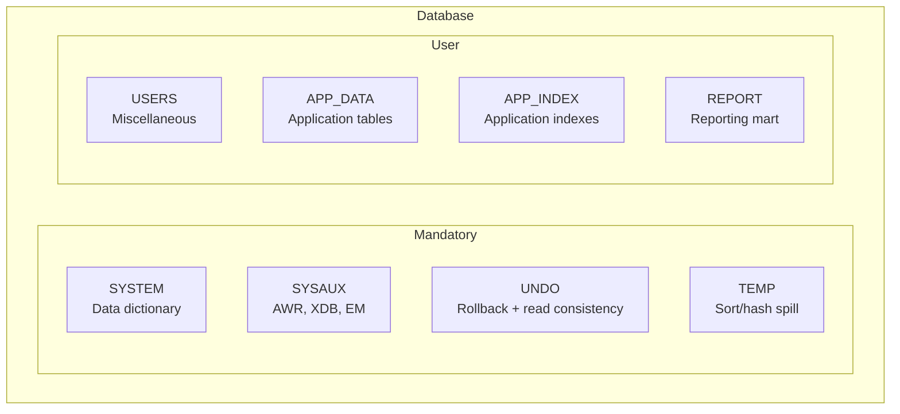

# Tablespaces

## Overview

A **tablespace** is a logical grouping of one or more datafiles that holds Oracle segments. Every table, index, undo record, and temporary sort spills into some tablespace. Tablespaces are the primary unit of **backup**, **recovery**, **transport**, **read-only management**, and **quota control**.

Every Oracle database has, at minimum: `SYSTEM`, `SYSAUX`, one UNDO tablespace, and one TEMP tablespace. Production databases add `USERS` for miscellaneous, application-specific tablespaces, and often separate data / index tablespaces per application.

## Architecture



## Internal Working

### Extent Management

Always **Locally Managed** (LMT). Dictionary-managed tablespaces (DMT) are deprecated. LMT stores extent allocation state as a bitmap in the datafile header (rather than in `SYS.UET$`), avoiding DDL contention.

Extent sizing options:

- `AUTOALLOCATE` (default) — Oracle picks extent sizes (64K, 1M, 8M, 64M, 256M) based on segment growth.
- `UNIFORM SIZE n` — every extent is `n` bytes. Simpler; ideal for uniform workloads.

### Segment Space Management (SSM)

- **ASSM** (Automatic Segment Space Management) — Oracle uses bitmap blocks per segment to track free space. Default and recommended.
- **MSSM** (Manual, aka Freelists) — legacy; requires `PCTUSED`, `FREELISTS`, `FREELIST GROUPS` parameters. Only in `SYSTEM` and legacy tablespaces.

### Types

- **Permanent** — persistent segments (default).
- **Undo** — special; holds undo segments.
- **Temporary** — sort/hash spill; sparse tempfiles.

### Bigfile vs Smallfile

- **Smallfile** (default) — up to 1023 datafiles per tablespace.
- **Bigfile** — exactly one very large datafile per tablespace. See [Bigfile Tablespaces](bigfile-tablespaces.md).

### Encryption

Tablespace-level TDE encryption (11.2+):

```sql
CREATE TABLESPACE secure_data
  DATAFILE '+DATA' SIZE 10G
  ENCRYPTION USING 'AES256'
  DEFAULT STORAGE (ENCRYPT);
```

Requires TDE keystore configured.

### Read-Only

Frozen for backup exemption and archival:

```sql
ALTER TABLESPACE hist_2020 READ ONLY;
-- Excluded from RMAN backup once backed up once
```

## Components

| Component  | Purpose                                         |
| ---------- | ----------------------------------------------- |
| Datafiles  | Physical backing                                |
| Extents    | Contiguous block groups within datafiles        |
| Segments   | Table/index/undo/lob occupants                  |
| Bitmap     | LMT extent tracking                             |
| SSM        | ASSM or MSSM                                    |
| Attributes | LOGGING, FORCE LOGGING, ENCRYPTION, COMPRESSION |

## Important Parameters

| Parameter                                     | Purpose                                |
| --------------------------------------------- | -------------------------------------- |
| `db_files`                                    | Max datafiles database-wide            |
| `db_create_file_dest`                         | OMF for tablespaces                    |
| `db_block_size`                               | Default block size for new tablespaces |
| `undo_tablespace`                             | Active UNDO                            |
| `temp_tablespace` (session-level)             | Default TEMP for user                  |
| `default_permanent_tablespace` (DB attribute) | Default for CREATE USER                |
| `default_temporary_tablespace` (DB attribute) | Default TEMP                           |

## Important Views

| View                  | Purpose                                    |
| --------------------- | ------------------------------------------ |
| `DBA_TABLESPACES`     | All tablespaces + attributes               |
| `DBA_DATA_FILES`      | Datafiles per tablespace                   |
| `DBA_TEMP_FILES`      | Tempfiles                                  |
| `DBA_FREE_SPACE`      | Free extents                               |
| `DBA_TEMP_FREE_SPACE` | Free temp space                            |
| `DBA_SEGMENTS`        | Segments per tablespace                    |
| `V$TABLESPACE`        | Current tablespace state from control file |

## Diagnostic Queries

```sql
-- Tablespace usage
SELECT ts.tablespace_name,
       ROUND(SUM(df.bytes)/1024/1024/1024, 2) AS size_gb,
       ROUND((SUM(df.bytes) - NVL(SUM(fs.bytes),0))/1024/1024/1024, 2) AS used_gb,
       ROUND(NVL(SUM(fs.bytes),0)/1024/1024/1024, 2) AS free_gb,
       ROUND((SUM(df.bytes) - NVL(SUM(fs.bytes),0)) / SUM(df.bytes)*100, 1) AS pct_used
FROM   dba_tablespaces ts
JOIN   dba_data_files df ON df.tablespace_name = ts.tablespace_name
LEFT JOIN dba_free_space fs ON fs.tablespace_name = ts.tablespace_name
WHERE  ts.contents = 'PERMANENT'
GROUP  BY ts.tablespace_name
ORDER  BY pct_used DESC;

-- Tablespace attributes
SELECT tablespace_name, block_size, extent_management,
       allocation_type, segment_space_management,
       contents, logging, force_logging, bigfile,
       encrypted, status
FROM   dba_tablespaces
ORDER  BY tablespace_name;

-- Largest segments per tablespace
SELECT tablespace_name, owner, segment_name, segment_type,
       ROUND(bytes/1024/1024/1024, 2) AS gb
FROM   dba_segments
WHERE  tablespace_name = '&TS'
ORDER  BY bytes DESC
FETCH FIRST 20 ROWS ONLY;
```

### Create Tablespaces

```sql
-- Standard permanent
CREATE TABLESPACE app_data
  DATAFILE '+DATA' SIZE 10G AUTOEXTEND ON NEXT 500M MAXSIZE 100G
  EXTENT MANAGEMENT LOCAL AUTOALLOCATE
  SEGMENT SPACE MANAGEMENT AUTO
  LOGGING;

-- Bigfile
CREATE BIGFILE TABLESPACE dw_data
  DATAFILE '+DATA' SIZE 100G AUTOEXTEND ON MAXSIZE 4T;

-- Encrypted
CREATE TABLESPACE secure_data
  DATAFILE '+DATA' SIZE 10G
  ENCRYPTION USING 'AES256'
  DEFAULT STORAGE (ENCRYPT);

-- Compressed
CREATE TABLESPACE archive_data
  DATAFILE '+DATA' SIZE 20G
  DEFAULT ROW STORE COMPRESS ADVANCED;

-- Temporary group
CREATE TEMPORARY TABLESPACE temp_a TEMPFILE '+DATA' SIZE 20G;
CREATE TEMPORARY TABLESPACE temp_b TEMPFILE '+DATA' SIZE 20G;
ALTER TABLESPACE temp_a TABLESPACE GROUP temp_group;
ALTER TABLESPACE temp_b TABLESPACE GROUP temp_group;
ALTER DATABASE DEFAULT TEMPORARY TABLESPACE temp_group;
```

## Common Issues

- **`ORA-01653/01654/01652`** — Extend failure (data / index / temp).
- **`ORA-01536: space quota exceeded for tablespace`** — User's quota exhausted; grant more with `ALTER USER x QUOTA UNLIMITED ON ts;`.
- **`ORA-25152: TEMPFILE cannot be dropped at this time`** — Session using it. Wait or kill.
- **Fragmentation reports** — With LMT + ASSM, fragmentation is rarely a problem. Focus on segments with high row migration, not tablespace "fragmentation."
- **SYSTEM tablespace growing rapidly** — Investigate dictionary bloat, xdb.

## Troubleshooting

1. `SELECT * FROM dba_free_space WHERE tablespace_name='X'` — how much free contiguous space?
2. `SELECT * FROM dba_data_files WHERE tablespace_name='X'` — autoextend on? MAXSIZE?
3. If tablespace 100% but autoextend blocked, filesystem/ASM full.
4. Enlarge: `ALTER DATABASE DATAFILE ... RESIZE Xg;` or add datafile.
5. For SYSAUX growth: `@?/rdbms/admin/awrinfo.sql` shows AWR footprint.

## Best Practices

1. Separate application tablespaces from `SYSTEM`, `SYSAUX`, `USERS`.
2. Use **LMT + ASSM** for all new tablespaces (defaults in 19c).
3. Use `AUTOEXTEND ON` with `MAXSIZE` cap — never blindly UNLIMITED.
4. Standardize: `AUTOALLOCATE` for OLTP; `UNIFORM SIZE 1M+` for DW/staging.
5. Consider **bigfile** for tablespaces > 500 GB with a single logical unit.
6. Enable **encryption** for regulated data via TDE.
7. Use `FORCE LOGGING` at the DB or tablespace level when Data Guard is in play.
8. Alert at 85% used; page at 95%.
9. Regularly compress historical tablespaces (read-only + Advanced Compression).

## Interview Questions

1. **Q:** What is a tablespace?
   **A:** A logical collection of one or more datafiles that stores segments.

2. **Q:** What tablespaces are mandatory?
   **A:** SYSTEM, SYSAUX, UNDO, TEMP.

3. **Q:** LMT vs DMT?
   **A:** Locally Managed uses bitmaps in the datafile for extent tracking. Dictionary-Managed uses `SYS.UET$`. LMT is the modern default; DMT is deprecated.

4. **Q:** ASSM vs MSSM?
   **A:** Automatic Segment Space Management uses per-segment bitmap blocks to track free space. Manual (freelists) requires `FREELISTS` tuning. ASSM is the modern default.

5. **Q:** Bigfile vs smallfile?
   **A:** Bigfile has exactly one very large datafile per tablespace (max ~128 TB with 32K blocks). Smallfile can have up to 1023 datafiles per tablespace.

6. **Q:** How do you shrink a tablespace?
   **A:** You cannot shrink the tablespace directly, but you can resize its datafiles down (if segments allow) or move segments and drop empty datafiles.

7. **Q:** What is `FORCE LOGGING`?
   **A:** Forces redo generation even for `NOLOGGING` operations — required for Data Guard synchronization.

## References

- Oracle Database Administrator's Guide 19c — Managing Tablespaces
- Oracle Database Concepts 19c — Tablespaces, Datafiles, and Control Files
- MOS Doc ID 372798.1 — LMT and ASSM
- MOS Doc ID 465694.1 — Tablespace Sizing and Fragmentation
