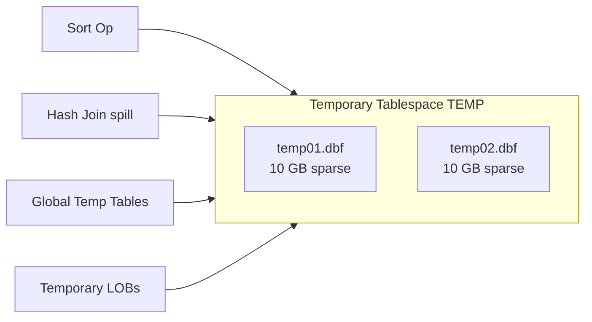

# Tempfiles

## Overview

**Tempfiles** back **temporary tablespaces**. They differ from datafiles in critical ways: they are **sparse** (space is not physically allocated until used), they generate **minimal redo** (extent-map changes only, not user data), and they do not need media recovery. Losing all tempfiles is annoying (queries needing spillage will fail) but not catastrophic — they can be recreated in seconds.

## Architecture



## Internal Working

### Sparse Allocation

Tempfiles are created at their declared size but **initially consume little disk space** (they're OS-sparse or ASM-sparse). Physical blocks are allocated as sort/hash operations request extents. On some filesystems (`ext4`, `xfs`, `zfs`), `du -h` shows small size initially; `ls -l` shows nominal.

### Minimal Redo

Only changes to the tempfile **extent map** (the header block) generate redo, not the user data written to temp. This is why temp segments cannot survive instance recovery — they're marked reusable on startup.

### Temporary Segments Auto-Cleanup

SMON periodically cleans up unused temporary segments. Segment lifetime:

- Sort/hash spill — segment released at query end.
- Global Temporary Table (GTT) — released at session end (`ON COMMIT DELETE ROWS`) or transaction end (`ON COMMIT PRESERVE ROWS`).
- Temporary LOB — released at cursor / session end.

### Local vs Shared

Historically shared TEMP tablespace served all sessions. 12c+ supports **local temporary tablespaces** for RAC — per-instance temp segments in a shared tablespace, reducing cross-node contention.

## Components

| Component            | Purpose            |
| -------------------- | ------------------ |
| Temporary tablespace | Logical container  |
| Tempfiles            | Physical backing   |
| Sort extents         | Per-session space  |
| Global Temp Tables   | Session/txn-scoped |

## Important Parameters

| Parameter             | Purpose                                       |
| --------------------- | --------------------------------------------- |
| `db_create_file_dest` | OMF for tempfiles too                         |
| `temp_undo_enabled`   | Redirect GTT undo to temp (reduces UNDO load) |

## Important Views

| View                  | Purpose                          |
| --------------------- | -------------------------------- |
| `V$TEMPFILE`          | Tempfile info                    |
| `DBA_TEMP_FILES`      | Similar, dictionary              |
| `V$TEMPSTAT`          | I/O per tempfile                 |
| `V$SORT_SEGMENT`      | Sort segment pool per tablespace |
| `V$TEMPSEG_USAGE`     | Per-session temp usage           |
| `V$TEMP_SPACE_HEADER` | Space by tempfile                |
| `V$TEMP_EXTENT_MAP`   | Extent map                       |

## Diagnostic Queries

```sql
-- Tempfiles
SELECT tf.tablespace_name, tf.file_name,
       tf.bytes/1024/1024 AS size_mb, tf.autoextensible,
       tf.maxbytes/1024/1024 AS max_mb
FROM   dba_temp_files tf;

-- Temp usage per tablespace right now
SELECT tablespace_name,
       tablespace_size/1024/1024 AS total_mb,
       allocated_space/1024/1024 AS allocated_mb,
       free_space/1024/1024 AS free_mb,
       ROUND(allocated_space/tablespace_size*100, 1) AS pct_used
FROM   dba_temp_free_space;

-- Sessions consuming temp
SELECT s.sid, s.username, s.machine, s.program,
       tsu.tablespace, tsu.segtype,
       tsu.extents, tsu.blocks*block_size/1024/1024 AS mb
FROM   v$tempseg_usage tsu
JOIN   v$session s ON s.saddr = tsu.session_addr
JOIN   ( SELECT DISTINCT block_size FROM dba_tablespaces
         WHERE  contents='TEMPORARY') b
ON     1=1
WHERE  tsu.blocks > 0
ORDER  BY mb DESC;

-- Sort segment stats
SELECT tablespace_name, extent_size, total_extents,
       used_extents, free_extents, max_used_size
FROM   v$sort_segment;
```

### Create / Manage Temp

```sql
-- Create temporary tablespace
CREATE TEMPORARY TABLESPACE temp2
  TEMPFILE '+DATA' SIZE 10G AUTOEXTEND ON NEXT 500M MAXSIZE 40G
  EXTENT MANAGEMENT LOCAL UNIFORM SIZE 1M;

-- Make default temp
ALTER DATABASE DEFAULT TEMPORARY TABLESPACE temp2;

-- Add tempfile
ALTER TABLESPACE temp ADD TEMPFILE '+DATA' SIZE 10G;

-- Resize online
ALTER DATABASE TEMPFILE '+DATA/prod/temp01.dbf' RESIZE 20G;

-- Shrink (release unused sparse space)
ALTER TABLESPACE temp SHRINK SPACE;
ALTER TABLESPACE temp SHRINK TEMPFILE '+DATA/prod/temp01.dbf';

-- Drop tempfile
ALTER DATABASE TEMPFILE '+DATA/prod/temp02.dbf' DROP INCLUDING DATAFILES;
```

## Common Issues

- **`ORA-01652: unable to extend temp segment by ... in tablespace TEMP`** — TEMP full or autoextend cap. Enlarge, add tempfile, or find runaway query.
- **`ORA-25153: Temporary Tablespace is Empty`** — Tempfiles missing. Add tempfile: `ALTER TABLESPACE TEMP ADD TEMPFILE '...';`.
- **`ORA-01187: cannot read from file because it failed verification tests`** — Tempfile missing. Drop and re-add.
- **Long-lived temp segments** — Session that hangs onto temp forever. Kill the session; SMON cleans up.
- **Temp usage way beyond expected** — Runaway query (missing index → giant hash join). Find via `V$TEMPSEG_USAGE`.

## Troubleshooting

1. `V$TEMPSEG_USAGE` shows per-session current allocations.
2. `V$SQL_WORKAREA_HISTOGRAM` — `onepass_executions > 0` means spillage.
3. Adjust `pga_aggregate_target` upward — most temp spillage is a PGA sizing issue.
4. For chronic spillage, review SQL: missing index, bad plan.
5. `ALTER TABLESPACE temp SHRINK SPACE;` reclaims sparse allocations.

## Best Practices

1. Use a **single** default TEMP tablespace with multiple tempfiles.
2. Size TEMP for peak concurrent workload — DW: 100+ GB common; OLTP: 20+ GB.
3. Enable autoextend on tempfiles with MAXSIZE cap.
4. Use **temp undo** (`temp_undo_enabled=TRUE`) for GTTs — reduces UNDO tablespace load.
5. Never put tempfiles on slow storage — sort/hash performance degrades linearly with temp I/O.
6. Regularly shrink oversized tempfiles: `ALTER TABLESPACE temp SHRINK SPACE;`.
7. In RAC, consider local temp tablespaces (`ALTER USER user TEMPORARY TABLESPACE temp1` per node) to reduce cross-node coordination.
8. Alert on `pct_used > 90` in `DBA_TEMP_FREE_SPACE`.

## Interview Questions

1. **Q:** How is a tempfile different from a datafile?
   **A:** Tempfiles are sparse, generate minimal redo, do not need media recovery, and can be dropped and recreated instantly.

2. **Q:** What causes `ORA-01652`?
   **A:** Temporary tablespace out of space during sort/hash spill or GTT population.

3. **Q:** Can you shrink a tempfile?
   **A:** Yes: `ALTER TABLESPACE temp SHRINK SPACE;` reclaims unused sparse allocations.

4. **Q:** What is `temp_undo_enabled`?
   **A:** 12c+ parameter that redirects undo for GTT operations to TEMP instead of UNDO — reduces UNDO load and enables active standby queries against GTTs.

5. **Q:** What happens to temp segments on instance crash?
   **A:** They're abandoned. SMON marks them reusable on next startup.

6. **Q:** Why doesn't temp need media recovery?
   **A:** Its contents are transient. On recovery, Oracle re-initializes tempfile headers; user data would be regenerated by re-running the query.

## References

- Oracle Database Administrator's Guide 19c — Managing Temporary Tablespaces
- Oracle Database Concepts 19c — Temporary Tablespaces
- MOS Doc ID 160203.1 — Temporary Segment Management
- MOS Doc ID 2027370.1 — Temp Undo Feature
