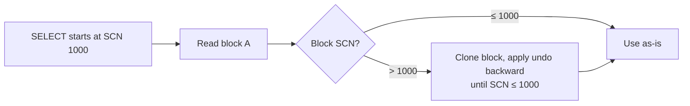

# Consistent Read

## Overview

**Consistent Read (CR)** is Oracle's mechanism for showing every query a snapshot of the database as it existed at a specific SCN — even while other sessions modify the same data. There's no lock, no wait; Oracle reconstructs the "before-image" of any block that has been modified since the query started, using undo.

This is Oracle's answer to `READ COMMITTED` (default) and `SERIALIZABLE` isolation, without shared locks.

## Architecture



## Internal Working

### Query Environment SCN

At the start of a SELECT (or at the start of a transaction under SERIALIZABLE), Oracle records the current SCN as the **query environment SCN**. Every block the query reads must reflect the database's state at that SCN.

### Reading a Block

For each block:

1. Read the current (CURRENT mode) block from buffer cache or datafile.
2. If the block's SCN (from the ITL) is **≤ query SCN**, use it directly.
3. If the block's SCN is **> query SCN**, the block has been modified since the query started. Oracle must **reconstruct** the earlier version:
   - Clone the block in memory (`consistent gets` counter).
   - Walk the ITL entries and apply undo records to roll changes back.
   - Continue until the block's effective SCN is ≤ query SCN.

The reconstructed block is called a **CR block** or **consistent read clone**.

### Statistics

- `db block gets` — CURRENT mode reads (writer's view).
- `consistent gets` — CR mode reads.
- `consistent changes` — undo applications during CR.
- `no work - consistent read gets` — reads that didn't need any rollback.
- `cleanouts and rollbacks - consistent read gets` — reads that needed both.

### When Reconstruction Fails

If needed undo is no longer available (expired + reused), the query fails with `ORA-01555: snapshot too old`. See [ORA-01555](ora-01555.md).

### Isolation Levels

| Level                      | Query SCN         | Notes                                                               |
| -------------------------- | ----------------- | ------------------------------------------------------------------- |
| `READ COMMITTED` (default) | Per-statement     | Each statement sees committed data as of statement start            |
| `READ ONLY`                | Transaction start | Snapshot for whole transaction; no DML allowed                      |
| `SERIALIZABLE`             | Transaction start | Snapshot for whole transaction; DML allowed with conflict detection |

## Components

| Component             | Purpose                            |
| --------------------- | ---------------------------------- |
| Query environment SCN | Snapshot boundary                  |
| CR block              | Reconstructed prior version        |
| Undo record chain     | Source of before-images            |
| ITL slot              | Points to undo for the transaction |

## Important Parameters

| Parameter                     | Purpose                                         |
| ----------------------------- | ----------------------------------------------- |
| `UNDO_RETENTION`              | Bounds how far back undo can be reconstructed   |
| Isolation level (session/txn) | `READ COMMITTED` / `READ ONLY` / `SERIALIZABLE` |

## Important Views

| View         | Purpose                                                  |
| ------------ | -------------------------------------------------------- |
| `V$SYSSTAT`  | `consistent gets`, `db block gets`, `consistent changes` |
| `V$SESSTAT`  | Per-session counters                                     |
| `V$UNDOSTAT` | `SSOLDERRCNT` for `ORA-01555` count                      |

## Diagnostic Queries

```sql
-- CR activity in session (must have STATISTICS_LEVEL enabled)
SELECT n.name, s.value
FROM   v$sesstat s JOIN v$statname n ON n.statistic# = s.statistic#
WHERE  s.sid = SYS_CONTEXT('userenv','sid')
   AND n.name IN ('consistent gets', 'db block gets',
                  'consistent changes',
                  'no work - consistent read gets',
                  'cleanouts and rollbacks - consistent read gets',
                  'rollbacks only - consistent read gets');

-- System-wide
SELECT name, value FROM v$sysstat
WHERE  name IN ('consistent gets', 'db block gets',
                'consistent changes');

-- Query environment SCN (session-level)
SELECT current_scn FROM v$database;   -- database current SCN

-- Set explicit read consistency
SET TRANSACTION READ ONLY;
SELECT COUNT(*) FROM hr.orders;
COMMIT;
```

## Example

```sql
-- Session A
INSERT INTO t VALUES (1, 'A');
-- not committed

-- Session B starts a SELECT (query SCN = X)
SELECT * FROM t;   -- does NOT see A's row (uncommitted)

-- Session A commits (SCN Y > X)

-- Session B, same query environment
-- If still under a serializable txn or in the same statement,
-- it still doesn't see A's row (query SCN = X, before Y).

-- Session B in READ COMMITTED (default), new statement
SELECT * FROM t;   -- now sees A's row (new query SCN)
```

## Common Issues

- **`ORA-01555`** — Undo needed to reconstruct is gone. See [ORA-01555](ora-01555.md).
- **High `consistent changes`** — Heavy read reconstruction; may indicate DML happening during long reads. Consider read-only reports on Active Data Guard standby.
- **`ORA-08177: can't serialize access for this transaction`** — Serializable transaction encountered a conflict with committed changes.

## Troubleshooting

1. High `consistent gets` per row: query is hitting many blocks and possibly reconstructing. Check plan.
2. `consistent changes` growing rapidly during a report: DML is heavy during report window.
3. For chronic long reports, move to Active Data Guard or use flashback query with FDA.

## Best Practices

1. Keep queries short — reduces window for reconstruction.
2. Batch DML off peak read hours if possible.
3. Use Active Data Guard for reporting — no undo pressure on primary.
4. Set `UNDO_RETENTION ≥ longest report`.
5. Understand isolation level implications — SERIALIZABLE reads are simpler mentally but risk `ORA-08177`.
6. Monitor `V$SYSSTAT.consistent_changes` in AWR for reconstruction load.

## Interview Questions

1. **Q:** How does Oracle provide read consistency?
   **A:** By reconstructing block versions using undo records — no shared read locks needed.

2. **Q:** What is `consistent gets`?
   **A:** Buffer gets in "consistent read" mode — the query's view SCN was different from the current block SCN, requiring reconstruction (or a check).

3. **Q:** Difference between CURRENT and CR reads?
   **A:** CURRENT is the writer's view (real current block). CR is a query-consistent version, possibly reconstructed via undo.

4. **Q:** Which isolation levels does Oracle support?
   **A:** READ COMMITTED (default), READ ONLY, SERIALIZABLE.

5. **Q:** What causes `ORA-01555`?
   **A:** Undo needed for CR reconstruction has been expired and reused.

6. **Q:** Does Oracle take shared locks for SELECT?
   **A:** No — CR uses undo, avoiding shared locks. Writers don't block readers.

7. **Q:** What is `set transaction read only`?
   **A:** Establishes a transaction-level query SCN so every SELECT in the transaction sees the same snapshot.

## References

- Oracle Database Concepts 19c — Data Concurrency and Consistency
- Jonathan Lewis, _Oracle Core_, Chapters 3–4
- MOS Doc ID 46114.1 — Understanding Read Consistency
