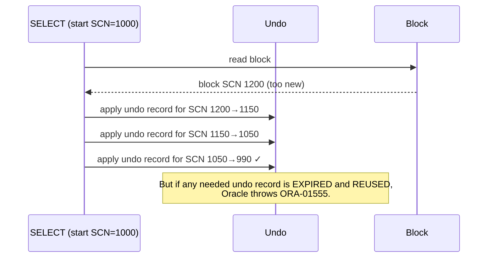

# ORA-01555: Snapshot Too Old

## Overview

`ORA-01555: snapshot too old: rollback segment number ... with name "..." too small` is the canonical undo error. Oracle needed to reconstruct a block to a query's start SCN, but the required undo records have already been reused. The query fails.

Root causes cluster into:

1. **Undo retention too short** — commits happening + heavy DML overwrites needed undo.
2. **UNDO tablespace too small** — extents rotate rapidly.
3. **Fetch-across-commit** — application commits inside a cursor loop.
4. **Delayed block cleanout** — first read after huge DML tries to clean up old ITLs whose undo is gone.
5. **LOB read** — LOB read exceeds `PCTVERSION` or undo retention.

Every DBA sees this. Fixing it means matching retention to workload, and — for the fetch-across-commit case — fixing the application.

## Architecture



## Root Causes and Diagnosis

### Cause 1: Retention too short

**Symptom**: Occasional `ORA-01555` in long reports, correlates with commit-heavy DML.

**Diagnose**:

```sql
-- Recent snapshot-too-old events
SELECT begin_time, ssolderrcnt, maxquerylen, tuned_undoretention
FROM   v$undostat
WHERE  ssolderrcnt > 0
ORDER  BY begin_time DESC;
```

**Fix**:

- Increase `UNDO_RETENTION`.
- Enlarge UNDO tablespace.
- Enable `RETENTION GUARANTEE` (risks `ORA-30036`).

### Cause 2: Undo tablespace too small

Even with high `UNDO_RETENTION`, if the tablespace is small under heavy DML, Oracle can't honor the target.

**Diagnose**: `V$UNDOSTAT.TUNED_UNDORETENTION` well below `UNDO_RETENTION`.

**Fix**: Enlarge UNDO tablespace to `DBMS_UNDO_ADV.required_undo_size(UNDO_RETENTION)`.

### Cause 3: Fetch-Across-Commit (Application Anti-Pattern)

```sql
-- BAD: commit inside cursor loop
DECLARE
  CURSOR c IS SELECT id FROM orders;
BEGIN
  FOR r IN c LOOP
    UPDATE order_stats SET count = count + 1 WHERE id = r.id;
    COMMIT;   -- commits release undo the cursor may need to reconstruct
  END LOOP;
END;
```

Each `COMMIT` advances the SCN and can invalidate undo the cursor needs for later fetches. Oracle may need to reconstruct the _cursor's_ consistent view and fail.

**Fix**:

- Bulk collect + FORALL, one commit at end.
- Batch commits (commit every N rows and re-open cursor).
- Restructure to use a WHERE clause instead of cursor iteration.

### Cause 4: Delayed Block Cleanout

Huge DML committed; blocks not fully cleaned out (ITL slots not updated). First reader tries to look up the commit SCN via undo, but the transaction table slot has been reused (transaction table wraps every so often).

**Symptom**: Read after huge DML fails with `ORA-01555`. `V$UNDOSTAT.NOCU_HEADER_ONLY_CU` climbing.

**Fix**: After huge DML, do a full scan to force cleanout:

```sql
SELECT /*+ FULL(t) */ COUNT(*) FROM t WHERE 1=0;
```

Or set `_optimizer_use_feedback` and run a quick scan. Or accept and enlarge undo/retention.

### Cause 5: LOB Reads

LOBs have their own retention mechanism (`PCTVERSION` for BasicFiles, `RETENTION` for SecureFiles).

**Diagnose**:

```sql
SELECT owner, table_name, column_name, retention, pctversion, cache, securefile
FROM   dba_lobs
WHERE  owner = '<schema>';
```

**Fix**:

- BasicFile: increase `PCTVERSION`.
- SecureFile: `RETENTION AUTO` (default) or `RETENTION MIN <seconds>`.

## Diagnostic Queries

```sql
-- Confirm the error rate
SELECT begin_time, ssolderrcnt AS ora_01555_count,
       maxquerylen, tuned_undoretention
FROM   v$undostat
WHERE  begin_time > SYSDATE - 1
ORDER  BY begin_time DESC;

-- Long-running queries at risk
SELECT s.sid, s.username, s.sql_id,
       (SYSDATE - s.logon_time) * 86400 AS logon_secs,
       s.event, s.status
FROM   v$session s
WHERE  s.type = 'USER' AND s.status = 'ACTIVE'
   AND (SYSDATE - s.logon_time) * 86400 > 3600
ORDER  BY logon_secs DESC;

-- Advisor recommendation
SELECT DBMS_UNDO_ADV.required_undo_size(14400) AS suggested_mb FROM dual;
SELECT DBMS_UNDO_ADV.longest_query(SYSDATE - 1, SYSDATE) AS max_secs FROM dual;
```

## Common Fixes Summary

| Cause                  | Fix                                          |
| ---------------------- | -------------------------------------------- |
| Retention too short    | Raise `UNDO_RETENTION`; consider GUARANTEE   |
| UNDO too small         | Enlarge UNDO tablespace                      |
| Fetch-across-commit    | Restructure application; commit outside loop |
| Delayed block cleanout | Post-DML full scan; enlarge undo             |
| LOB PCTVERSION         | Increase or migrate to SecureFile            |

## Best Practices

1. Size UNDO to hold peak retention: `DBMS_UNDO_ADV.required_undo_size`.
2. `UNDO_RETENTION` ≥ longest expected read.
3. Use `RETENTION GUARANTEE` for critical reporting windows — accept `ORA-30036` trade-off.
4. Prohibit fetch-across-commit in application code review.
5. After bulk DML, run a low-cost full scan to force cleanout.
6. Migrate BasicFile LOBs to SecureFile.
7. For very long reports, move to Active Data Guard standby.
8. Alert on `V$UNDOSTAT.SSOLDERRCNT > 0`.

## Interview Questions

1. **Q:** What is `ORA-01555`?
   **A:** Snapshot too old — Oracle can't reconstruct a block to the query's SCN because required undo has been reused.

2. **Q:** Main causes?
   **A:** Retention too short, UNDO too small, fetch-across-commit, delayed block cleanout, LOB retention.

3. **Q:** How do you fix "fetch-across-commit"?
   **A:** Restructure application — bulk collect + single commit, or don't commit inside the cursor loop.

4. **Q:** What does `RETENTION GUARANTEE` change?
   **A:** Forces Oracle to honor `UNDO_RETENTION` even under space pressure. Risks `ORA-30036` for concurrent DML.

5. **Q:** What is delayed block cleanout?
   **A:** After large DML commits, blocks retain "active" transaction markers until first read. If the transaction table slot has been reused and undo purged, subsequent read may fail with `ORA-01555`.

6. **Q:** How do you prevent LOB-related `ORA-01555`?
   **A:** SecureFile with `RETENTION AUTO` (default), or increase `PCTVERSION` for BasicFile.

7. **Q:** Which view shows past occurrences?
   **A:** `V$UNDOSTAT.SSOLDERRCNT`.

## References

- Oracle Database Administrator's Guide 19c — Diagnosing and Correcting ORA-01555
- MOS Doc ID 40689.1 — ORA-01555 Overview
- MOS Doc ID 45895.1 — Snapshot Too Old
- MOS Doc ID 269814.1 — AUM
- Runbook: [ORA-01555](../27-runbooks/blocking-sessions.md)
