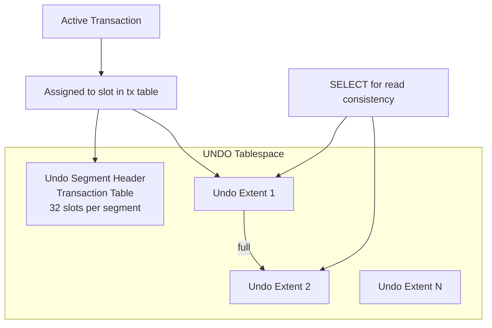

# Undo Architecture

## Overview

The **UNDO tablespace** holds **undo segments** — special segments that record the "before image" of every modified data row and block change. Undo serves three purposes:

1. **Rollback** — `ROLLBACK` restores data using undo.
2. **Read consistency** — Readers reconstruct blocks to their query start SCN using undo.
3. **Flashback** — Flashback Query, Flashback Table, and (indirectly) Flashback Database use undo.

Since 9i, Oracle recommends **Automatic Undo Management (AUM)**: one UNDO tablespace, Oracle manages segments automatically. Rollback-segment manual management (legacy) is deprecated.

## Architecture



## Internal Working

### Undo Segments

Named `_SYSSMU<n>$` (system-managed) or manually as `RBS<n>`. Each segment has:

- **Transaction table** (segment header) — 32 slots. Each slot holds:
  - Transaction ID (XID)
  - Status (active / committed / rolled back)
  - Commit SCN (if committed)
  - Undo block address (UBA) pointer chain
- **Extents** — hold the actual undo records (change vectors).

Under AUM, Oracle creates as many undo segments as needed and rotates their use dynamically. A segment can hold multiple transactions, one per slot.

### Undo Record

For every DML change, Oracle writes an undo record:

- Type (insert / update / delete)
- Data block address (DBA)
- Before-image column values (or entire row for INSERT rollback)
- Pointer to previous undo record for this transaction (chain)

The chain of undo records for a transaction is a linked list ending at the transaction's first record.

### Transaction Lifecycle

1. `INSERT/UPDATE/DELETE` — foreground writes undo record; block header's ITL slot points to undo.
2. `COMMIT` — transaction table slot marked committed with commit SCN.
3. **After commit** — undo remains for as long as `UNDO_RETENTION` (or forever with GUARANTEE) so readers can reconstruct old block versions.
4. **Extent expiration** — once a segment's extent has no live transactions and its undo is beyond retention, Oracle marks it **expired** and reusable.

### Extent Stealing

Under memory pressure, Oracle "steals" expired extents from one undo segment to another needing space. If retention is honored, unexpired extents are protected from stealing.

### AUM vs Manual RBS

Since 9i, AUM (`UNDO_MANAGEMENT=AUTO`) is default and recommended. Manual RBS mode (`UNDO_MANAGEMENT=MANUAL`) requires manual `CREATE ROLLBACK SEGMENT`, `PUBLIC`, sizing per segment — not used in modern databases.

### RAC

Each RAC instance has its own UNDO tablespace (`UNDO_TABLESPACE` per-instance parameter). This avoids cross-instance undo coordination.

## Components

| Component                | Purpose                                       |
| ------------------------ | --------------------------------------------- |
| UNDO tablespace          | Container                                     |
| Undo segment             | Rotating storage for one or more transactions |
| Transaction table        | 32-slot per-segment transaction directory     |
| Undo record              | Before-image change vector                    |
| UBA (Undo Block Address) | Pointer into undo extents                     |

## Important Parameters

| Parameter           | Purpose                                                   |
| ------------------- | --------------------------------------------------------- |
| `UNDO_MANAGEMENT`   | AUTO (recommended) / MANUAL                               |
| `UNDO_TABLESPACE`   | Which UNDO tablespace is active                           |
| `UNDO_RETENTION`    | Seconds to keep undo after commit (target, not guarantee) |
| `TEMP_UNDO_ENABLED` | Redirect GTT undo to TEMP                                 |

## Important Views

| View               | Purpose                                              |
| ------------------ | ---------------------------------------------------- |
| `V$UNDOSTAT`       | Rolling window (10-min buckets) of undo stats        |
| `DBA_UNDO_EXTENTS` | Every undo extent + state (ACTIVE/EXPIRED/UNEXPIRED) |
| `V$ROLLSTAT`       | Per-undo-segment stats                               |
| `V$ROLLNAME`       | Segment name mapping                                 |
| `V$TRANSACTION`    | Active transactions + undo usage                     |

## Diagnostic Queries

```sql
-- Undo tablespace usage
SELECT tablespace_name, extent_management, allocation_type, retention
FROM   dba_tablespaces
WHERE  contents = 'UNDO';

-- Extent state breakdown (how much reusable vs held)
SELECT status,
       COUNT(*) AS extents,
       ROUND(SUM(blocks)/128, 1) AS mb   -- assuming 8K blocks; 128 blocks = 1 MB
FROM   dba_undo_extents
GROUP  BY status;

-- Undo activity (recent)
SELECT begin_time, end_time,
       undoblks, txncount, maxquerylen,
       tuned_undoretention, ssolderrcnt, nospaceerrcnt
FROM   v$undostat
ORDER  BY begin_time DESC
FETCH FIRST 20 ROWS ONLY;

-- Currently active transactions and their undo usage
SELECT s.sid, s.username, t.used_ublk AS undo_blocks,
       t.used_urec AS undo_records,
       (SYSDATE - t.start_date) * 86400 AS seconds,
       t.status
FROM   v$transaction t JOIN v$session s ON s.taddr = t.addr
ORDER  BY used_ublk DESC;

-- Undo segment sizing
SELECT r.name, s.extents, s.rssize/1024/1024 AS mb,
       s.status, s.optsize/1024/1024 AS opt_mb
FROM   v$rollname r JOIN v$rollstat s ON s.usn = r.usn
ORDER  BY s.rssize DESC;
```

## Common Operations

### Create UNDO tablespace

```sql
CREATE UNDO TABLESPACE undotbs2
  DATAFILE '+DATA/prod/undo02.dbf' SIZE 20G
  AUTOEXTEND ON NEXT 1G MAXSIZE 50G
  RETENTION NOGUARANTEE;
```

### Switch active UNDO tablespace

```sql
ALTER SYSTEM SET undo_tablespace = 'UNDOTBS2';

-- Later, when the old one has no active transactions
DROP TABLESPACE undotbs1 INCLUDING CONTENTS AND DATAFILES;
```

### Enable GUARANTEE

```sql
-- Prevents extent reuse until retention expires (may cause ORA-30036)
ALTER TABLESPACE undotbs2 RETENTION GUARANTEE;

-- Turn off (default)
ALTER TABLESPACE undotbs2 RETENTION NOGUARANTEE;
```

## Common Issues

- **`ORA-01555: snapshot too old`** — Query needed to reconstruct a block, but undo has been reused. See [ORA-01555](ora-01555.md).
- **`ORA-30036: unable to extend segment by ... in undo tablespace`** — Under GUARANTEE, no expired extents available; transaction cannot allocate more undo. Enlarge UNDO or reduce `UNDO_RETENTION`.
- **Runaway transaction fills UNDO** — Long-running DML holding undo. Kill session or wait.
- **Multiple active UNDO tablespaces** — Old UNDO tablespace still has active transactions.

## Troubleshooting

1. `V$UNDOSTAT.MAXQUERYLEN` — longest running query in the window.
2. `V$UNDOSTAT.SSOLDERRCNT` — `ORA-01555` count in window.
3. `V$UNDOSTAT.NOSPACEERRCNT` — extend-failure count.
4. Sizing: aim for undo tablespace ≥ `MAXQUERYLEN × undo generation rate × 1.5`.
5. If GUARANTEE + `ORA-30036`: enlarge UNDO or remove GUARANTEE.

## Best Practices

1. **AUM always.**
2. Size UNDO tablespace using Undo Advisor:
   ```sql
   SELECT dbms_undo_adv.required_undo_size(3600) AS size_mb FROM dual;
   ```
3. `UNDO_RETENTION` = longest query + margin. Typical 3600 (1h) or 14400 (4h).
4. `RETENTION GUARANTEE` only for schemas requiring flashback within a window.
5. Monitor `V$UNDOSTAT` weekly; alert on `SSOLDERRCNT`.
6. Kill runaway transactions promptly.
7. In RAC, one UNDO per instance; do not share.
8. Enable `TEMP_UNDO_ENABLED=TRUE` (12c+) — reduces UNDO churn from GTTs.

## Interview Questions

1. **Q:** What does UNDO do?
   **A:** Provides rollback, read consistency, and flashback by storing before-images of changes.

2. **Q:** AUM vs manual rollback segments?
   **A:** AUM (default) auto-manages undo segments. Manual is legacy (`CREATE ROLLBACK SEGMENT`) — deprecated.

3. **Q:** How many transactions can share an undo segment?
   **A:** Up to 32 (the transaction-table slot count per segment).

4. **Q:** What is an "expired" undo extent?
   **A:** An extent whose undo records are past `UNDO_RETENTION` and can be reused.

5. **Q:** Retention: guarantee vs no-guarantee?
   **A:** GUARANTEE prevents extent reuse until retention expires (may cause `ORA-30036`). NOGUARANTEE allows reuse under pressure (may cause `ORA-01555`).

6. **Q:** In RAC, how many UNDO tablespaces?
   **A:** One per instance, set via `UNDO_TABLESPACE` parameter per-instance.

7. **Q:** What is `TEMP_UNDO_ENABLED`?
   **A:** 12c+ feature that stores undo for GTT DML in TEMP instead of UNDO — reduces UNDO churn and allows GTT DML on Active Data Guard.

## References

- Oracle Database Administrator's Guide 19c — Managing UNDO
- Oracle Database Concepts 19c — Data Concurrency and Consistency
- MOS Doc ID 269814.1 — AUM Overview
- MOS Doc ID 268870.1 — Undo Segment Internals
