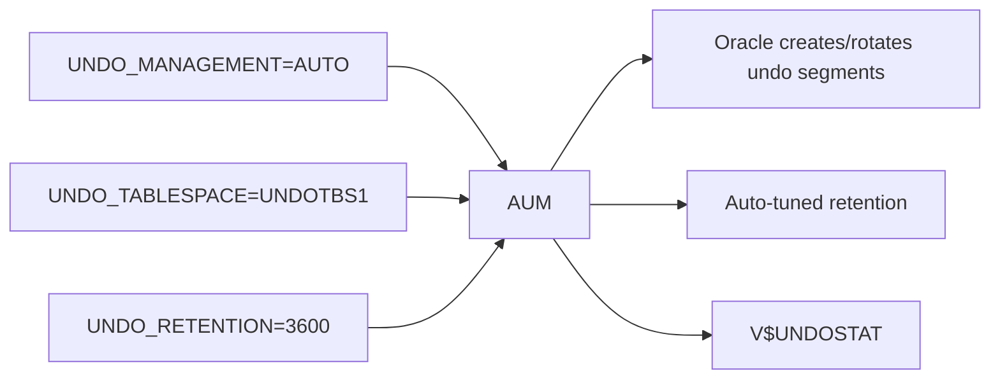

# Undo Management

## Overview

**Automatic Undo Management (AUM)** is Oracle's default undo model since 9i. The DBA sets an UNDO tablespace, a retention target, and lets Oracle create/manage segments dynamically. In practice, AUM administration reduces to: right-size the tablespace, right-size the retention, monitor `V$UNDOSTAT`, and handle the occasional runaway transaction.

## Architecture



## Internal Working

### Auto-Tuned Retention

Under AUM, Oracle tracks the longest actively running query (`MAXQUERYLEN` in `V$UNDOSTAT`) and dynamically adjusts the actual retention (`TUNED_UNDORETENTION`) upward if space permits — targeting no `ORA-01555`.

`UNDO_RETENTION` is the _minimum_ target. Oracle may hold undo longer if space is available.

### With `RETENTION GUARANTEE`

- Oracle **guarantees** extents are not reused until retention expires.
- Trades read consistency (fewer `ORA-01555`) for possible `ORA-30036` (unable to extend).
- Set at tablespace level: `ALTER TABLESPACE undotbs1 RETENTION GUARANTEE;`.

### Sizing

Undo tablespace size ≈ `UNDO_RETENTION (sec) × undo_generation_rate (bytes/sec) × 1.2`.

Use the advisor:

```sql
-- Recommended UNDO size for a target retention (seconds)
SELECT required_undo_size AS mb
FROM   DUAL, TABLE(DBMS_UNDO_ADV.required_undo_size(14400)) t;
```

## Components

Same as [Undo Architecture](undo-architecture.md).

## Important Parameters

| Parameter           | Purpose                            |
| ------------------- | ---------------------------------- |
| `UNDO_MANAGEMENT`   | AUTO (only supported mode)         |
| `UNDO_TABLESPACE`   | Active UNDO tablespace name        |
| `UNDO_RETENTION`    | Minimum retention target (seconds) |
| `TEMP_UNDO_ENABLED` | Redirect GTT undo to TEMP          |

## Important Views

Same as [Undo Architecture](undo-architecture.md), especially:

- `V$UNDOSTAT`
- `DBA_UNDO_EXTENTS`
- `V$TRANSACTION`

## Diagnostic Queries

```sql
-- Confirm AUM
SHOW PARAMETER undo_management
SHOW PARAMETER undo_tablespace
SHOW PARAMETER undo_retention

-- Recent undo stats (10-min buckets)
SELECT begin_time, end_time,
       undoblks * 8 / 1024 AS undo_generated_mb,
       tuned_undoretention AS retention_sec,
       maxquerylen AS longest_query_sec,
       ssolderrcnt AS snapshot_too_old,
       nospaceerrcnt AS no_space
FROM   v$undostat
ORDER  BY begin_time DESC
FETCH FIRST 24 ROWS ONLY;

-- Undo tablespace usage
SELECT tablespace_name, status,
       COUNT(*) AS extents,
       ROUND(SUM(bytes)/1024/1024/1024, 2) AS gb
FROM   dba_undo_extents
GROUP  BY tablespace_name, status
ORDER  BY tablespace_name, status;

-- Long-running queries risking ORA-01555
SELECT s.sid, s.username, s.status,
       (SYSDATE - s.logon_time)*86400 AS logon_secs,
       s.sql_id, s.event, s.seconds_in_wait
FROM   v$session s
WHERE  s.status = 'ACTIVE' AND s.type = 'USER'
   AND (SYSDATE - s.logon_time)*86400 > 3600
ORDER  BY logon_secs DESC;
```

## Common Operations

### Switch UNDO tablespace

```sql
-- Create new one
CREATE UNDO TABLESPACE undotbs2
  DATAFILE '+DATA/prod/undo02.dbf' SIZE 20G
  AUTOEXTEND ON NEXT 1G MAXSIZE 60G;

-- Switch active
ALTER SYSTEM SET undo_tablespace = 'UNDOTBS2';

-- Wait for old to have no active transactions
SELECT segment_name, status
FROM   dba_rollback_segs
WHERE  tablespace_name = 'UNDOTBS1' AND status <> 'OFFLINE';

-- Drop old
DROP TABLESPACE undotbs1 INCLUDING CONTENTS AND DATAFILES;
```

### Enable GUARANTEE

```sql
ALTER TABLESPACE undotbs2 RETENTION GUARANTEE;
```

### Resize existing

```sql
ALTER DATABASE DATAFILE '+DATA/prod/undo01.dbf' RESIZE 40G;
-- Or add datafile
ALTER TABLESPACE undotbs2
  ADD DATAFILE '+DATA/prod/undo03.dbf' SIZE 20G AUTOEXTEND ON MAXSIZE 40G;
```

## Common Issues

- **Chronic `ORA-01555`** — Retention too low or UNDO too small. See [ORA-01555](ora-01555.md).
- **`ORA-30036`** — GUARANTEE + insufficient UNDO. Enlarge or remove GUARANTEE.
- **Excessive undo growth** — Long open transactions holding thousands of undo blocks. Kill runaway.
- **UNDO tablespace won't drop** — Old tablespace has offline/active undo segments. Wait or use `_offline_rollback_segments`.

## Troubleshooting

1. `V$UNDOSTAT` shows if you're hitting `ORA-01555` or `ORA-30036`.
2. Runaway transactions: `V$TRANSACTION.USED_UBLK` sorted descending.
3. Advisor: `DBMS_UNDO_ADV.required_undo_size(seconds)`.
4. If GUARANTEE causes `ORA-30036`, enlarge UNDO or remove GUARANTEE.
5. Consider `TEMP_UNDO_ENABLED=TRUE` to offload GTT undo.

## Best Practices

1. **Size to hold peak workload's longest query.** Use Undo Advisor.
2. `UNDO_RETENTION = 3600` minimum for OLTP; 14400+ for reporting.
3. Enable `TEMP_UNDO_ENABLED=TRUE` for GTT-heavy workloads.
4. Alert on `V$UNDOSTAT.SSOLDERRCNT > 0` or `NOSPACEERRCNT > 0`.
5. Use GUARANTEE selectively — only when flashback within window is critical.
6. Monitor UNDO tablespace utilization weekly.
7. Kill idle-in-transaction sessions after configured timeout (Resource Manager).
8. In RAC, each instance's UNDO sized independently.

## Interview Questions

1. **Q:** What is AUM?
   **A:** Automatic Undo Management — Oracle auto-creates and rotates undo segments in a designated UNDO tablespace.

2. **Q:** Does `UNDO_RETENTION` guarantee retention?
   **A:** No — only with `RETENTION GUARANTEE` on the tablespace. Otherwise it's a target that Oracle may extend or shorten based on space.

3. **Q:** How do you size UNDO?
   **A:** Undo Advisor: `DBMS_UNDO_ADV.required_undo_size(retention_sec)`. Practical: peak generation rate × retention × margin.

4. **Q:** How do you switch UNDO tablespace?
   **A:** Create new, `ALTER SYSTEM SET undo_tablespace = new_name;`, wait for old segments to become offline, drop old tablespace.

5. **Q:** Trade-off of GUARANTEE?
   **A:** Prevents `ORA-01555` at the risk of `ORA-30036` (unable to extend).

6. **Q:** Does GTT DML use UNDO tablespace?
   **A:** By default yes. With `TEMP_UNDO_ENABLED=TRUE`, it uses TEMP instead.

7. **Q:** In RAC, is UNDO shared across instances?
   **A:** No — each instance has its own UNDO tablespace.

## References

- Oracle Database Administrator's Guide 19c — Managing UNDO
- MOS Doc ID 269814.1 — AUM
- MOS Doc ID 1580362.1 — Undo Advisor
- Runbook: [ORA-01555](ora-01555.md)
