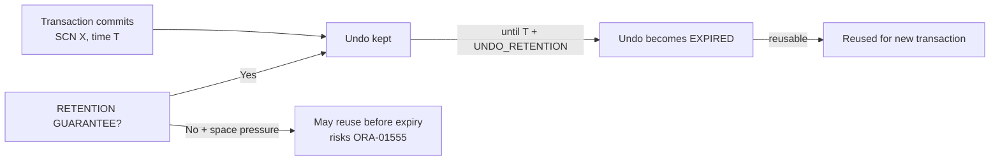

# Undo Retention

## Overview

**Undo Retention** is how long Oracle keeps committed-transaction undo before allowing that undo space to be reused. It directly bounds:

- The window during which Flashback Query and Flashback Table can look into the past.
- The likelihood of `ORA-01555: snapshot too old` for long-running queries.

`UNDO_RETENTION` is set in seconds. It is a **target**, not a guarantee — unless the tablespace has `RETENTION GUARANTEE`.

## Architecture



## Internal Working

### Extent States

| Status      | Meaning                                                           |
| ----------- | ----------------------------------------------------------------- |
| `ACTIVE`    | Extents with active transactions                                  |
| `UNEXPIRED` | Extents with committed transactions still within retention window |
| `EXPIRED`   | Retention has passed; safe to reuse                               |

Oracle reuses `EXPIRED` first. Under pressure without `GUARANTEE`, it will steal `UNEXPIRED` (dropping retention below target — enabling `ORA-01555`).

### Auto-Tuned Retention

`V$UNDOSTAT.TUNED_UNDORETENTION` shows the actual retention Oracle is applying, which may be **higher** than `UNDO_RETENTION` (when space is plentiful) or lower (under pressure without GUARANTEE).

### With `RETENTION GUARANTEE`

- `UNDO_RETENTION` is honored strictly.
- New transactions may fail with `ORA-30036` if `EXPIRED` space runs out.

## Components

Same as [Undo Architecture](undo-architecture.md).

## Important Parameters

| Parameter                                    | Purpose                    |
| -------------------------------------------- | -------------------------- |
| `UNDO_RETENTION`                             | Target retention (seconds) |
| `RETENTION GUARANTEE` (tablespace attribute) | Strict retention           |

## Important Views

| View                        | Purpose                                                              |
| --------------------------- | -------------------------------------------------------------------- |
| `V$UNDOSTAT`                | `TUNED_UNDORETENTION`, `MAXQUERYLEN`, `SSOLDERRCNT`, `NOSPACEERRCNT` |
| `DBA_UNDO_EXTENTS`          | Per-extent status                                                    |
| `DBA_TABLESPACES.RETENTION` | GUARANTEE / NOGUARANTEE / NOT APPLY                                  |

## Diagnostic Queries

```sql
-- Retention configuration
SHOW PARAMETER undo_retention
SELECT tablespace_name, retention FROM dba_tablespaces WHERE contents='UNDO';

-- Auto-tuned retention over time
SELECT begin_time, end_time,
       tuned_undoretention AS actual_sec,
       maxquerylen AS longest_query_sec,
       ssolderrcnt AS snapshot_errors,
       nospaceerrcnt AS space_errors
FROM   v$undostat
ORDER  BY begin_time DESC
FETCH FIRST 24 ROWS ONLY;

-- Extent status
SELECT status, COUNT(*) AS extents,
       ROUND(SUM(bytes)/1024/1024/1024, 2) AS gb
FROM   dba_undo_extents
WHERE  tablespace_name = (SELECT value FROM v$parameter WHERE name = 'undo_tablespace')
GROUP  BY status;

-- Longest query in last hour
SELECT MAX(maxquerylen) AS longest_query_sec
FROM   v$undostat
WHERE  begin_time > SYSDATE - 1/24;
```

## Common Operations

### Set retention

```sql
ALTER SYSTEM SET undo_retention = 14400;   -- 4 hours
```

### Enable GUARANTEE

```sql
ALTER TABLESPACE undotbs1 RETENTION GUARANTEE;
```

### Turn off GUARANTEE

```sql
ALTER TABLESPACE undotbs1 RETENTION NOGUARANTEE;
```

### Query flashback within retention

```sql
-- Flashback query works only if data is within retention window
SELECT * FROM hr.orders AS OF TIMESTAMP (SYSTIMESTAMP - INTERVAL '30' MINUTE);

-- If retention insufficient: ORA-01466 or ORA-01555
```

## Common Issues

- **`ORA-01555` in reporting workloads** — Retention < longest report. Enlarge retention or UNDO.
- **`ORA-30036` after enabling GUARANTEE** — GUARANTEE + heavy DML + small UNDO. Enlarge UNDO or shorten retention.
- **Reports hit `ORA-01555` at busy hours** — Peak DML causes extent stealing. Enable GUARANTEE or add UNDO capacity.
- **Retention "auto-tuned" below UNDO_RETENTION** — Space pressure. Enlarge tablespace.

## Troubleshooting

1. `V$UNDOSTAT.TUNED_UNDORETENTION` vs `UNDO_RETENTION` — see if Oracle is honoring your target.
2. `V$UNDOSTAT.MAXQUERYLEN` shows longest query — set retention above it.
3. `DBA_UNDO_EXTENTS` — how much is expired (reusable) vs unexpired (protected)?
4. Enable GUARANTEE if reporting/flashback within window is critical.
5. Monitor `V$UNDOSTAT.SSOLDERRCNT` — non-zero means `ORA-01555` occurred.

## Best Practices

1. **`UNDO_RETENTION` ≥ longest expected query** — 3600 for OLTP; 14400+ for BI.
2. Size UNDO tablespace: `DBMS_UNDO_ADV.required_undo_size(retention)`.
3. Enable `RETENTION GUARANTEE` only when necessary — every long query risks `ORA-30036` for other DML.
4. For flashback-critical schemas, consider **Flashback Data Archive (FDA)** — cheaper than long undo retention.
5. Monitor `V$UNDOSTAT.SSOLDERRCNT` weekly.
6. Kill idle-in-transaction sessions (Resource Manager `SWITCH_TIME`).
7. Alert on `MAXQUERYLEN > UNDO_RETENTION` — future `ORA-01555` risk.

## Interview Questions

1. **Q:** What does `UNDO_RETENTION` do?
   **A:** Sets the target seconds Oracle keeps committed undo before allowing reuse.

2. **Q:** Is it a guarantee?
   **A:** No — only with `RETENTION GUARANTEE` at the tablespace level.

3. **Q:** How does Oracle auto-tune retention?
   **A:** It observes `MAXQUERYLEN` and, when space allows, extends actual retention (`TUNED_UNDORETENTION`) above the parameter.

4. **Q:** What is `RETENTION GUARANTEE`?
   **A:** Tablespace attribute making retention absolute — protects against `ORA-01555`, risks `ORA-30036`.

5. **Q:** Difference between undo retention and FDA?
   **A:** UNDO retention is short (hours). FDA persists change history in a dedicated tablespace for months/years.

6. **Q:** How do you decide retention?
   **A:** Base on peak `MAXQUERYLEN` + margin for flashback needs.

7. **Q:** Symptoms of retention too low?
   **A:** `ORA-01555` in reports; `V$UNDOSTAT.SSOLDERRCNT > 0`.

## References

- Oracle Database Administrator's Guide 19c — Managing UNDO
- MOS Doc ID 269814.1 — AUM and Retention
- MOS Doc ID 1580362.1 — Undo Advisor
- Related: [ORA-01555](ora-01555.md), [Flashback Data Archive](../16-flashback/index.md)
