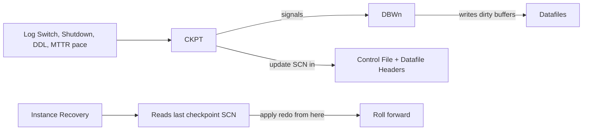

# Checkpoints

## Overview

A **checkpoint** is a point in the SCN timeline where all dirty buffers have been (or will be) written to their datafiles. Checkpoints bound instance recovery time: SMON only replays redo from the last completed checkpoint. The lower the checkpoint SCN, the more redo to apply on recovery — the slower the recovery.

Oracle runs continuous **incremental checkpoints** paced by `fast_start_mttr_target` and triggers **full checkpoints** at log switches, tablespace status changes, and shutdown.

## Architecture



## Internal Working

### Types

| Type            | Trigger                                         | Scope                          |
| --------------- | ----------------------------------------------- | ------------------------------ |
| **Incremental** | Continuous, MTTR-paced                          | Rolling; DBWn writes gradually |
| **Full**        | Log switch, shutdown, `ALTER SYSTEM CHECKPOINT` | All dirty buffers              |
| **Thread**      | Per-instance checkpoint                         | RAC instance's dirty buffers   |
| **Tablespace**  | `ALTER TABLESPACE ... OFFLINE NORMAL`           | Just that tablespace's dirty   |
| **Object**      | Certain DDL (drop tablespace, offline datafile) | Object's blocks                |

### Incremental Checkpoint

DBWn continuously writes dirty buffers at a pace calculated to satisfy `fast_start_mttr_target`. CKPT tracks the "target checkpoint SCN" — the highest SCN whose dirty buffers must be written to bound recovery.

Views: `V$INSTANCE_RECOVERY` shows the current gap.

### Full Checkpoint

Triggers:

- Log switch (implicit).
- `ALTER SYSTEM CHECKPOINT;` (manual).
- `SHUTDOWN NORMAL/IMMEDIATE/TRANSACTIONAL`.
- `ALTER TABLESPACE ... BEGIN BACKUP` (per-tablespace).

Actions:

1. CKPT identifies dirty buffers below target SCN.
2. Signals DBWn to write.
3. Waits for DBWn.
4. Updates control file header, datafile headers with new checkpoint SCN.

### Checkpoint SCN

Stored in:

- **Control file** — global checkpoint SCN and per-datafile checkpoint SCN.
- **Datafile header** — same per-file SCN.

Recovery reads these to know where to begin replay.

## Components

| Component             | Purpose                         |
| --------------------- | ------------------------------- |
| CKPT                  | Signals + updates headers       |
| DBWn                  | Writes dirty buffers            |
| Target checkpoint SCN | Where the checkpoint is heading |
| Actual checkpoint SCN | Confirmed to disk               |

## Important Parameters

| Parameter                  | Purpose                                                 |
| -------------------------- | ------------------------------------------------------- |
| `fast_start_mttr_target`   | Recovery MTTR in seconds — paces incremental checkpoint |
| `log_checkpoint_interval`  | (legacy) redo blocks between checkpoints                |
| `log_checkpoint_timeout`   | (legacy) seconds between checkpoints                    |
| `log_checkpoints_to_alert` | Log to alert log                                        |

## Important Views

| View                                   | Purpose                                               |
| -------------------------------------- | ----------------------------------------------------- |
| `V$INSTANCE_RECOVERY`                  | Target, actual, estimated MTTR                        |
| `V$LOG_HISTORY`                        | Switch history                                        |
| `V$DATAFILE.CHECKPOINT_CHANGE#`        | Per-datafile checkpoint SCN                           |
| `V$DATAFILE_HEADER.CHECKPOINT_CHANGE#` | Header SCN                                            |
| `V$SYSSTAT`                            | `DBWR checkpoints`, `DBWR checkpoint buffers written` |

## Diagnostic Queries

```sql
-- Instance recovery config
SELECT recovery_estimated_ios,
       actual_redo_blks, target_redo_blks,
       target_mttr, estimated_mttr,
       ckpt_block_writes, log_file_size_redo_blks
FROM   v$instance_recovery;

-- Datafile checkpoint SCNs
SELECT file#, checkpoint_change# AS ckpt_scn,
       checkpoint_time,
       (SELECT current_scn FROM v$database) AS current_scn,
       (SELECT current_scn FROM v$database) - checkpoint_change# AS scn_gap
FROM   v$datafile
ORDER  BY scn_gap DESC
FETCH FIRST 10 ROWS ONLY;

-- Log switch frequency (each triggers full checkpoint)
SELECT TO_CHAR(first_time,'YYYY-MM-DD HH24') AS hr,
       COUNT(*) AS switches
FROM   v$log_history
WHERE  first_time > SYSDATE - 1
GROUP  BY TO_CHAR(first_time,'YYYY-MM-DD HH24')
ORDER  BY 1;

-- Checkpoint stats
SELECT name, value FROM v$sysstat
WHERE  name IN ('DBWR checkpoints',
                'DBWR checkpoint buffers written',
                'DBWR thread checkpoint buffers written');
```

## Common Operations

### Manual full checkpoint

```sql
ALTER SYSTEM CHECKPOINT;
```

### Tune recovery time

```sql
-- 5-minute recovery target
ALTER SYSTEM SET fast_start_mttr_target = 300;

-- Verify
SELECT target_mttr, estimated_mttr FROM v$instance_recovery;
```

### Log checkpoints to alert log (diagnostic)

```sql
ALTER SYSTEM SET log_checkpoints_to_alert = TRUE;
```

## Common Issues

- **`log file switch (checkpoint incomplete)`** — DBWn didn't finish previous checkpoint before next log switch. Fix: enlarge log groups or add DBWn workers.
- **High DBWn writes** — `fast_start_mttr_target` too low forcing aggressive incremental checkpointing.
- **Long instance recovery after ABORT** — MTTR target too high; too much redo to replay.
- **Frequent full checkpoints** — Manual `ALTER SYSTEM CHECKPOINT` in code (rare); tablespace status changes.

## Troubleshooting

1. `V$INSTANCE_RECOVERY.ESTIMATED_MTTR` shows expected recovery time.
2. If `log file switch (checkpoint incomplete)` in top waits, enlarge log groups.
3. Trade-off: lower MTTR = more DBWn writes = more I/O; higher MTTR = longer recovery.

## Best Practices

1. `fast_start_mttr_target = 300` (5 min) for OLTP; adjust based on RTO.
2. Size log groups so switches happen every 15–20 min → less frequent full checkpoints.
3. Multiple DBWn workers for large SGA or heavy write.
4. Don't manually issue `ALTER SYSTEM CHECKPOINT` — let Oracle manage.
5. Monitor `V$INSTANCE_RECOVERY.ESTIMATED_MTTR` — should be near target.

## Interview Questions

1. **Q:** What is a checkpoint?
   **A:** A synchronized point where all dirty buffers up to a certain SCN have been written to datafiles.

2. **Q:** Why do checkpoints matter?
   **A:** They bound instance recovery time — SMON only replays redo from the last checkpoint.

3. **Q:** What triggers a full checkpoint?
   **A:** Log switch, clean shutdown, manual command, tablespace/datafile offline.

4. **Q:** What is `fast_start_mttr_target`?
   **A:** Target instance recovery time in seconds. Oracle paces incremental checkpoint to meet it.

5. **Q:** Does CKPT write data blocks?
   **A:** No — CKPT signals DBWn. CKPT updates SCN in control file + datafile headers.

6. **Q:** How do you check current MTTR estimate?
   **A:** `V$INSTANCE_RECOVERY.ESTIMATED_MTTR`.

## References

- Oracle Database Concepts 19c — Checkpoints
- Oracle Database Backup and Recovery User's Guide 19c
- MOS Doc ID 34381.1 — Checkpoint Tuning
- MOS Doc ID 76713.1 — fast_start_mttr_target
