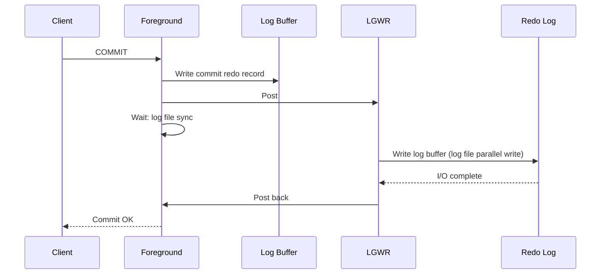

# Commit Processing

## Overview

`COMMIT` finalizes a transaction. From the client's perspective it's one round-trip; from Oracle's perspective it involves:

1. Marking the transaction as committed in the undo segment header.
2. Generating a commit redo record.
3. LGWR flushing the log buffer to disk.
4. LGWR posting the foreground session.
5. Client receiving success.

Steps 3–4 are the **synchronous wait** — the `log file sync` wait event. Every millisecond LGWR spends here is a millisecond every transaction pays.

## Architecture



## Internal Working

### Commit Redo Record

The commit record includes:

- Transaction ID
- Commit SCN
- SCN of the transaction's begin

Written to the log buffer (fast). Then LGWR must flush.

### Group Commit

Multiple sessions committing near-simultaneously get "group committed" — LGWR performs one write covering all of their redo. Each session sees the same `log file sync` completion.

### `commit_write` Parameter

Governs commit semantics:

| Value               | Effect                                                     |
| ------------------- | ---------------------------------------------------------- |
| `IMMEDIATE, WAIT`   | Default — flush at commit, wait for completion             |
| `IMMEDIATE, NOWAIT` | Flush at commit, don't wait — potential data loss on crash |
| `BATCH, WAIT`       | Batch commits within LGWR — small latency win              |
| `BATCH, NOWAIT`     | Batch + don't wait — risk of loss                          |

Session-level via `ALTER SESSION SET commit_wait = NOWAIT;` and `commit_logging`. Use with extreme care.

### `log file sync` Wait

The foreground waits from posting LGWR to being posted back. Includes:

- LGWR CPU / scheduling delay
- LGWR I/O to redo (`log file parallel write`)
- LGWR post back to foreground

If `log file sync` >> `log file parallel write`, LGWR CPU or scheduling is the bottleneck, not I/O.

### Two-Phase Commit (Distributed)

For transactions across DB links using 2PC:

1. **Prepare** — coordinator asks all participants to prepare (write redo, hold locks, don't yet commit).
2. **Commit** — coordinator sends commit; participants commit locally.

Failure between phases can leave in-doubt transactions. See [RECO](../03-instance-architecture/processes/reco.md).

## Components

| Component           | Purpose                                      |
| ------------------- | -------------------------------------------- |
| Log buffer          | Staging                                      |
| Commit redo record  | Marker in the log stream                     |
| LGWR                | Writer                                       |
| Undo segment header | Transaction table (commit SCN recorded here) |

## Important Parameters

| Parameter                | Purpose                 |
| ------------------------ | ----------------------- |
| `log_buffer`             | Buffer size             |
| `commit_write`           | Global commit semantics |
| `commit_logging`         | IMMEDIATE / BATCH       |
| `commit_wait`            | WAIT / NOWAIT           |
| `_use_single_log_writer` | (hidden) scalable LGWR  |

## Important Views

| View                     | Purpose                                                        |
| ------------------------ | -------------------------------------------------------------- |
| `V$SYSSTAT`              | `user commits`, `user rollbacks`, `redo writes`, `redo size`   |
| `V$SYSTEM_EVENT`         | `log file sync`, `log file parallel write`, `log buffer space` |
| `V$SESSION_WAIT_HISTORY` | Recent waits per session                                       |
| `V$COMMIT_WAIT_TIME`     | Commit histogram (12c+)                                        |

## Diagnostic Queries

```sql
-- Commit rate
SELECT name, value FROM v$sysstat
WHERE  name IN ('user commits', 'user rollbacks',
                'redo writes', 'redo size');

-- Log file sync avg wait
SELECT event, total_waits, time_waited_micro/1000000 AS sec,
       ROUND(time_waited_micro/DECODE(total_waits,0,1,total_waits)/1000, 2) AS avg_ms
FROM   v$system_event
WHERE  event IN ('log file sync', 'log file parallel write')
ORDER  BY event;

-- Session-level current wait
SELECT sid, event, seconds_in_wait, state
FROM   v$session
WHERE  status = 'ACTIVE' AND event = 'log file sync';

-- Commit wait histogram (12c+)
SELECT event, wait_time_milli, wait_count
FROM   v$event_histogram
WHERE  event IN ('log file sync', 'log file parallel write')
ORDER  BY event, wait_time_milli;
```

## Common Issues

- **`log file sync` avg > 20 ms** — LGWR bottleneck. Check redo I/O and CPU.
- **`log file sync` >> `log file parallel write`** — LGWR CPU-bound, or many small commits (context-switching overhead).
- **`log buffer space`** — Log buffer full while LGWR busy. Enlarge `log_buffer`.
- **DG SYNC latency** — `log file sync` inflated by primary→standby round trip.
- **Excess commit rate** — Application committing per-row instead of per-batch.

## Troubleshooting

1. Compare `log file sync` avg to `log file parallel write` avg. Difference indicates non-I/O overhead.
2. AWR "Instance Efficiency" panel shows commit throughput and latency.
3. Move redo to lower-latency storage if `parallel write` is > 5 ms.
4. Enable scalable LGWR (`_use_single_log_writer=FALSE`) for high-throughput OLTP.
5. Batch commits at the application layer.
6. For DG SYNC-related latency, evaluate if MAX_PROTECTION is required or MAX_AVAILABILITY (SYNC/NOAFFIRM) is acceptable.

## Best Practices

1. **Batch commits at the application layer.** One commit per business transaction, not per row.
2. Redo on **NVMe or ASM `+REDO`** with HIGH redundancy.
3. Multiplex log members — but on independent storage; slow member drags LGWR.
4. Scalable LGWR for > 100 txns/sec.
5. Don't use `commit_wait=NOWAIT` unless the application can tolerate loss of last-second commits on crash.
6. Alert on `log file sync` > 20 ms.
7. Monitor commit rate — abnormally high = application anti-pattern.
8. For DG: use FASTSYNC or ASYNC unless zero-data-loss required.

## Interview Questions

1. **Q:** What happens on COMMIT?
   **A:** Foreground writes commit redo to log buffer, posts LGWR, waits (log file sync). LGWR flushes and posts back. Client sees success.

2. **Q:** Why is commit synchronous?
   **A:** Durability — the transaction is not durable until its redo is on disk.

3. **Q:** What is `log file sync`?
   **A:** Foreground wait for LGWR to complete its redo write.

4. **Q:** Difference between `log file sync` and `log file parallel write`?
   **A:** Sync = foreground's total wait. Parallel write = LGWR's I/O only. Diff = LGWR CPU + scheduling + post-back.

5. **Q:** Group commit?
   **A:** LGWR batches concurrent commits into a single write, so multiple sessions "share" one flush.

6. **Q:** `commit_write = NOWAIT`?
   **A:** Commit returns immediately without waiting for redo flush. Risk: crash may lose last commits. Rarely used.

7. **Q:** How would you reduce commit latency?
   **A:** Faster redo storage, scalable LGWR, batch commits at app layer, avoid DG SYNC if possible.

## References

- Oracle Database Concepts 19c — Commit Processing
- Oracle Database Performance Tuning Guide 19c — LGWR Tuning
- MOS Doc ID 34592.1 — LGWR/redo tuning
- MOS Doc ID 1376916.1 — Scalable LGWR
- MOS Doc ID 857576.1 — log file sync waits
