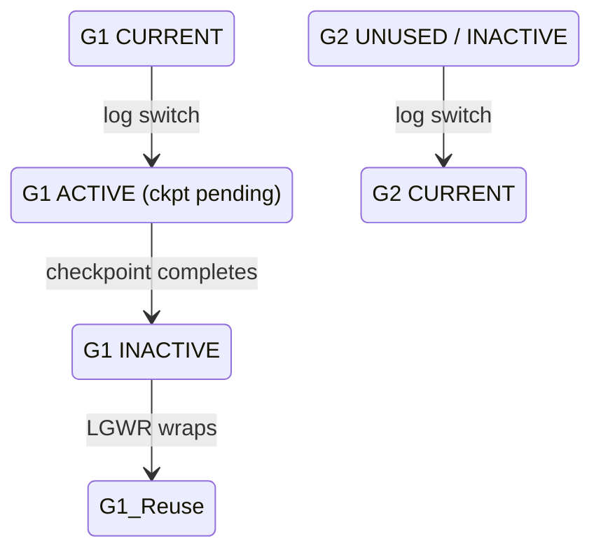

# Log Switches

## Overview

A **log switch** is the transition from one online redo log group to the next: LGWR marks the current group full, moves to the next available INACTIVE group, and triggers ARCn to archive the just-filled group. Log switch cadence — how often switches happen — directly affects redo I/O overhead, standby lag, backup granularity, and recovery time.

Rule of thumb: switch every 15–20 minutes at peak workload. Faster switches thrash DBWn and ARCn; slower switches lengthen recovery and increase standby lag.

## Architecture



## Internal Working

### What Happens on a Switch

1. LGWR notes current group is full.
2. LGWR flushes any remaining redo in the log buffer.
3. LGWR marks current group `ACTIVE` (or `INACTIVE` if checkpoint is complete).
4. LGWR opens next group; marks it `CURRENT`.
5. LGWR signals CKPT for a checkpoint.
6. LGWR signals ARCn to archive the previous group.
7. Session commit redo begins landing in new group.

### Triggers

- **Automatic** — current group full.
- **Manual** — `ALTER SYSTEM SWITCH LOGFILE;`.
- **`archive_lag_target`** — force a switch every N seconds even if group not full. Useful in DG for bounded lag during quiet times.
- **RAC** — `ALTER SYSTEM ARCHIVE LOG CURRENT;` switches all threads.

### Sizing to Cadence

Redo generation rate × time between switches ≈ log group size.

Example: 50 MB/sec redo × 900 sec = 45 GB per group for 15-min switch.

### Costs

- **DBWn** — implicit full checkpoint after every switch.
- **ARCn** — one archive-log write per switch per destination.
- **Standby transport** — smaller groups → more frequent (smaller) transports.

### `log file switch` Waits

Three variants tell you the problem:

| Event                                               | Cause                                              |
| --------------------------------------------------- | -------------------------------------------------- |
| `log file switch completion`                        | Normal wait during switch                          |
| `log file switch (checkpoint incomplete)`           | DBWn behind → enlarge groups or add DBWn           |
| `log file switch (archiving needed)`                | ARCn behind → fix FRA / add ARCn / fix destination |
| `log file switch (private strand flush incomplete)` | Rare; strand cleanup                               |

## Components

Same as [Redo Architecture](redo-architecture.md).

## Important Parameters

| Parameter                   | Purpose                                    |
| --------------------------- | ------------------------------------------ |
| `archive_lag_target`        | Force switch every N seconds               |
| `log_archive_max_processes` | ARCn count                                 |
| `db_writer_processes`       | DBWn count                                 |
| `fast_start_mttr_target`    | Recovery MTTR (indirectly checkpoint pace) |

## Important Views

| View             | Purpose                                               |
| ---------------- | ----------------------------------------------------- |
| `V$LOG`          | Group status                                          |
| `V$LOG_HISTORY`  | Every switch                                          |
| `V$SYSSTAT`      | `redo log space requests`, `redo log space wait time` |
| `V$SYSTEM_EVENT` | Log switch wait events                                |

## Diagnostic Queries

```sql
-- Switch cadence
SELECT TO_CHAR(first_time,'YYYY-MM-DD HH24') AS hr,
       COUNT(*) AS switches,
       ROUND(SUM(blocks*block_size)/1024/1024/1024, 2) AS archived_gb
FROM   v$archived_log
WHERE  dest_id = 1 AND first_time > SYSDATE - 2
GROUP  BY TO_CHAR(first_time,'YYYY-MM-DD HH24')
ORDER  BY 1;

-- Time between recent switches
SELECT thread#, sequence#,
       first_time,
       LAG(first_time) OVER (PARTITION BY thread# ORDER BY sequence#) AS prev_time,
       ROUND((first_time - LAG(first_time) OVER (PARTITION BY thread# ORDER BY sequence#)) * 24 * 60, 1) AS minutes_since_prev
FROM   v$log_history
WHERE  first_time > SYSDATE - 1
ORDER  BY thread#, sequence# DESC;

-- Related wait events
SELECT event, total_waits, time_waited
FROM   v$system_event
WHERE  event LIKE 'log file switch%'
ORDER  BY time_waited DESC;

-- Log group status right now
SELECT group#, thread#, sequence#, bytes/1024/1024 AS mb,
       members, archived, status
FROM   v$log ORDER BY group#;
```

## Common Operations

### Force a switch

```sql
ALTER SYSTEM SWITCH LOGFILE;
-- RAC: switch on this instance only
ALTER SYSTEM ARCHIVE LOG CURRENT;
```

### Set archive lag target

```sql
ALTER SYSTEM SET archive_lag_target = 900;   -- 15 min
```

### Add / drop groups

See [Redo Logs](../04-storage/redo-logs.md).

## Common Issues

- **Switches every 1–2 minutes** — Groups too small; enlarge or workload burst.
- **`log file switch (checkpoint incomplete)`** — DBWn behind. Enlarge groups, add DBWn, or lower `fast_start_mttr_target`.
- **`log file switch (archiving needed)`** — ARCn/destination behind. Free FRA, fix DG target, add ARCn.
- **Very slow switch** — Multiplex member disk slow.

## Troubleshooting

1. Look at wait events first: which log-file-switch variant?
2. Check group size vs redo rate.
3. `V$LOG.STATUS` — persistent `ACTIVE` groups mean DBWn slow.
4. `V$INSTANCE.ARCHIVER = 'STOPPED'` — archiving broken.

## Best Practices

1. Size groups for **15–20 min switch cycle** at peak.
2. **At least 3 groups per thread** (4 safer). Prevents wrapping while previous still archiving.
3. Multiplex on independent low-latency disks.
4. `archive_lag_target = 900` for DG time-bound apply.
5. Alert on `log file switch (checkpoint incomplete)` or `(archiving needed)`.
6. Same group count and size across RAC instances.
7. Post-workload change, re-evaluate switch cadence.

## Interview Questions

1. **Q:** What is a log switch?
   **A:** LGWR transitions from a full online redo log group to the next; triggers checkpoint and archive.

2. **Q:** Recommended switch interval?
   **A:** Every 15–20 minutes at peak workload.

3. **Q:** What does `log file switch (checkpoint incomplete)` mean?
   **A:** LGWR wants to reuse a group, but the group's checkpoint hasn't completed — DBWn is behind. Enlarge groups or add DBWn.

4. **Q:** What does `log file switch (archiving needed)` mean?
   **A:** LGWR wants to reuse a group, but ARCn hasn't archived it. Fix ARCn / FRA / destination.

5. **Q:** Minimum groups per thread?
   **A:** 2, but 3+ recommended.

6. **Q:** What is `archive_lag_target`?
   **A:** Forces a log switch every N seconds even during quiet periods — bounds standby lag.

7. **Q:** How do you force a switch?
   **A:** `ALTER SYSTEM SWITCH LOGFILE;`.

## References

- Oracle Database Administrator's Guide 19c — Managing Redo Log Files
- MOS Doc ID 601316.1 — Redo Log Best Practices
- MOS Doc ID 34592.1 — Redo Log Sizing
