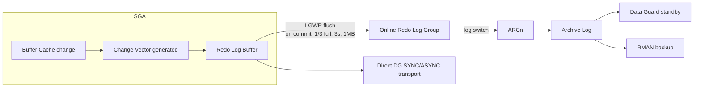

# Redo Architecture

## Overview

Redo is Oracle's write-ahead log. Every change to a data block, index block, undo block, or SYSTEM tablespace produces one or more **change vectors** grouped into a **redo record**. LGWR flushes these to the online redo log; ARCn later archives filled online logs. Recovery — from crash, media loss, or standby apply — is entirely driven by redo.

## Architecture



## Internal Working

### Change Vector

Each block modification generates one change vector:

- Target block DBA
- Operation code (insert row, delete row, update column value, etc.)
- Op-specific payload (row bytes, column values, ROWID)
- SCN
- Redo layer information

Multiple change vectors typically form one redo record (e.g., an INSERT touches the data block and the associated index block, generating vectors for each).

### Change Vector Generation

Sessions generate redo in the log buffer (SGA). Each vector is copied under a **redo copy latch** (or **redo allocation latch** for space). On multi-CPU systems, Oracle allocates parallel redo strands so multiple foregrounds copy concurrently.

### Log Buffer

`log_buffer` (typically 8–128 MB). LGWR flushes when:

- **Commit** — synchronous flush.
- **3 seconds** — periodic wake.
- **1 MB threshold**.
- **1/3 full**.
- Before **DBWn writes** any dirty buffer whose redo is not yet on disk (write-ahead protocol).

### Online Redo Log

Two or more groups per thread. LGWR writes to current group. On fill → log switch → next group.

### Archive Log

If ARCHIVELOG mode, ARCn copies the just-filled group to configured destinations.

### Recovery Use

- **Crash recovery** — SMON reads current and active online logs, applies redo from last checkpoint SCN forward.
- **Media recovery** — RMAN reads archive logs to bring restored datafiles up to date.
- **Standby apply** — MRP0 on standby applies received redo.

## Components

| Component       | Purpose                         |
| --------------- | ------------------------------- |
| Change vector   | Atomic redo unit                |
| Redo record     | Group of change vectors         |
| Log buffer      | SGA staging                     |
| Redo copy latch | Serializes copy into log buffer |
| Online redo log | On-disk journal                 |
| Archive log     | Copy of filled online log       |
| SCN             | Serialization/ordering          |
| LGWR / LG00..   | Writer processes                |

## Important Parameters

| Parameter                | Purpose                       |
| ------------------------ | ----------------------------- |
| `log_buffer`             | Log buffer size               |
| `log_archive_dest_n`     | Archive destinations          |
| `archive_lag_target`     | Force switch every N seconds  |
| `commit_write`           | Commit flush behavior         |
| `_use_single_log_writer` | (hidden) scalable LGWR toggle |

## Important Views

| View             | Purpose                                    |
| ---------------- | ------------------------------------------ |
| `V$LOG`          | Redo groups                                |
| `V$LOGFILE`      | Members                                    |
| `V$LOG_HISTORY`  | Switches                                   |
| `V$SYSSTAT`      | `redo size`, `redo writes`, `redo entries` |
| `V$SYSTEM_EVENT` | `log file sync`, `log file parallel write` |

## Diagnostic Queries

```sql
-- Redo generation rate
SELECT ROUND(value/1024/1024/1024, 2) AS total_gb,
       ROUND(value/((SYSDATE - startup_time)*86400)/1024/1024, 2) AS mb_per_sec
FROM   v$sysstat s, v$instance i
WHERE  s.name = 'redo size';

-- Recent switch pattern
SELECT TO_CHAR(first_time,'YYYY-MM-DD HH24') AS hr,
       COUNT(*) AS switches,
       ROUND(SUM(blocks*block_size)/1024/1024/1024, 2) AS archived_gb
FROM   v$archived_log
WHERE  first_time > SYSDATE - 2
GROUP  BY TO_CHAR(first_time,'YYYY-MM-DD HH24')
ORDER  BY 1;

-- Log file sync / parallel write
SELECT event,
       total_waits,
       ROUND(time_waited_micro/1000000, 1) AS total_sec,
       ROUND(time_waited_micro/DECODE(total_waits,0,1,total_waits), 0) AS avg_micro
FROM   v$system_event
WHERE  event LIKE 'log file%' OR event = 'log buffer space'
ORDER  BY total_sec DESC;
```

## Common Issues

- **High `log file sync`** — LGWR slow; check I/O to redo, CPU pressure, DG SYNC mode.
- **`log buffer space`** — Log buffer too small or LGWR can't keep up.
- **`log file switch (checkpoint incomplete)`** — DBWn slow.
- **`log file switch (archiving needed)`** — ARCn or FRA issue.
- **Data Guard lag** — Redo transport slow or standby apply slow.

## Best Practices

1. **Multiplex online redo logs** on independent low-latency storage.
2. Size for 15–20 min switch at peak.
3. Enable **scalable LGWR** on high-transaction OLTP.
4. Use LGWR ASYNC for Data Guard unless zero-data-loss required.
5. `archive_lag_target = 900` bounds DG lag during quiet periods.
6. Alert on `log file sync` avg > 20 ms.
7. Isolate redo I/O from datafile I/O — separate ASM diskgroup or LUN.

## Interview Questions

1. **Q:** What is redo?
   **A:** Write-ahead log describing every change to Oracle blocks. Used for recovery.

2. **Q:** Flow of redo?
   **A:** Change vector generated by foreground → log buffer → LGWR flushes to online log → ARCn archives → optional Data Guard shipping.

3. **Q:** Why does commit wait for LGWR?
   **A:** Durability — the transaction is not durable until its redo is on disk.

4. **Q:** What's `log file sync` vs `log file parallel write`?
   **A:** `log file sync` = foreground wait for LGWR to finish. `parallel write` = LGWR's own I/O wait.

5. **Q:** When does LGWR flush?
   **A:** On commit, 3-second timer, 1/3 full, 1 MB threshold, before DBWn writes dirty buffer.

6. **Q:** How does Oracle recover from crash?
   **A:** SMON reads redo from last checkpoint SCN forward, applies to datafiles.

## References

- Oracle Database Concepts 19c — Online Redo Log
- Oracle Database Backup and Recovery User's Guide 19c
- MOS Doc ID 34592.1 — Redo Log Sizing
- Jonathan Lewis, _Oracle Core_, Chapter 6 — Redo
