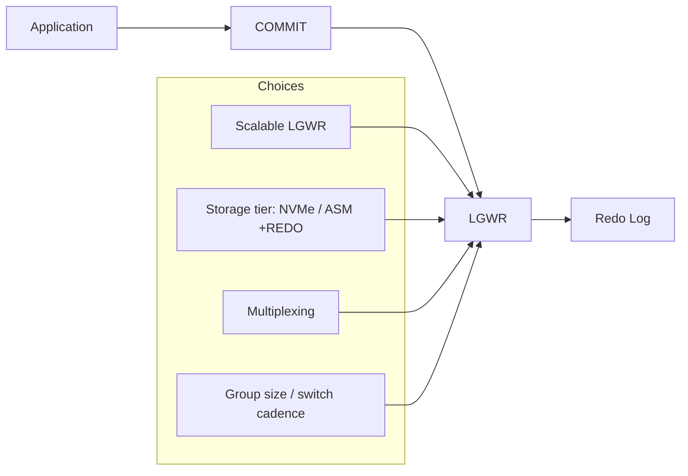

# Redo Tuning

## Overview

Redo tuning is about **making writes fast without losing durability**. The four levers:

1. **Storage** — where redo lives.
2. **Multiplexing** — how many members per group, where they are.
3. **Sizing / cadence** — group size and switch frequency.
4. **LGWR mode** — single-process vs scalable.

Get these right and `log file sync` stays under 5 ms on modern hardware.

## Architecture



## Internal Working

### Storage Choice (Biggest Lever)

Redo I/O is synchronous, small (KB-scale), latency-critical. Priorities:

1. **NVMe SSD** — sub-millisecond writes.
2. **Enterprise SSD (SAS/SATA)** — 1–2 ms.
3. **RAID10 spindles with battery-backed cache** — 3–5 ms.
4. **RAID5 spindles** — 10+ ms, only for dev/test.

**ASM `+REDO` diskgroup with HIGH redundancy** on NVMe is the gold standard.

### Multiplexing

Members within a group are written **simultaneously**. LGWR waits for the slowest member. Guidelines:

- **2 members** per group typical. 3 for maximum protection.
- Members on **independent disks/diskgroups**. A slow member = slow LGWR.
- In ASM, one member per diskgroup: `+REDO_A`, `+REDO_B` on different SAN LUNs.

### Group Sizing

Rule: log switch every 15–20 minutes at peak. Redo rate × 900 seconds = group size.

Example: 100 MB/sec generation → 90 GB per group for 15-min cycle.

### Scalable LGWR (12c+)

Enable via `_use_single_log_writer=FALSE`. LGWR distributes redo writes across worker processes `LG00..LG99`. Reduces LGWR CPU as sole bottleneck at very high transaction rates.

When to enable:

- `log file sync` avg >> `log file parallel write` avg (LGWR CPU bound).
- > 1000 commits/sec sustained.
- Multi-socket servers.

### Redo Log Buffer (`log_buffer`)

Larger buffer doesn't reduce `log file sync` — LGWR still flushes on commit. Larger buffer only helps during **burst** where commits temporarily exceed LGWR throughput.

Set 8 MB minimum; 64–128 MB for high-throughput OLTP.

### `commit_write` Variations

Rarely used. `NOWAIT` trades durability for latency — not recommended for financial systems.

### Data Guard Considerations

- **SYNC (AFFIRM)** — Maximum Protection. `log file sync` includes primary→standby round-trip. Adds network + standby I/O latency.
- **FASTSYNC (SYNC/NOAFFIRM)** — Standby acks on receipt (not disk flush). Less latency.
- **ASYNC (LGWR ASYNC)** — Fire-and-forget from primary's view. Cheapest.

### `NOLOGGING` and `FORCE LOGGING`

- **`NOLOGGING`** operations (direct-load INSERT, CTAS) skip redo for the data.
- **`FORCE LOGGING`** at DB / tablespace level overrides — required for Data Guard.

## Components

Same as [Redo Architecture](redo-architecture.md).

## Important Parameters

| Parameter                   | Purpose                                      |
| --------------------------- | -------------------------------------------- |
| `log_buffer`                | Log buffer size                              |
| `_use_single_log_writer`    | (hidden) TRUE (default) / FALSE for scalable |
| `commit_write`              | Commit semantics                             |
| `archive_lag_target`        | Force switch at N seconds                    |
| `log_archive_max_processes` | ARCn worker count                            |
| `filesystemio_options`      | Async I/O for filesystem redo                |

## Important Views

| View                | Purpose                                    |
| ------------------- | ------------------------------------------ |
| `V$SYSSTAT`         | `redo size`, `redo writes`, `redo entries` |
| `V$SYSTEM_EVENT`    | Wait events                                |
| `V$EVENT_HISTOGRAM` | Wait distribution                          |
| `V$LOG`             | Group state                                |

## Diagnostic Queries

```sql
-- Total redo generated
SELECT ROUND(value/1024/1024/1024, 2) AS gb
FROM   v$sysstat
WHERE  name = 'redo size';

-- Wait event summary
SELECT event, total_waits, ROUND(time_waited_micro/1000000, 1) AS sec,
       ROUND(time_waited_micro/DECODE(total_waits,0,1,total_waits)/1000, 2) AS avg_ms
FROM   v$system_event
WHERE  event LIKE 'log file%'
   OR  event = 'log buffer space'
ORDER  BY sec DESC;

-- Log file sync histogram
SELECT wait_time_milli, wait_count
FROM   v$event_histogram
WHERE  event = 'log file sync'
ORDER  BY wait_time_milli;

-- Are we I/O bound or CPU bound?
-- If log file sync avg >> log file parallel write avg, LGWR is CPU/posting bound.
-- If both roughly equal and > 5ms, storage bound.

-- Redo writes per second
SELECT ROUND(value / (SYSDATE - startup_time) / 86400, 1) AS writes_per_sec
FROM   v$sysstat s, v$instance i
WHERE  s.name = 'redo writes';
```

## Common Operations

### Enable scalable LGWR

```sql
ALTER SYSTEM SET "_use_single_log_writer" = FALSE SCOPE = SPFILE;
-- Restart required
```

### Verify multiplexing

```sql
SELECT group#, COUNT(*) AS members
FROM   v$logfile GROUP BY group# ORDER BY group#;
```

### Change log buffer

```sql
ALTER SYSTEM SET log_buffer = 128M SCOPE = SPFILE;
-- Fixed at startup; restart
```

### Enable FORCE LOGGING

```sql
ALTER DATABASE FORCE LOGGING;
```

## Common Issues

- **`log file sync` > 20 ms** — Redo storage slow or LGWR CPU bound.
- **`log file parallel write` > 5 ms** — Storage bottleneck; move to NVMe or investigate SAN.
- **`log buffer space`** — Buffer full; enlarge or fix LGWR bottleneck.
- **DG SYNC latency dominating** — Consider FASTSYNC or ASYNC.
- **NOLOGGING invalidating standby** — Enable FORCE LOGGING.

## Troubleshooting

1. Compare `log file sync` and `log file parallel write` averages.
2. Look at histograms (`V$EVENT_HISTOGRAM`) — outliers matter more than averages.
3. Check redo storage IOPS + latency at OS level (`iostat -x` on Linux).
4. Enable scalable LGWR at high commit rates.
5. Split multiplex members onto truly independent storage.
6. If DG is the culprit, evaluate protection mode necessity.

## Best Practices

1. **NVMe or ASM `+REDO` HIGH** for redo storage.
2. **Multiplex** minimum 2 members per group on independent disks.
3. **Sized for 15–20 min switch** at peak load.
4. **Scalable LGWR** on high-transaction OLTP.
5. `log_buffer = 32–128 MB`.
6. `filesystemio_options = SETALL` on Linux fs-based redo.
7. Alert on `log file sync` avg > 20 ms.
8. `FORCE LOGGING` for Data Guard databases.
9. Split redo I/O away from datafile I/O — separate ASM diskgroup or LUN.
10. Data Guard SYNC only when zero-data-loss required.

## Interview Questions

1. **Q:** What's the single biggest lever for redo latency?
   **A:** Redo storage — NVMe or dedicated ASM `+REDO` diskgroup on low-latency disks.

2. **Q:** When does scalable LGWR help?
   **A:** Very high transaction rates where LGWR CPU is bottleneck. Symptom: `log file sync` >> `log file parallel write`.

3. **Q:** Does enlarging `log_buffer` reduce `log file sync`?
   **A:** No — LGWR still flushes on commit. Buffer only helps burst throughput.

4. **Q:** Impact of Data Guard SYNC on primary?
   **A:** Every commit's `log file sync` includes network round-trip + standby I/O.

5. **Q:** How do you know if you're CPU-bound or I/O-bound?
   **A:** Compare `log file sync` avg to `log file parallel write` avg. Sync >> Parallel = CPU/post-back. Both similar and high = I/O.

6. **Q:** What is `FORCE LOGGING`?
   **A:** Overrides `NOLOGGING` — every operation generates redo. Required for Data Guard.

7. **Q:** How would you eliminate a spike in `log file sync`?
   **A:** Faster redo storage, multiplex on independent devices, scalable LGWR, batch commits at app layer, evaluate DG mode.

## References

- Oracle Database Performance Tuning Guide 19c — Redo Log Configuration
- MOS Doc ID 34592.1 — Redo Log Tuning
- MOS Doc ID 857576.1 — log file sync
- MOS Doc ID 1376916.1 — Scalable LGWR
- MOS Doc ID 601316.1 — Best practices
