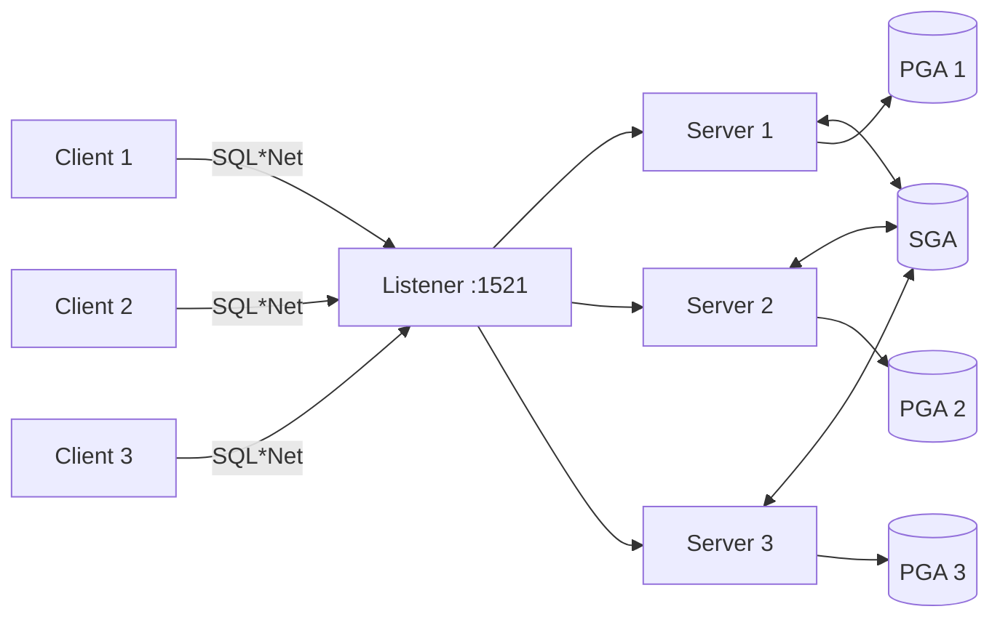

# Dedicated Server

## Overview

**Dedicated Server** is the default Oracle connection mode: one **server (foreground) process** per client session. The server process is the same OS entity for the session's entire lifetime — it holds the PGA, runs SQL, manages cursors. When the client disconnects, the server process exits.

Dedicated is Oracle's recommended mode for OLTP, batch, and reporting workloads.

## Architecture



## Internal Working

### Connection Path

1. Client TCP connect to listener.
2. Client sends CONNECT with service name.
3. Listener validates service, chooses instance handler.
4. Listener performs one of:
   - **Fork/exec** — Unix: fork a new `oracle` process, execve to `$ORACLE_HOME/bin/oracle`.
   - **Bequeath** — For local IPC connections.
   - **Hand-off** — Listener passes socket to a pre-spawned dedicated process (Windows / bequeath variants).
5. New server process attaches to SGA, allocates PGA.
6. Registers session in `V$SESSION`, `V$PROCESS`.
7. Client-server socket now directly links client and server (listener steps out).

### Fork vs Prespawn

On Unix/Linux, default is **fork on demand** — each connect forks a new process. Prespawn options exist but are rarely used.

Cost: `fork+exec` is milliseconds — noticeable at very high connect rates.

### Memory Footprint

Each dedicated server has its own PGA, typically starting a few MB and growing as needed. `PROCESSES` × average PGA per process is a real memory consumer — plan accordingly.

### When Dedicated Wins

- OLTP with connection pool (few, long-lived, active connections).
- Batch jobs (long-running, high CPU/memory).
- RMAN, Data Pump, Data Guard broker.
- Any use case where session state and consistent PGA matter.

## Components

| Component                        | Purpose                                  |
| -------------------------------- | ---------------------------------------- |
| Server process (`oracle` binary) | Runs SQL for one session                 |
| PGA                              | Private memory                           |
| UGA                              | Session state (inside PGA for dedicated) |

## Important Parameters

| Parameter                           | Purpose                 |
| ----------------------------------- | ----------------------- |
| `processes`                         | Max total OS processes  |
| `sessions`                          | Max concurrent sessions |
| `dedicated_through_broker_listener` | Server-side setting     |

Client-side (TNS):

```
(CONNECT_DATA = (SERVICE_NAME = prod)(SERVER = DEDICATED))
```

The `SERVER = DEDICATED` clause forces dedicated even when shared server is configured.

## Important Views

| View             | Purpose                                     |
| ---------------- | ------------------------------------------- |
| `V$SESSION`      | Every session                               |
| `V$PROCESS`      | Every OS process — one per dedicated server |
| `V$SESSTAT`      | Per-session counters                        |
| `V$SESSION_WAIT` | Current wait                                |

## Diagnostic Queries

```sql
-- Session per user
SELECT username, machine, program, COUNT(*) AS sessions
FROM   v$session
WHERE  type = 'USER'
GROUP  BY username, machine, program
ORDER  BY sessions DESC;

-- Sessions and their server processes
SELECT s.sid, s.serial#, s.username, s.status,
       p.spid AS os_pid, p.program,
       ROUND(p.pga_used_mem/1024/1024, 1) AS pga_mb
FROM   v$session s JOIN v$process p ON s.paddr = p.addr
WHERE  s.type = 'USER'
ORDER  BY s.sid;

-- Process count trend
SELECT COUNT(*) AS server_procs
FROM   v$process
WHERE  program LIKE '%(LOCAL=NO)%';   -- dedicated servers via listener
```

## Common Issues

- **`ORA-00020: maximum number of processes exceeded`** — Hit `processes` cap. Kill idle sessions or raise `processes`.
- **PGA runaway** — Sum of all PGA exceeds `pga_aggregate_limit`; Oracle kills biggest offenders.
- **Slow connect rate** — Fork+exec cost at very high rates; use connection pool at app tier.
- **Stale sessions** — Application not closing connections. `SQLNET.EXPIRE_TIME` helps.

## Best Practices

1. **Default to dedicated** for OLTP, batch, admin, RMAN, DP, DG.
2. Use **connection pooling** (HikariCP, UCP, WebLogic) at the app tier — amortize connect cost.
3. Set `processes` to peak expected concurrent connections + 20% headroom.
4. Configure `SQLNET.EXPIRE_TIME = 10` — cleans up dead sessions.
5. Use Resource Manager to cap runaway session PGA.
6. Alert on `V$RESOURCE_LIMIT.CURRENT_UTILIZATION / MAX_UTILIZATION` approaching `LIMIT_VALUE` for `processes`.
7. Force dedicated for RMAN and Data Pump: `SERVER=DEDICATED` in the connect string.

## Interview Questions

1. **Q:** What is dedicated server?
   **A:** One server process per client session — the default connection model.

2. **Q:** When is a dedicated server created?
   **A:** On connect: listener forks/exec's a new `oracle` process for the session.

3. **Q:** Where does UGA live?
   **A:** In PGA (in dedicated mode).

4. **Q:** How do you force dedicated even under shared server?
   **A:** `SERVER=DEDICATED` in the TNS `CONNECT_DATA`.

5. **Q:** Trade-off vs shared server?
   **A:** Dedicated: more RAM per session, faster response, session state preserved. Shared: lower RAM per session, but queue/latency.

6. **Q:** What's `ORA-00020`?
   **A:** `processes` parameter cap reached.

7. **Q:** How can you scale to thousands of connections in dedicated mode?
   **A:** Application-tier connection pool → amortize connect overhead and cap active connection count.

## References

- Oracle Database Concepts 19c — Dedicated and Shared Servers
- Oracle Database Net Services Administrator's Guide 19c
- MOS Doc ID 15112.1 — Shared vs Dedicated
