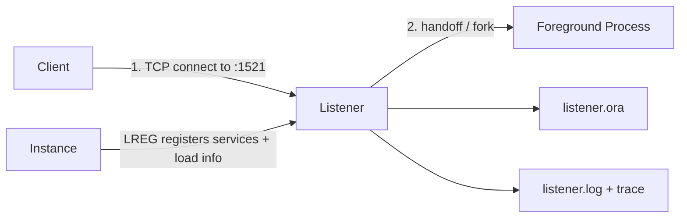

# Listener

## Overview

The **Oracle Net Listener** (`tnslsnr`) is a separate process that runs on the database server, listening on a TCP port (default 1521) for incoming client connect requests. It receives the connect string, validates the service name against registered instances, and hands off the connection to a foreground process (dedicated) or dispatcher (shared).

The listener is independent of any database instance — it can run without an instance, and vice versa. In production, `srvctl` manages listeners on RAC clusters; `lsnrctl` manages them on single-instance.

## Architecture



## Internal Working

### Startup

`lsnrctl start [LISTENER_NAME]`:

1. Reads `listener.ora` in `$ORACLE_HOME/network/admin` (or `$TNS_ADMIN` if set).
2. Binds to configured protocol addresses.
3. Waits for LREG registration from any local instances.
4. Serves connect requests.

### Service Registration

Two mechanisms:

- **Dynamic (LREG)** — Instances announce their services via LREG. Preferred.
- **Static (SID_LIST_LISTENER in listener.ora)** — Explicitly declared. Needed for connections before instance is open (e.g., RMAN restore of a NOMOUNT instance).

### Connect Flow

1. Client resolves connect string → host + port + service name.
2. TCP connection to listener.
3. Client sends CONNECT packet with service name.
4. Listener consults its registered service list.
5. Match found → listener selects an instance handler (load-balanced if multiple).
6. Listener either forks a foreground (bequeath / dedicated) or forwards to a dispatcher.
7. Session established; listener steps out.

### Load Balancing

For RAC or multiple instances registering the same service:

- **Server-side connect-time load balancing (CLB)** — Listener picks the least-loaded instance based on LREG-reported load.
- **Client-side connect-time load balancing** — Client picks a random address from the connect string list.
- **Client-side connection failover (CFO)** — Client retries next address on failure.

### Statistics

`lsnrctl status` shows connection counts, uptime, and current registrations.

## Components

| Component                           | Purpose                    |
| ----------------------------------- | -------------------------- |
| `tnslsnr` binary                    | The listener process       |
| `lsnrctl` binary                    | Control utility            |
| `listener.ora`                      | Config file                |
| `listener.log`                      | Audit/trace log            |
| Dynamic service registration (LREG) | Runtime services           |
| Static registration                 | Pre-instance-open services |

## Important Parameters

Listener side — set in `listener.ora`:

- `LISTENER = ...` — protocol addresses.
- `SID_LIST_LISTENER = ...` — static services.
- `INBOUND_CONNECT_TIMEOUT_LISTENER` — timeout for connect handshake.
- `SUBSCRIBE_FOR_NODE_DOWN_EVENT_LISTENER` — RAC event subscription.

Instance side — control which listener the instance registers with:

- `LOCAL_LISTENER` — comma list of listener aliases or addresses.
- `REMOTE_LISTENER` — SCAN listeners in RAC.

## Important Views

| View                 | Purpose            |
| -------------------- | ------------------ |
| `V$LISTENER_NETWORK` | Listener endpoints |

At OS level:

```bash
lsnrctl status
lsnrctl services
lsnrctl reload
```

## Diagnostic Queries

```bash
# Listener status
lsnrctl status

# Registered services
lsnrctl services

# Reload config after listener.ora change
lsnrctl reload

# Debug: enable trace
lsnrctl set trc_level SUPPORT   # heavy
lsnrctl set trc_level OFF

# Log path
lsnrctl show log_file

# Start/stop
lsnrctl start LISTENER
lsnrctl stop LISTENER
```

Force instance to register right now:

```sql
ALTER SYSTEM REGISTER;
```

## Common Issues

- **`TNS-12545` — Listener down** — Start with `lsnrctl start`.
- **`ORA-12514` — Service not known** — Instance hasn't registered, wrong service name.
- **`ORA-12505` — SID not known** — Similar; using SID-based connect while listener only knows services.
- **`ORA-12516/12519/12520`** — Handler capacity issues (Shared Server) or listener overloaded.
- **Listener won't start** — Port in use, permissions on `listener.log`.
- **Slow connects** — DNS resolution slow, listener log I/O slow, or firewall latency.

## Troubleshooting

1. `lsnrctl status` — is listener running?
2. `lsnrctl services` — is expected service registered? If not, check LREG on instance side.
3. `tnsping <alias>` from client — resolves connect string end-to-end.
4. Firewall: telnet to 1521 from client.
5. `listener.log` in `$ORACLE_BASE/diag/tnslsnr/<host>/<listener>/alert/log.xml` and `trace/`.
6. If overloaded, increase `queuesize` in listener.ora or add another listener.
7. In RAC, `srvctl status listener` and `crsctl stat res -t`.

## Best Practices

1. Manage listeners with **`srvctl`** in RAC, `lsnrctl` for single-instance.
2. Use **dynamic registration (LREG)** — avoid static entries except when needed for RMAN.
3. Standardize on port **1521**; don't fragment across ports.
4. Log rotation for `listener.log` — 100 MB+ becomes hard to search.
5. `INBOUND_CONNECT_TIMEOUT_LISTENER=60` (default) prevents lingering connections.
6. Alert on listener process not running.
7. Enable listener logging for audit; disable trace unless troubleshooting.
8. In RAC, use SCAN listener for connect-time load balance across nodes.
9. Never `LOCAL_LISTENER=''` (empty) — instance won't register.

## Interview Questions

1. **Q:** What is the listener?
   **A:** `tnslsnr` process that accepts client TCP connect requests and hands off to a database foreground.

2. **Q:** Static vs dynamic registration?
   **A:** Dynamic: LREG announces services at runtime. Static: `SID_LIST_LISTENER` in `listener.ora`, needed pre-instance-open (RMAN NOMOUNT).

3. **Q:** How to add a listener config change?
   **A:** Edit `listener.ora`, then `lsnrctl reload`.

4. **Q:** How do you force an instance to register?
   **A:** `ALTER SYSTEM REGISTER;`.

5. **Q:** What is the default port?
   **A:** 1521 (TCP).

6. **Q:** Does the listener persist through session lifetime?
   **A:** No — it steps out after handoff. Session runs directly between client and foreground process.

7. **Q:** Why can't listener see my service after instance restart?
   **A:** LREG hasn't registered yet (up to 60 sec) or listener wasn't running when instance started. Run `ALTER SYSTEM REGISTER;`.

## References

- Oracle Database Net Services Administrator's Guide 19c
- MOS Doc ID 2412805.1 — Listener Troubleshooting
- MOS Doc ID 1298415.1 — Listener Registration
- Runbook: [Listener Down](../27-runbooks/listener-down.md)
