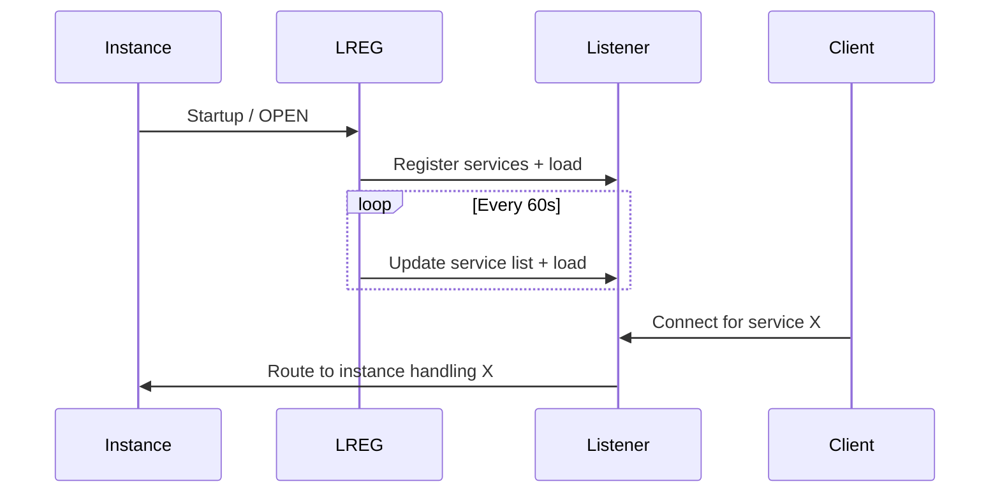

# Service Registration

## Overview

**Service registration** is how a database instance tells a listener that a specific service is available and how loaded it is. In 12c+, the **LREG** background process performs registration; before 12c, PMON did it.

Without registration, the listener has no idea what services the instance offers. Clients connecting for those services get `ORA-12514` (service not known).

## Architecture



## Internal Working

### What Gets Registered

- **Service names** (`SERVICE_NAMES` parameter and any created via `DBMS_SERVICE`/`srvctl`).
- **Instance name**.
- **Load metrics** (active session count, average I/O wait).
- **PDB names** (each PDB is a service in multitenant).

### Registration Timing

- **Startup** — LREG registers immediately after OPEN.
- **Periodic** — every 60 seconds (default).
- **Manual** — `ALTER SYSTEM REGISTER;`.
- **On DBMS_SERVICE.START_SERVICE** — immediate.

### Which Listener?

Governed by:

- `LOCAL_LISTENER` — usually a listener alias or inline address on the local host.
- `REMOTE_LISTENER` — SCAN listener addresses in RAC.

Example:

```sql
ALTER SYSTEM SET local_listener = '(ADDRESS=(PROTOCOL=TCP)(HOST=dbhost)(PORT=1521))';
ALTER SYSTEM SET remote_listener = 'scan.example.com:1521';
```

### Multitenant

In a CDB, every PDB is registered as a **service**. When a PDB opens, LREG registers its service (`pdb_name.db_domain`). When closed, LREG deregisters.

### RAC and SCAN

- All RAC instances register with the **SCAN listeners** (via `remote_listener`).
- SCAN listeners maintain a database-wide view of instances offering each service.
- Client connects to SCAN → SCAN routes to least-loaded instance offering the requested service.

## Components

| Component         | Purpose                                                     |
| ----------------- | ----------------------------------------------------------- |
| LREG              | Registration process                                        |
| `local_listener`  | Node-local listener                                         |
| `remote_listener` | Cluster-scope listener (SCAN in RAC)                        |
| `service_names`   | Non-default services (default = `db_unique_name.db_domain`) |
| `DBMS_SERVICE`    | Programmatically manage services                            |
| `srvctl`          | Cluster service management (RAC)                            |

## Important Parameters

| Parameter         | Purpose                                     |
| ----------------- | ------------------------------------------- |
| `service_names`   | Comma list of services this instance offers |
| `instance_name`   | Registered instance ID                      |
| `local_listener`  | Where LREG registers locally                |
| `remote_listener` | SCAN listener addresses                     |
| `db_domain`       | Appended to service names                   |
| `dispatchers`     | Shared server dispatchers (also registered) |

## Important Views

| View                     | Purpose                        |
| ------------------------ | ------------------------------ |
| `V$ACTIVE_SERVICES`      | Currently active services      |
| `V$SERVICES`             | All defined services           |
| `DBA_SERVICES`           | Persistent service definitions |
| `V$SESSION.SERVICE_NAME` | Service session came in via    |

## Diagnostic Queries

```sql
-- Currently active services
SELECT name, network_name, pdb, con_id
FROM   v$active_services
ORDER  BY name;

-- All defined
SELECT service_id, name, network_name, pdb
FROM   dba_services
ORDER  BY name;

-- Session distribution across services
SELECT service_name, COUNT(*) AS sessions
FROM   v$session
WHERE  type = 'USER'
GROUP  BY service_name
ORDER  BY sessions DESC;

-- Listener parameters on instance side
SHOW PARAMETER listener
SHOW PARAMETER service_names
```

At OS level:

```bash
# What does the listener know?
lsnrctl services
lsnrctl status

# Force registration
sqlplus / as sysdba
SQL> ALTER SYSTEM REGISTER;
```

## Common Operations

### Create a service (single-instance)

```sql
BEGIN
  DBMS_SERVICE.CREATE_SERVICE(
    service_name       => 'REPORTS.CORP.EXAMPLE.COM',
    network_name       => 'REPORTS',
    failover_method    => 'BASIC',
    failover_type      => 'SELECT');
  DBMS_SERVICE.START_SERVICE('REPORTS.CORP.EXAMPLE.COM');
END;
/
```

### Create a service (RAC)

```bash
srvctl add service -db prod -service reports \
   -preferred prod1 -available prod2 \
   -policy AUTOMATIC -failovertype SELECT -failovermethod BASIC

srvctl start service -db prod -service reports
```

### Force re-registration

```sql
ALTER SYSTEM REGISTER;
```

### Change local_listener

```sql
ALTER SYSTEM SET local_listener = 'LISTENER_PROD';
-- Then re-register
ALTER SYSTEM REGISTER;
```

## Common Issues

- **Service missing from `lsnrctl services`** — LREG not running, wrong `local_listener`, listener wasn't up at registration time. Fix: check LREG process, `ALTER SYSTEM REGISTER;`.
- **`ORA-12514: service not known`** — Client asked for a service the listener doesn't have registered.
- **Registration blocked** — `VALID_NODE_CHECKING_REGISTRATION_LISTENER` blocks source. Adjust `REGISTRATION_INVITED_NODES_LISTENER`.
- **RAC service on wrong instance** — `srvctl relocate service` or check preferred/available assignment.

## Troubleshooting

1. `lsnrctl services` — is expected service registered?
2. `V$ACTIVE_SERVICES` — is instance advertising it?
3. `SHOW PARAMETER local_listener` — pointing to the right listener?
4. Listener log — any registration errors?
5. In RAC, `srvctl status service` and `crsctl stat res -t`.

## Best Practices

1. **Use services**, not SIDs, in tnsnames.ora and connect strings.
2. **`srvctl` in RAC**, `DBMS_SERVICE` for single-instance.
3. Create per-workload services: `OLTP`, `REPORTS`, `BATCH` — enables per-service Resource Manager plans, TAF, and monitoring.
4. In RAC, use SCAN + service name; do not hard-code instance names.
5. Alert on services disappearing from `V$ACTIVE_SERVICES`.
6. In multitenant, PDB service names are automatic — do not hijack.
7. Set `LOCAL_LISTENER` explicitly if using non-default port.
8. Test service registration after every listener or instance parameter change.

## Interview Questions

1. **Q:** Who registers services with the listener in 19c?
   **A:** LREG.

2. **Q:** How often does registration happen?
   **A:** At startup, then every 60 seconds. `ALTER SYSTEM REGISTER;` forces it immediately.

3. **Q:** Where does the instance find the listener to register with?
   **A:** `LOCAL_LISTENER` and `REMOTE_LISTENER` parameters.

4. **Q:** How does SCAN listener work in RAC?
   **A:** All RAC instances register with SCAN listeners via `REMOTE_LISTENER`. Client connects to SCAN, which routes to a least-loaded instance offering the requested service.

5. **Q:** What is a service?
   **A:** Logical name a client uses to connect to a database. Supports load balancing, TAF, and Resource Manager.

6. **Q:** How to create a service in single-instance?
   **A:** `DBMS_SERVICE.CREATE_SERVICE` + `DBMS_SERVICE.START_SERVICE`.

7. **Q:** Force re-registration?
   **A:** `ALTER SYSTEM REGISTER;`.

## References

- Oracle Database Net Services Administrator's Guide 19c
- Oracle RAC Administration 19c — Services
- MOS Doc ID 1298415.1 — Listener Registration
- MOS Doc ID 1957301.1 — LREG in 12c+
