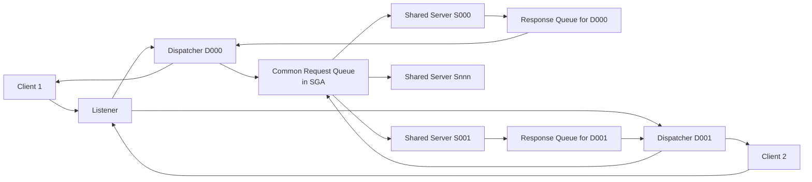

# Shared Server

## Overview

**Shared Server** (formerly Multi-Threaded Server, MTS) uses a small pool of shared server processes behind one or more dispatchers. Clients connect to a dispatcher; the dispatcher multiplexes client I/O over the shared server pool. UGA moves from PGA to the SGA large pool so any shared server can serve any session.

Shared Server is niche. It shines when you have **thousands of mostly-idle connections** (portal/kiosk apps). For modern OLTP with connection pooling, dedicated server is nearly always the better choice.

## Architecture



## Internal Working

### Components

- **Dispatcher (Dnnn)** — accepts client TCP connections, multiplexes multiple sessions over one process. Reads request from client, enqueues to common request queue.
- **Common Request Queue** — SGA queue shared across dispatchers. Any shared server may pick a request.
- **Shared Server (Snnn)** — executes the SQL from the request queue. Publishes response to dispatcher-specific response queue.
- **Response Queue** — dispatcher-specific outbound queue back to the dispatcher.

Multiple dispatchers can share the request queue. Shared servers are not client-specific — they're a pool.

### UGA in the Large Pool

Because any shared server may serve any session, per-session state (UGA) must be accessible from any server. UGA is allocated in the **large pool**. Sizing `large_pool_size` is critical when shared server is enabled.

### When Shared Server Wins

- Thousands of mostly-idle connections (portal apps).
- Very high connection counts on RAM-constrained hardware.
- Applications without connection pooling.

### When It Loses

- Batch jobs (heavy CPU/memory per session — dispatcher becomes bottleneck).
- RMAN, Data Pump, DG broker (need dedicated).
- Modern connection-pooled apps.

### Enabling Shared Server

```sql
ALTER SYSTEM SET dispatchers = '(PROTOCOL=TCP)(DISPATCHERS=3)';
ALTER SYSTEM SET shared_servers = 4;
ALTER SYSTEM SET max_shared_servers = 20;
ALTER SYSTEM SET max_dispatchers = 5;
```

Force a specific client to use shared:

```
(CONNECT_DATA = (SERVICE_NAME = prod)(SERVER = SHARED))
```

Force dedicated (recommended for RMAN):

```
(CONNECT_DATA = (SERVICE_NAME = prod)(SERVER = DEDICATED))
```

## Components

| Component            | Purpose                                |
| -------------------- | -------------------------------------- |
| Listener             | Same as usual — routes to dispatcher   |
| Dispatcher (Dnnn)    | Accepts/multiplexes client connections |
| Common request queue | SGA queue                              |
| Shared server (Snnn) | Executes requests                      |
| Response queue       | Per-dispatcher outbound                |
| Circuits             | Client-dispatcher session state        |

## Important Parameters

| Parameter                | Purpose                                |
| ------------------------ | -------------------------------------- |
| `dispatchers`            | Dispatcher config                      |
| `max_dispatchers`        | Cap on dispatchers                     |
| `shared_servers`         | Initial shared server count            |
| `max_shared_servers`     | Cap                                    |
| `circuits`               | Virtual circuits (concurrent sessions) |
| `large_pool_size`        | UGA storage                            |
| `shared_server_sessions` | Alternative session cap                |

## Important Views

| View                      | Purpose                                   |
| ------------------------- | ----------------------------------------- |
| `V$DISPATCHER`            | Dispatcher state and load                 |
| `V$SHARED_SERVER`         | Shared server state                       |
| `V$CIRCUIT`               | Virtual circuits (shared server sessions) |
| `V$QUEUE`                 | Queue depth                               |
| `V$SHARED_SERVER_MONITOR` | Peak use tracking                         |

## Diagnostic Queries

```sql
-- Sessions on shared vs dedicated
SELECT server, COUNT(*)
FROM   v$session
WHERE  type = 'USER'
GROUP  BY server;

-- Dispatcher busy vs idle
SELECT name, network, status,
       ROUND(busy/(busy+idle)*100, 1) AS busy_pct,
       accept, messages, bytes
FROM   v$dispatcher;

-- Shared servers activity
SELECT name, status, messages, requests, idle, busy
FROM   v$shared_server;

-- Queue backlog (waiting requests)
SELECT paddr, type, queued, wait, totalq, averageq
FROM   v$queue;

-- Peak circuits
SELECT * FROM v$shared_server_monitor;
```

## Common Issues

- **Dispatchers overloaded** — `busy_pct > 50` — add more dispatchers.
- **Request queue backup** — `V$QUEUE.WAIT` high — add shared servers.
- **Large pool exhausted** — UGA can't allocate. Enlarge `large_pool_size`.
- **`ORA-12520: could not find available handler`** — Shared server exhausted; client can't get a slot.
- **Long queries blocking a shared server** — One long query monopolizes a shared server, degrading others. Route long queries to dedicated.

## Troubleshooting

1. `V$DISPATCHER` — utilization high?
2. `V$SHARED_SERVER.STATUS` — all `BUSY`? Add servers.
3. `V$QUEUE` — request queue growing?
4. `V$SGASTAT WHERE pool='large pool'` — UGA fitting?
5. Force one client to dedicated to isolate.

## Best Practices

1. **Prefer dedicated server** in most cases.
2. If shared: `dispatchers = ceil(peak_connections / 250)`, `shared_servers = ceil(peak_active / 4)`.
3. `SERVER = DEDICATED` in RMAN, Data Pump, batch, admin connections — force dedicated even when shared enabled.
4. Configure `large_pool_size ≥ 256 MB` when shared server enabled.
5. Monitor `V$SHARED_SERVER_MONITOR.MAXIMUM_CONNECTIONS_HIGH_WATER_MARK`.
6. For very high connection counts, evaluate **DRCP** (Database Resident Connection Pool) — 12c+ alternative.

## Interview Questions

1. **Q:** Dedicated vs shared server?
   **A:** Dedicated: 1 server per session. Shared: pool of servers behind dispatchers, UGA in large pool.

2. **Q:** When would you use shared?
   **A:** Thousands of mostly-idle client connections, no app-tier connection pooling, RAM-constrained.

3. **Q:** Where does UGA live in shared server?
   **A:** In the large pool of the SGA.

4. **Q:** What is a dispatcher?
   **A:** Process (Dnnn) that accepts client connections and multiplexes them onto the shared server pool.

5. **Q:** What is a shared server?
   **A:** Process (Snnn) that picks requests from the common queue and executes them, then hands results to the response queue.

6. **Q:** Why force RMAN to use dedicated?
   **A:** RMAN sessions are long-lived and high-bandwidth. Shared server multiplexing hurts throughput.

7. **Q:** What is DRCP?
   **A:** Database Resident Connection Pool — Oracle-managed pool of dedicated servers reused across clients. Better than shared server for modern web apps with short-lived requests.

## References

- Oracle Database Net Services Administrator's Guide 19c — Shared Server
- Oracle Database Concepts 19c — Server Processes
- MOS Doc ID 15112.1 — Shared vs Dedicated
- MOS Doc ID 296504.1 — Sizing Shared Server
