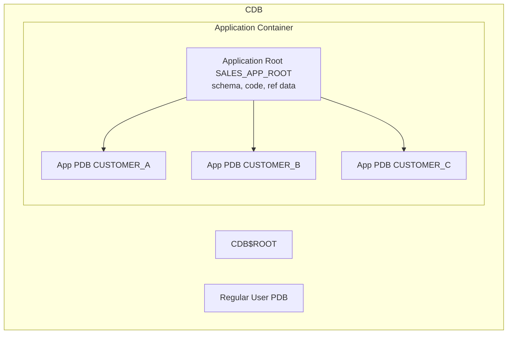

# Application Containers

## Overview

**Application Containers** (12.2+) extend the multitenant model with a hierarchical structure: an **application root** holds shared code, data, and configuration, and one or more **application PDBs** inherit from it. This is Oracle's answer to multi-tenant SaaS: a single "application definition" propagated to many customer PDBs.

Think of an application container as a factory: define your schema and reference data once at the application root, deploy to N application PDBs, and updates ripple through with a single command.

## Architecture



## Internal Working

### Application Root

Special PDB created inside a CDB:

```sql
CREATE PLUGGABLE DATABASE sales_app_root AS APPLICATION CONTAINER
  ADMIN USER app_admin IDENTIFIED BY pwd
  FILE_NAME_CONVERT = ('+DATA/prod/pdbseed', '+DATA/prod/sales_app_root');

ALTER PLUGGABLE DATABASE sales_app_root OPEN;
```

Everything created inside application root using `SHARING` clauses becomes **shared** with all application PDBs.

### Application Definitions

Applications are installable code + data units. Registered at application root:

```sql
ALTER SESSION SET CONTAINER = sales_app_root;
ALTER PLUGGABLE DATABASE APPLICATION sales_app BEGIN INSTALL '1.0';

-- All DDL between BEGIN INSTALL and END INSTALL is captured
CREATE TABLESPACE app_data DATAFILE SIZE 1G;
CREATE USER sales_owner IDENTIFIED BY pwd;
GRANT CREATE SESSION, CREATE TABLE TO sales_owner;
CREATE TABLE sales_owner.products SHARING = DATA (id NUMBER, name VARCHAR2(100));
INSERT INTO sales_owner.products VALUES (1, 'Widget');
COMMIT;

ALTER PLUGGABLE DATABASE APPLICATION sales_app END INSTALL '1.0';
```

### Sharing Modes

For every object in the application root, specify `SHARING = ...`:

| Mode            | Meaning                                                |
| --------------- | ------------------------------------------------------ |
| `METADATA`      | Only definition shared; each PDB has its own data      |
| `DATA`          | Definition + all data shared (read-only in PDB)        |
| `EXTENDED DATA` | Definition + root data shared, PDBs can add local rows |
| `NONE`          | Not shared                                             |

### Application PDB

Create from an application root:

```sql
ALTER SESSION SET CONTAINER = sales_app_root;
CREATE PLUGGABLE DATABASE customer_a
  ADMIN USER pdbadmin IDENTIFIED BY pwd
  FILE_NAME_CONVERT = ('+DATA/prod/pdbseed', '+DATA/prod/customer_a');
ALTER PLUGGABLE DATABASE customer_a OPEN;

-- Sync application definition to this new PDB
ALTER SESSION SET CONTAINER = customer_a;
ALTER PLUGGABLE DATABASE APPLICATION sales_app SYNC;
```

### Application Upgrade

```sql
ALTER SESSION SET CONTAINER = sales_app_root;
ALTER PLUGGABLE DATABASE APPLICATION sales_app BEGIN UPGRADE '1.0' TO '2.0';

ALTER TABLE sales_owner.products ADD (price NUMBER);

ALTER PLUGGABLE DATABASE APPLICATION sales_app END UPGRADE TO '2.0';

-- Propagate to all application PDBs
ALTER PLUGGABLE DATABASE ALL APPLICATION sales_app SYNC;
```

Every application PDB now has the `price` column.

### Application Patch

Smaller, non-major changes:

```sql
ALTER PLUGGABLE DATABASE APPLICATION sales_app BEGIN PATCH 100;
INSERT INTO sales_owner.products VALUES (2, 'Gadget');
ALTER PLUGGABLE DATABASE APPLICATION sales_app END PATCH 100;
```

## Components

| Component        | Purpose                                |
| ---------------- | -------------------------------------- |
| Application root | Definition source                      |
| Application PDB  | Consumer of definitions                |
| Application      | Named, versioned unit                  |
| SHARING clause   | Metadata / data / extended data / none |

## Important Parameters

Same as CDB. No AC-specific parameters.

## Important Views

| View                        | Purpose                                      |
| --------------------------- | -------------------------------------------- |
| `DBA_APPLICATIONS`          | Applications defined in the current app root |
| `DBA_APP_ERRORS`            | Errors during install/upgrade/sync           |
| `DBA_APP_STATEMENTS`        | Statements executed during app operations    |
| `DBA_APP_PATCHES`           | Applied patches                              |
| `DBA_APP_PDB_STATUS`        | PDB sync status                              |
| `CDB_PDBS.APPLICATION_ROOT` | Which container is an app root               |

## Diagnostic Queries

```sql
-- Applications in current app root
ALTER SESSION SET CONTAINER = sales_app_root;
SELECT app_name, app_version, app_status FROM dba_applications;

-- Sync status across app PDBs
SELECT pdb_name, app_name, app_version, patch_number, status
FROM   dba_app_pdb_status;

-- Application errors
SELECT app_name, statement_id, error_number, error_message
FROM   dba_app_errors;
```

## Common Issues

- **Sync required after connect** — App PDB shows `NEEDS UPGRADE`. Run `ALTER PLUGGABLE DATABASE APPLICATION <app> SYNC;`.
- **Cannot DDL in app PDB** — Some objects are `METADATA LINK` — read-only definition. Attempt in app root.
- **BEGIN INSTALL / END INSTALL asymmetric** — Any statement error inside the block leaves the app in a broken state. Roll back and retry.

## Best Practices

1. Use application containers for **multi-tenant SaaS** where all customers run the same app version.
2. Version applications explicitly.
3. Test upgrades on one app PDB before running `ALTER ... ALL APPLICATION SYNC`.
4. Use SHARING = DATA for reference data (currencies, countries).
5. Use SHARING = METADATA for schema, SHARING = EXTENDED DATA for customer-owned data with shared lookup rows.
6. Do not confuse regular PDBs (independent) with application PDBs (inherit from app root).
7. Backup the application root — its state is authoritative.

## Interview Questions

1. **Q:** What is an application container?
   **A:** A hierarchical structure with an application root PDB and multiple application PDBs. Definitions and shared data propagate from root to PDBs.

2. **Q:** Regular PDB vs application PDB?
   **A:** Regular PDBs are independent. Application PDBs inherit from an application root and share versioned application definitions.

3. **Q:** SHARING modes?
   **A:** METADATA (definition), DATA (definition + read-only data), EXTENDED DATA (root data + local rows), NONE.

4. **Q:** How do you upgrade an application?
   **A:** `BEGIN UPGRADE ... END UPGRADE` at the app root; then `ALTER PLUGGABLE DATABASE ALL APPLICATION SYNC`.

5. **Q:** Use case?
   **A:** Multi-tenant SaaS: same app code, per-customer data isolation.

## References

- Oracle Database Multitenant Administrator's Guide 19c — Application Containers
- MOS Doc ID 2091823.1 — Application Container Overview
